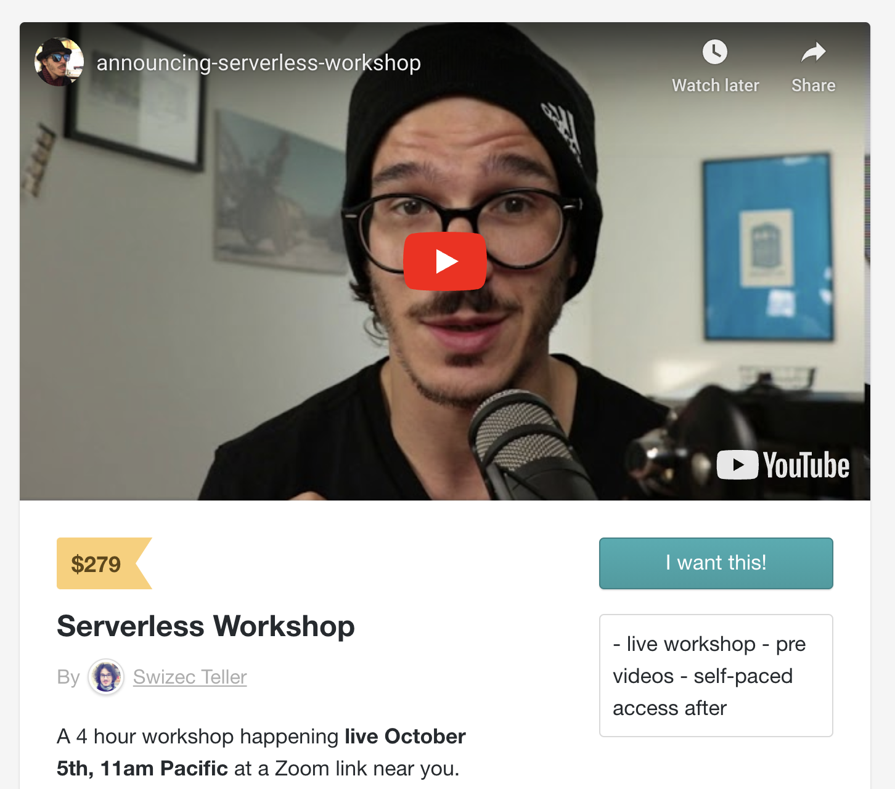

Times are changing, the future of web development is here.

Story time! 20 years of history in a 2min read, it's gonna be great 🤘

Cue 2001. Young Swiz here just convinced his mom to install ADSL, an early version of broadband. 256kbps

_"You don't want dial-up mom, I'd just rack up the phone bill so much you'd think the time I spent \\\\$300 calling porn hotlines a pleasant joke"_

Hey we didn't have the internet in middle school. Sketchy phone numbers in grandpa's boobie magazines were all you could get.

## Putting up a site in the early days

With ADSL going straight to my bedroom it was time to get into web development. How?

Oh that's easy. You just create an HTML file and you have a website. CSS wasn't popular yet, JavaScript was a joke.

Then what?

Oh that's easy, you dummy.

You run Apache on your Linux machine, put `index.html` in the right directory, open port 80 in your iptables, set your ADSL modem to pass-through mode, turn your computer into the network router, beg your internet provider for a static IP (my mom still uses it, good old 193.77.212.100), and you have a website. Yay!

Wait no, first you gotta send money in an envelope to a domain registrar to get a domain. Online payments are still the future. 😅

Oh you want your site to be dynamic? Use the LAMP stack? (linux, apache, mysql, php)

That's easy!

Install PHP on your computer, configure Apache to reverse proxy port 80 to your running PHP server, create config rules to run the PHP script on every request, and voila. You've got a computer open to exploit from every script kiddie on the internet with 5min to spare!

## Times improve with virtual hosting

Web development got a massive upgrade when collocation and virtual hosting (VPS) became popular in the mid 2000's.

As operating systems and hardware learned how to run multiple servers on 1 machine, isolated from each other, people started opening up. You could pay someone to run your website. 😍

If your site was big, you'd use collocation. Grab a machine, set it up, carry it down to the neighborhood data center and hook up. At least it isn't in your bedroom.

For a smaller site, you could pay a small fee for SSH access.

A bloke dealt with servers, you got a virtual machine. No more network config, just the Apache, PHP, MySQL, and other software concerns. Much easier!

## The Cloud

Then the 2010's hit. Suddenly we had cloud and platform-as-a-service (PaaS) providers.

This was amazing.

For the first time, you didn't need to worry about servers at all. Run a command, get a server. No SSH, no process daemons, no command line muckery.

You wrote your website in a full-stack framework like Rails, Django, or Express, clicked a button, and your app is live.

And then your credit card melted.

You shouldn't run machine learning algorithms on Google AppEngine in 2010. Ask me how I know 😅

Cloud and PaaS were new back then. Expensive as heck and kinda difficult to use. You got the worst of both worlds.

No control over your execution environment, but needed to know your execution environment in great detail to make your app smooth.

Plus a lot of the config was on you.

No automatic CDNs, no automatic domain configs, little automatic routing, lots of arcane incantations to get it all juuuust right. Want to replicate the config on a new environment or set up per-branch deploys? lol, tough luck

## 2020 is galaxy brain

Here's what putting up a new server looks like in 2020:

That one command gives you:

- a new custom domain
- https support
- a configured server running your code
- on-demand pricing
- CDN setup for fast performance
- static file hosting
- cloud function for backend code
- distributed logs
- guaranteed uptime

I've been watching and studying this space for 2 years now and it's ridiculous how good it's become. You don't want to miss this.

## Join Serverless Workshop today

[Serverless Workshop](https://gum.co/pEmTq) is the best way to dive into serverless cloud functions.

If you want to understand how they work, learn the mindset of how to wield them, and grok which provider is best for your use case, this is the workshop for you.

Happening live October 5th at a Zoom link near you.

Designed for everyone interested in serverless and cloud functions.

You'll learn:

- when to use serverless cloud functions
- how to use cloud functions in 3 environments - Netlify - Vercel - AWS Lambda
- 2 ways to read params from the browser and when to use them
- using serverless to integrate with a 3rd party API (you'll send an SMS)
- automating browser interactions with Chrome Puppeteer (you'll take a web screenshot)
- write files to S3
- how to read and write data to a database
- integrate your cloud function with a simple UI

You'll gain a feel for what serverless cloud functions can do and how you can start using them in your projects. At work or otherwise.

Doing the exercises will teach you about debugging, deploying to production, monitoring your code, logging errors, managing permissions, and dealing with secrets. All crucial tools in your quest.

[Reserve your spot today](https://gum.co/pEmTq) and learn how your skills can do more. Enrollment closes today.

## What you get

Buying [Serverless Workshop](https://gum.co/pEmTq) gets you live access to the workshop, the pre videos, and lifetime access to the recording.

Before the workshop, you get a few short videos with the basic theory. You can think of these as a mini course.

Just watching those videos you'll learn a bunch and we can focus on exercises during the workshop without wasting time 😍

After the live workshop, you get lifetime access to the exercises in a self-paced workshop format. Review when you want, play around as you please.

[Reserve your spot today](https://gum.co/pEmTq) and become the future looking expert in your field.

Cheers,
~Swizec

PS: if $279 is tough right now, there's an [option to pay in installments](https://gum.co/wYpbg) or you can reply to this email and we'll work something out
