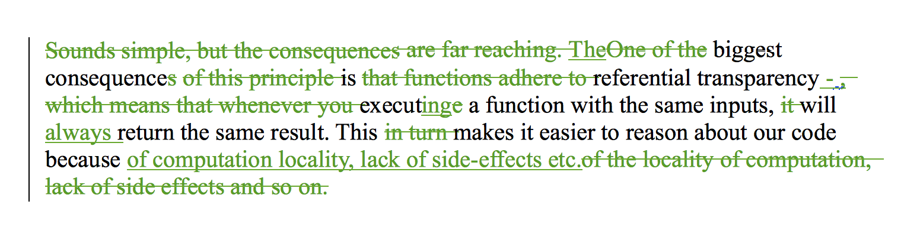

`.doc`**` record changes``show changes `` .odt``.docx `**

https://twitter.com/Swizec/statuses/375221837510492161

Some 15 pages of editing went _poof_. It happened again a few days ago. But I was more careful and only lost 5 pages. Then I converted all current versions to `.odt`. That seems to work. The collaboration has been wonderful too! Because we can't all work on the document at the same time, but have to resort to sending it around via email and working in sequence eeeeeverything draaaags oooout foreeever. Packt promised I had 3 months to write and then there'd be a 3 month editing process. We blew past that because I'm a slow writer, but in June I thought the book was done. We'd spent 3 months writing and 3 months editing. Then in the end of August I got technical feedback. Oh yeah. Yes editors are people too and they have other shit to do than care about my book and I'm really happy that one guy in particular ([@kmrhb](https://twitter.com/kmrhb)) has taken great care to leave a comment next to almost every single paragraph ... but still. Apparently a big part of the main editor's job is merging all the documents everyone sends her. :| I'm not sure how that works, but a lot of the comments I got in late August are dated to early July. Hm. If you ever write a book, _please_ use a better tool. Write it in a textual format - markdown works well - and use something that shows diffs and helps you merge stuff and lets people comment without having to wait for you to finish. Draft looks like it's got a lot of those features. I've had great results with Github for my other book. [_Readers_ have sent me typo fixes](https://github.com/Swizec/nightowls/pulls) that I can just merge! Whatever you do, don't write a book in .doc.

