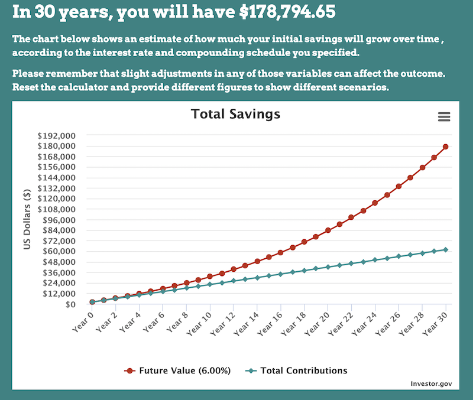

Twitter went abuzz with engineers sharing their salaries. Then everything turned to shit.

Why are all these rich fucks complaining about not being rich enough?? TONE DEAF!

I'm on food stamps and these spoiled Silicon Valley engineers over here sipping $12 lattes wearing $100 allbirds and complaining about money on their $1000 iphone.

And that person is right. Engineers _are_ spoiled. We live in a time where our skills are highly sought after, deliver heaps of value, and take lots of work to acquire.

Time to get paid, baby! Ka-ching

No seriously, that's _the_ trifecta of making money:

1.  Skill that's hard to acquire
2.  Skill that delivers lots of value
3.  Skill that everyone needs

Add to that a fast growing market and 🤑

## But mention money and everyone loses their shit

Engineers are weird when it comes to money.

You're supposed to love coding for the love of the coding. You're supposed to give most of your work away for free. You're supposed to be ashamed about how much money you make.

Fuck that.

Ever seen a lawyer give their work away for free? They won't even comp you a pencil.\[1] What about a doctor? Or a dentist? Fortune500 exec?

_Those_ are the folks making 6 figures. You need to stop thinking like a $10/hour barista, my friend.

But please do contribute to open source. The fate of every multi-billion dollar tech unicorn rests on your free code.

## Consider your value

https://twitter.com/Swizec/status/1228825341579448320

The mindset shift I urge you to consider is this: **It doesn't matter how hard or how much _you_ work, it only matters how much value _they_ get.**

I think that's why engineers are squeamish about salary.

We think we're overpaid. We think our work's too easy. We come from backgrounds where hard work is a virtue, physical labor is king, _doing_ stuff is the norm, and your boss is a jerk.

And all we do is sit there and type and think.

**But YOU deliver tons of value**. Tons.

Google, for example, makes [$1.3 _million_ dollars revenue per employee](https://9to5google.com/2019/10/28/alphabet-q3-2019-earnings/). Some $300k of that is pure profit.

You don't even have to work for Google. Any profitable company will do. Hell, even unprofitable companies get tons of value from you in investments and future returns on your work.

If your company bleeds money and not because they're betting on VC rocketship stuff ... you should reconsider 😅

## Why sharing salaries helps everyone

Ok so you're being paid for value, your value is massive, and what's the point of sharing salaries?

Sharing your salary in public might hurt your negotiating position, this is true. They're gonna say _"Yo you did this work for $X, why you want $Y now?"_

You are talking to a wage slave. Stop. Find someone else. Change the conversation.

It doesn't matter that you did similar work for $X. The new company is bigger, more profitable, and has more painful more expensive problems. You are here to help and **deliver _more_ value**.

That's why you're getting more.

And sharing your income could make people envious, jealous, feel bad about themselves, etc. That's the short term.

Long term those people will learn from you. They'll be inspired. They're going to change their lives.

_YOU_ can show them what's possible.

https://twitter.com/Swizec/status/1228697056002351104

HackerNews comments 10 years ago made me look at my income and think _"Why the fuck am I working for peanuts when folks just like me in Silicon Valley are making bank? This shit whack"_

I moved. Now I put more into savings every year than my just-as-talented peers back home make in total salary. At least the ones that aren't freelancing remotely for US companies.

Without folks sharing how much they make, I'd still be stuck building websites for $5/hour.

Thank you kind internet strangers.

## In conclusion

Tell your friends how much you make. Figure out together how you all can make more.

Just a $2000 salary increase can compound into $178,000 of lifetime savings and that's kinda crazy. [source](https://www.investor.gov/additional-resources/free-financial-planning-tools/compound-interest-calculator)

Happy Friday ❤️

Cheers,   
~Swizec

PS: you can see the full spreadsheet of salaries compiled from tweets here: \[[click](https://docs.google.com/spreadsheets/d/1-xIgk7Mw1S5DXTZSbKBgxlsQAn7XGIu7Mfy72lSVHKk/edit#gid=129993618)]. Data is kinda messy but very fascinating

\[1] when you work with lawyers you'll sometimes notice an invoice for thousands of dollars of their time ... oh and $20 for ink and printing
