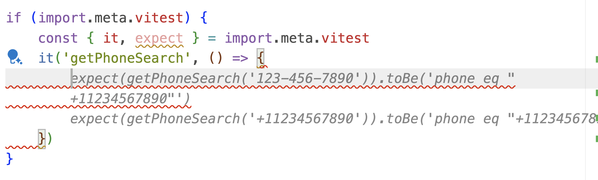

People are starting to use AI to write their tests. This is great! Also very bad.

This is a reflection on seeing the rise of LLMs that write your tests like [Meta's TestGen](https://arxiv.org/abs/2402.09171) and [its first open source implementation](https://www.codium.ai/blog/we-created-the-first-open-source-implementation-of-metas-testgen-llm/). I may be wrong! Replies welcome.

https://x.com/Swizec/status/1793005975630229834

That got a lot of replies. I didn't read them all. Let's go deeper.

## Why people write tests

I think the majority of tests people write today are because somebody else said it's important. When's the last time you saw tests catch a bug? _Before_ it hit production.

https://x.com/Swizec/status/1793016365755805957

### Find related changes

In my experience, good TypeScript (or other static types) coverage removes much of the need for unit tests. Types will tell you when you're holding a method wrong or when you've changed something that has consequences elsewhere.

Although [research has struggled to validate the effectiveness of types](https://swizec.com/blog/the-efficacy-of-typescript/) for preventing bugs.

You may need unit tests to do the work of a type system in a dynamic language like Python or Ruby. Otherwise you'll never catch every instance that needs to change when you rename a function or change its arguments.

### Beyonce rule

The [Beyonce rule](https://swizec.com/blog/what-i-learned-from-software-engineering-at-google/) states that _If you liked it you shoulda put a test on it_.

This matters in large organisations with shared code ownership where anyone may change anything at any time. They'll bump into your code, make a change that seems reasonable, and break tests.

Those tests tell the programmer that _you intended_ the weird behavior. This forces a conversation and you can figure out if the old behavior is still needed and how to incorporate the new thing.

### To avoid talking

Many of the tests you see in the wild are solving a communication problem. Programmers touching code they don't understand, programmers causing side-effects in systems they don't own, or even programmers leaving and not being there to ask questions anymore.

I prefer [solving this with team structure](https://swizec.com/blog/what-i-learned-from-team-topologies/). Give teams vertical ownership of their domains. Keep that ownership long-term. That way there's less need for people to muck around in code they don't understand.

Vertical ownership and [vertical code organisation](https://portal.gitnation.org/contents/forget-bad-code-focus-on-the-system) also means that you're less likely to have side-effects spanning into systems you don't own. Worrying that making a change in module A is going to break module D likely means those modules are incorrectly coupled. You may have fallen for the classic [DRY vs SoC dilemma](https://swizec.com/blog/dry-vs-soc-a-difficult-choice/).

### To trick programmers into thinking

This is good. Asking people to think about how they'll know when the code works is a fantastic head fake. Tricks them into thinking about edge cases and possible side-effects _before_ writing code. Definitely works on me.

TDD is okay but cumbersome. Writing out your tests cases as bullet points is fine.

### Regression testing

Yes! If you write good \[integration] tests, you'll know when something breaks after you change the code. Fantastic for refactoring and library updates.

You'll know your tests are good when you rarely have to change the tests to fit the new code. Most unit tests I've seen in production fail this criteria. Most integration and end-to-end tests pass.

## How you let AI write tests matters

After all that, do _you_ think deriving tests from your implementation is valuable?

Here's an example from last night. I was playing with Vitest for in-code testing of helper utils and letting Copilot do its thing.

Yep that's the test I was gonna write. But is it _valuable_?

Eh I don't think so. The code is a basic string transformation that's easy to read, quick to understand, and unlikely to change in the future. If we do come back here to make a change, it's going to be because the API we're using has changed. When that happens the tests will be just as wrong as the code.

And because the AI _derived the test from the code_, you can't even apply the Beyonce rule. What if that string transformation is wrong and that wasn't the programmer's intent? We'll never know. The bug now exists in both places.

### Write higher level tests

An integration or end-to-end test higher up the stack would be way more useful. When a user clicks this button and enters a phone number, does the search work?

That test won't need to change until _the feature_ changes. You could swap out the whole implementation underneath and keep the same test. That's a valuable test.

AI writing tests like that would be fantastic. Don't worry about code coverage. Focus on feature coverage.

### What might work

3 ideas for using AI to write tests that might work. I haven't tried them yet.

1. **Using AI to fuzz your app**. Generate lots of production-like inputs to discover edge cases.
2. **Using AI to translate acceptance criteria into tests**. You write bullet points, AI writes the high-level tests, you write the code.
3. **Using AI to write code that fits your tests**. You write the tests and let AI figure out the rest. This would be cool, but hard on our ego

Cheers, 
\~Swizec

PS: the related articles feature helped me find this thought from 7 years ago ❤️

https://x.com/Swizec/status/865295043162021889
