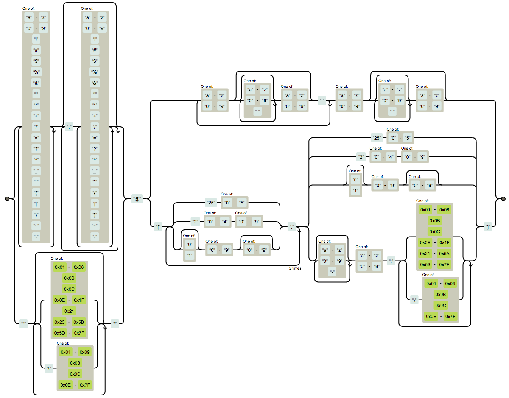

Have you ever had a tweet go so viral it changed your whole view of software engineering?

https://twitter.com/Swizec/status/1399831783613423616

That was a typo, it's supposed to say "scare".

We had fixed yet another timezone bug in our codebase ... an API call that removed UTC offset from `startDate`, but not `endDate`. Made 3 hours of data unfindable 🙃

Small obvious fix in the end, but it took 2 engineers over an hour to find and verify.

```javascript
fetch(..., {
	startDate: datefns.parse(
		formValues.startDate,
		'yyyy-MM-dd',
		new Date()
	),
	endDate: datefns.addDays(
		new Date(formValues.startDate),
		1
	)
})

// 👇

const startDateWithoutTime = parse(
  formValues.startDate,
  'yyyy-MM-dd',
  new Date()
)
fetch(..., {
	startDate: startDateWithoutTime,
	endDate: datefns.addDays(
		startDateWithoutTime,
		1
	)
})
```

`new Date('2021-06-05')` gives you a timestamp set to midnight in the user's timezone. 5pm UTC in San Francisco, 3pm UTC in New York, etc. And when the server expects midnight UTC, you got a problem.

We did that for `startDate` but not for `endDate`.

🤦‍♀️

## Timezones

I cannot tell you how much of my life I've lost to timezones, my friend. From coding to traveling across oceans and international calls.

Timezones are a mess.

And they're getting better! Europe wanted to [end daylight savings](https://www.bloomberg.com/news/articles/2021-03-11/will-daylight-saving-time-ever-end) in fall of 2021.

For countries that choose to end it ... on the winter or the summer time ... their choice ... making the CET timezone any of 3 possible current times ...

Wait that's not better at all!


If you have not been scarred by timezones my friend, consider yourself lucky. It's coming.

And before you say _"Abolish timezones, it's the right thing to do_, remember that China does that. [Everyone is on Beijing time](https://99percentinvisible.org/episode/matters-of-time/3/).

You can't have a 9am meeting between Beijing and Xinjiang because Xinjiang's sunrise is 2 hours later and they start work at 11am. "This is understood".

Sounds a lot like timezones 🤔

## Regex

You know what they say: A beginner looks at the problem, sees that regex can solve it, now they have 2 problems.


Regular expressions are great. Little bits of inscrutable logic that parse strings. Versatile as heck.

Quick! What does this do?

```javascript
const valid = formValue.match(/[a-z]+@[a-z]+\.[a-z]+/i)
```

It's a bad way to validate email inputs.

Checks that you have at least 1 letter, then an `@`, then more letters, followed by a dot and even more letters.

The correct regex for email validation looks like this:

    (?:[a-z0-9!#$%&'*+/=?^_`{|}~-]+(?:\.[a-z0-9!#$%&'*+/=?^_`{|}~-]+)*|"(?:[\x01-\x08\x0b\x0c\x0e-\x1f\x21\x23-\x5b\x5d-\x7f]|\\[\x01-\x09\x0b\x0c\x0e-\x7f])*")@(?:(?:[a-z0-9](?:[a-z0-9-]*[a-z0-9])?\.)+[a-z0-9](?:[a-z0-9-]*[a-z0-9])?|\[(?:(?:(2(5[0-5]|[0-4][0-9])|1[0-9][0-9]|[1-9]?[0-9]))\.){3}(?:(2(5[0-5]|[0-4][0-9])|1[0-9][0-9]|[1-9]?[0-9])|[a-z0-9-]*[a-z0-9]:(?:[\x01-\x08\x0b\x0c\x0e-\x1f\x21-\x5a\x53-\x7f]|\\[\x01-\x09\x0b\x0c\x0e-\x7f])+)\])

Yeah I don't get it either. [StackOverflow](https://stackoverflow.com/questions/201323/how-to-validate-an-email-address-using-a-regular-expression) says that regex internally translates to this state machine:



Oh and it doesn't work. Comments point to several bugs where this regex fails to match the spec.

🥲

PS: if you pass a very long string this regex will hang your server

## CORS

CORS is a safety feature on modern browsers. Stands for [Cross-Origin-Resource-Sharing](https://en.wikipedia.org/wiki/Cross-origin_resource_sharing).

And it's a mess. Kind of.

The rules are simple: Your browser can load any resource that might contain executable code which the responding server has whitelisted for the domain it's being loaded from.

If you're on `swizec.com` and make a request to `api.swizec.com`, the API server has to _explicitly_ say "Requests from swizec.com are okay". Otherwise the browser pretends the result is invisible.

But if you load an image from `cdn.swizec.com`, it works without special headers. Images aren't executable.

_Fonts_, however, are 🙃

## State and Mutation

State sounds harder than it is.

```javascript
const value = 1
```

There. State!

Where state gets tricky is [domain modeling](https://en.wikipedia.org/wiki/Domain_model). And I think that's what people mean when they say "state is hard".

> Domain modeling is a cruel mistress
>
> ~ Me when we found yet another exception to the rules

How do you take the natural world with its fuzzy edges and weird exceptions and put it inside a computer? Computers need certainty.

When does a bunch of pebbles become a pile? When does a brown bear become a polar bear?

Brown bears and polar bears are creating a new [prizzly bear](https://en.wikipedia.org/wiki/Grizzly%E2%80%93polar_bear_hybrid) species. They can mate.


Nature is complex. It doesn't care about your classifications and your rules.

Mutation ... mutation is bad when state is shared. Because [shared state is wrong state](https://swizec.com/blog/my-favorite-lessons-from-pragmatic-programmer/).

## Unicode and charsets and localization

I have been lucky enough to avoid this whole mess.

Here's a smol taste instead, paste this in your console:

    '🏳' + '\u200d' + '🌈'

🏳️‍🌈

\`\\u200d' is a [zero-width-joiner](https://www.bram.us/2016/08/27/fun-with-javascript-and-emoji/) character. Combines emojis. See how you make an emoji family:

    [...'👨‍👩‍👧‍👦']

Try it. I promise it's fun :)

## What scary words have in common

All these words are powerful tools that are not meant to be safe.


And that's an important lesson.

Cheers,
~Swizec

PS: it was 3 hours of unfindable data because we have people on the East and West coast. UTC+4 and UTC+7. If we had a person in every UTC+N, we could find it all 🙃
