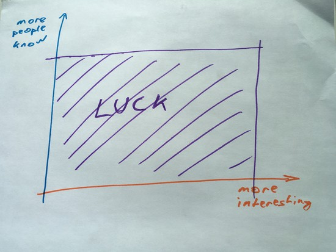

A reader recently asked me how they can do things next to their demanding day job as a software engineer. Contribute to GitHub, write blogs, give talks, be active in the community, and maybe even sidehustle some money on the side.

You know, all the things that we look at and say, _&quot;That dude is amazing! Rockstar! Much love 😍 How does she talk at 50 conferences per year wtf!?&quot;_

But first I want to answer **why**.

### Why you should work ON your career, not just IN your career

I&#x27;m borrowing a concept from [Kai Davis](https://kaidavis.com/), a famous consultant. He talks a lot about the difference between working **in** your business versus working **on** your business.

When you work _in_ your business, you deliver value to clients.

When you work _on_ your business, you deliver value to yourself.

Engineering careers are similar. There&#x27;s work that benefits your employer: you go to meetings, you deliver code, you code review, you help your team and act as a force multiplier, etc. You do stuff that delivers value to others.

You build features for your users, and you make your boss happy by showing up on time and going to meetings even when you don&#x27;t really quite feel like it. Stuff like that.

This also builds experience, so it often feels like working _on_ your career. You&#x27;re solving problems you haven&#x27;t solved before. You&#x27;re gonna solve them faster next time.

It improves your career a little.

If you want to improve your career a lot, you have to work _on_ your career. You have to do work that force multiplies yourself, not just those around you.

For 1 unit of effort, how do you get 3 units of career growth?

### How to work ON your career

There are many ways you can work _on_ your career. Depends what you want.

You can become a better engineer specialist through pet projects. Explore some new tech, develop some new skills. Watch talks, read blogs, go to conferences. Learn more skills.

Next time somebody needs a thing, you can say, _&quot;I can do that!&quot;_.

And your career as an engineer improves. You can do more stuff.

* * *

You can become a thought leader and rockstar 🤘 Give talks at meetups and conferences, publish blogs, be active in the community. This makes people know about you and how awesome you are.

Now you&#x27;re a thought leader in some area or community. People come to you for opinions and advice because they value the way you think and approach problems.

And your career improves. When someone needs advice, they think of you.

* * *

An easier way at the beginning, and harder when your projects take off, is to work on open source. It&#x27;s a lot like giving talks, but easier to fit in your schedule. Until you&#x27;re famous. Then it&#x27;s harder.

Publishing open source projects makes you That Person Whose Tools We Use™.

Now you&#x27;re not just telling people how to fish, you&#x27;re giving them _actual_ fish. This is a great place to be.

The more people use your tools, the more they will like you, the more they will value your opinions. This can lead to speaking opportunities, being generally known of in the community, and sometimes even getting hired as a job perk for other engineers because everyone wants to work with you.

And your career improves. People know of you, people rely on you, they want to work with you.

* * *

You can be a connector. Go out and meet people. Introduce people to each other. Make people comfortable in social situations. Connect person who needs X with a person who knows X.

This approach may sound silly. Bah, I&#x27;m an engineer, and engineers are judged on their merits and their code!

But are they? We&#x27;re all humans, and we work in teams, and we like to work in teams with people we like and enjoy spending time with. Humanness matters.

An engineer who is good at social is a rare breed. Your career will skyrocket. This is how you become a VP of Engineering. You think they code? No, they deal with people.

The connector approach works best if you ever want to start your own team. Oh, you need 5 engineers with skills in X, Y, and Z? Yeah, I know them. I&#x27;m buddies with 10 of them. I&#x27;ll have a team put together in 2 weeks.

And your career improves. People come to you when they need help because they know you&#x27;ll point them in the right direction.

## Whatever it is, do _something_

Most importantly, you should do _something_ that builds your career, not just your code.

