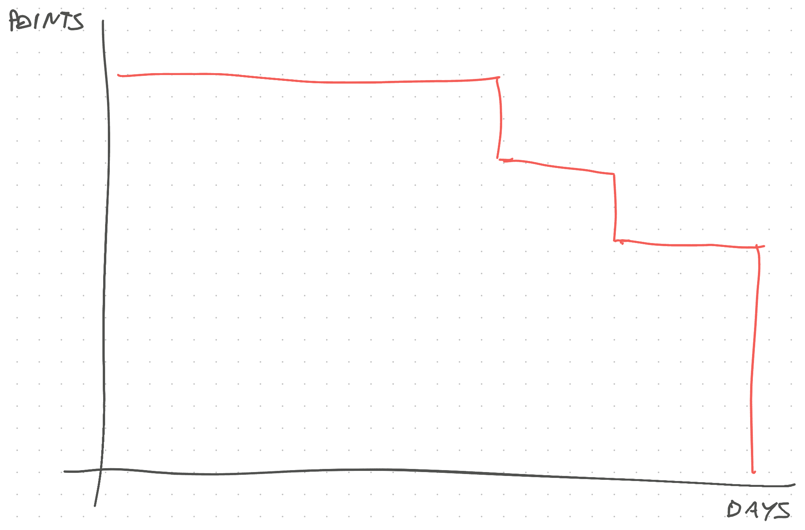
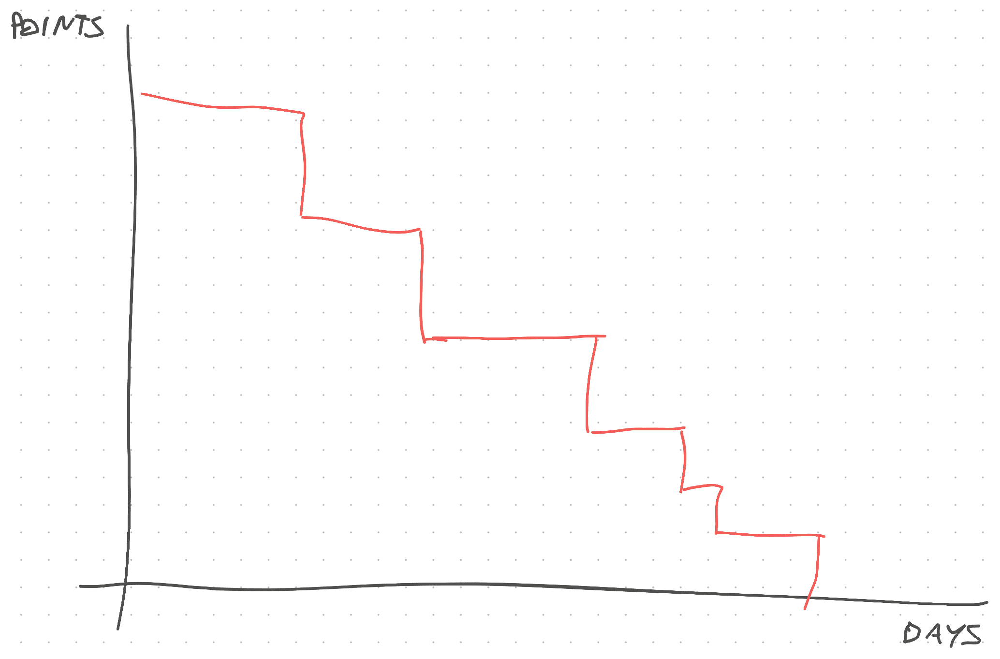

Friend here's a puzzle that never makes sense intuitively and always proves out in practice –

You have a team of 6 engineers. All fantastic people great at their jobs.

You give them a gaggle of projects. Call it a sprint. 6 projects for 2 weeks. Seems reasonable yeah?

What happens next is ... weird.

## Scenario 1: Team works as a group of soloists

Every engineer takes a story and runs with it. They break it into subtasks, talk to the product owner to clarify requirements, and bang out code.

Despite occasional hiccups, everyone makes steady progress and their project goes great. They're annoyed that nobody has time to review pull requests and getting help can be frustrating.

Your burndown chart looks like this:

Sprint is finished, but barely. You all push hard on the last day and get it done. Heroes! 💪

## Scenario 2: Team works as a team

Your team takes the first story and runs with it. You get into a swarm session, break it into subtasks, talk to the product owner to clarify requirements, and bang out code.

Despite occasional hiccups, you make steady progress and the project goes great. Everyone has time for pull requests and getting help is easy – you're all thinking about the same project.

Your burndown chart looks like this:

Sprint is finished. Leisurely with no fuss. On the last day you have time to attack the tech debt backlog.

## But why?

Here's the puzzle – if it takes 6 engineers 10 days to complete 6 projects in parallel, why does it take 8 days when you work together 🤨

That's not what Brooks told us in The Mythical Man-Month ...

> If a pregnant lady can build a baby in 9 months, how long do 2 pregnant ladies need?

... but it is what Goldratt told us in [The Goal](https://swizec.com/blog/build-better-software-with-the-theory-of-constraints/).

Cheers, 
~Swizec

PS: our manager at $Dayjob keeps telling us to use Scenario 2 and we keep going for Scenario 1 intuitively. We mess it up every time we listen to our intuition.
