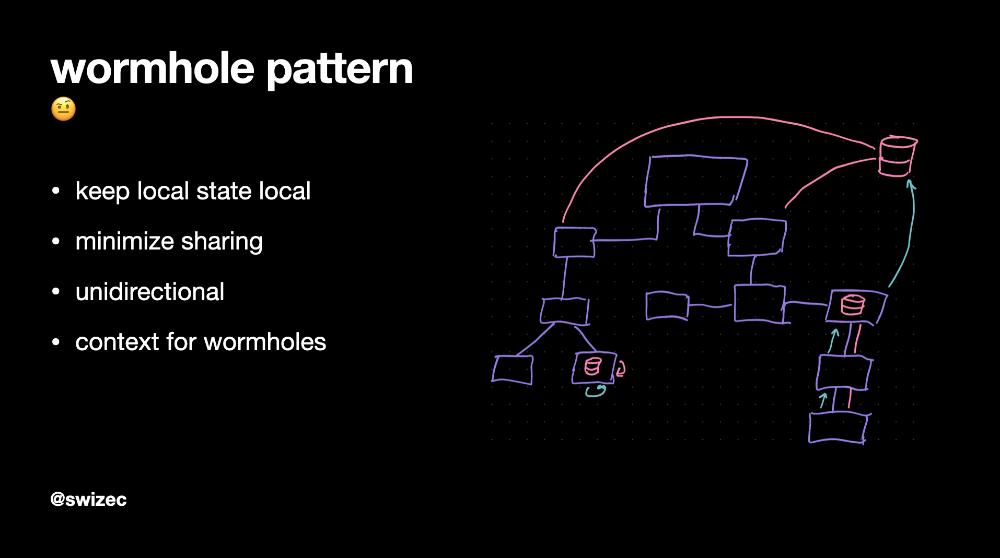
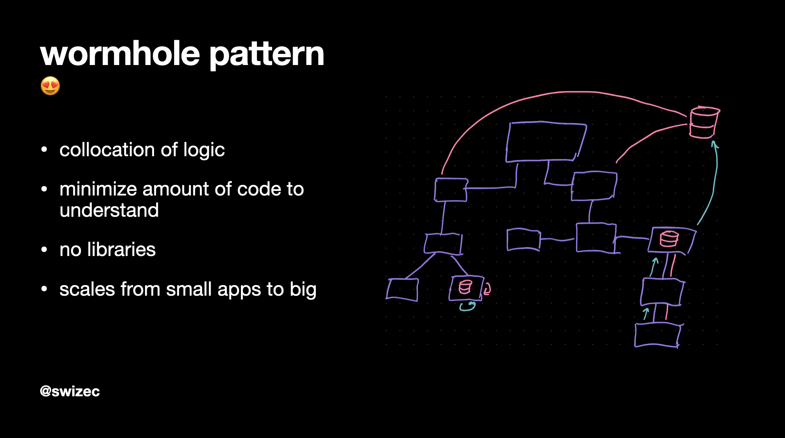

Engineers often jump into Redux, MobX, XState, or Recoil before they really need to. That's what large orgs use so it must be right.

You are not Google, Facebook, Amazon, or Uber. You're shooting yourself in the foot by blindly following their patterns. Probably.

[](https://www.youtube.com/watch?v=62AMy1QIpzk)

_This article is based on my talk at Reactive Conf Meetup #4 in May_ 👆

The Wormhole State Management pattern stems from a single idea: use the least complex machinery that solves your problem.

That's why it's a pattern, not a library.

_You_ have control to make it as simple or complex as fits the problem. _You_ can scale it from small examples to large codebases.

It's the pattern behind libraries like [useAuth](https://github.com/Swizec/useAuth) and every React app – big or small – that I've built in the past 18 months. And now it has a name ✌️

Here's how it works

## Keep local state local



What's the smallest amount of sharing you can get away with?

Keep your state there. As close to where it's used as possible.

If a single component cares, use that. If a few components care, share it with props. If many components care, put it in context.

Context is like a wormhole. It bends your component tree so pieces far apart can touch.

Leverage custom hooks to make this easy.

## Keep state simple



What's the simplest state you can get away with?

Do that. You can always change it later.

You can always make a simple codebase complex, but you can't make a complex codebase simple.

Your code becomes easier to understand, too.

Imagine stepping into a component you haven't seen in 2 years. What happens?

First you read the component code. It kind of makes sense.

Then you travel 5 files into a different directory and learn about how its state works.

3 more files away is a bit more of its state.

Another 10 files away are all the side-effects from who knows what.

Before you know it, you've read most of the codebase and you're still not sure how this component works. You try to isolate it to run some tests and realize it needs the whole state management jungle to work.

You wanted a banana. You got [a gorilla holding the banana and the entire jungle](https://www.johndcook.com/blog/2011/07/19/you-wanted-banana/).


## An example

Follow along as I build a contrived click counter. The Wormhole State Management pattern is best explained through examples ✌️

### step 1

We start with `useState` because it's the simplest.

https://codesandbox.io/s/wormhole-state-pattern-1-8i1zv?file=/src/App.js

```javascript
const ClickCounter = () => {
  const [count, setCount] = useState(0)

  function onClick() {
    setCount((count) => count + 1)
  }

  return <button onClick={onClick}>{count} +1</button>
}
```

`count` holds the current number of clicks, `setCount` lets us update the value on every click.

Simple enough.

Presentation isn't the prettiest though. Let's improve it with a custom button component and some nesting.

### step 2

https://codesandbox.io/s/wormhole-state-pattern-2-kg697?file=/src/App.js

We created a reusable `PrettyButton` that ensures every button in our app looks fabulous. Nice and pink.

State remains in the `ClickCounter` component.

```javascript
const ClickCounter = () => {
  const [count, setCount] = useState(0)

  function onClick() {
    setCount((count) => count + 1)
  }

  return (
    <>
      <p>You have clicked buttons {count} times</p>
      <div style={{ textAlign: "right" }}>
        <PrettyButton onClick={onClick}>+1</PrettyButton>
      </div>
    </>
  )
}
```

This is the least amount of state sharing necessary. We kept state simple, too.

The counter component cares about clicks and counts so it passes a callback into the button as a prop. Function gets called, state updates, component re-renders.

No complex machinery required.

## step 3

What if our state is more complex? We have 2 items that belong together.

You can keep complex values in your state. Works great.

https://codesandbox.io/s/wormhole-state-pattern-3-eygcf?file=/src/App.js

```javascript
const ClickCounter = () => {
  const [count, setCount] = useState({ A: 0, B: 0 })

  function onClickA() {
    setCount((count) => {
      return { ...count, A: count.A + 1 }
    })
  }

  function onClickB() {
    setCount((count) => {
      return { ...count, B: count.B + 1 }
    })
  }

  return (
    <>
      <p>
        You have clicked buttons A: {count.A}, B: {count.B} times
      </p>
      <div style={{ textAlign: "right" }}>
        <PrettyButton onClick={onClickA}>A +1</PrettyButton>
        &nbsp;
        <PrettyButton onClick={onClickB}>B +1</PrettyButton>
      </div>
    </>
  )
}
```

We've split `count` into an object – `{ A, B }`.

Now a single piece of state can hold multiple values. Separate counts for separate button clicks.

React uses JavaScript equality to detect changes for re-renders so you have to make copies of full state on every update. This gets slow around 10,000 or so elements.

You can use `useReducer` here, too. Especially when your state becomes more complex and items often update separately.

Similar state using `useReducer` would look something like this:

```javascript
const [state, dispatch] = useReducer(
  (action, state) => {
    switch (action.type) {
      case "A":
        return { ...state, A: state.A + 1 }
      case "B":
        return { ...state, A: state.A + 1 }
    }
  },
  { A: 0, B: 0 }
)

function onClickA() {
  dispatch({ type: "A" })
}
```

The more complex your state, the more this makes sense.

But I think those switch statements get messy fast and your callback functions are already actions anyway.

## step 4

What if we want 2 buttons to update the same state?

https://codesandbox.io/s/wormhole-state-pattern-4-czh8n?file=/src/App.js

You can pass both the `count` and `setCount` to your components as props. But this is getting messy.

```javascript
const AlternativeClick = ({ count, setCount }) => {
  function onClick() {
    setCount((count) => {
      return { ...count, B: count.B + 1 }
    })
  }

  return (
    <div style={{ textAlign: "left" }}>
      You can also update B here
      <br />
      <PrettyButton onClick={onClick}>B +1</PrettyButton>
      <p>It's {count.B} btw</p>
    </div>
  )
}
```

We've created a component that's hard to move and needs to understand too much of parent logic. Concerns are split, abstractions are weird, and we've created a mess.

You can fix it a little by passing just the parts of state it needs and a more customized `setCount`. But that's a lot of work.

### step 5

Instead, you can use a wormhole to share state with a custom hook. 🤩

https://codesandbox.io/s/wormhole-state-pattern-5-j4w5e?file=/src/App.js

You now have 2 independent components sharing state. Put them anywhere in your codebase and it Just Works™.

Need to access shared state somewhere else? Add the `useSharedCount` hook and voila.

Here's how this part works.

We have a context provider with some machinery inside:

```javascript
export const SharedCountProvider = ({ children }) => {
  // replace with useReducer for more flexiblity
  const [state, setState] = useState(defaultState)

  const [contextValue, setContextValue] = useState({
    state,
    // dispatch // from your reducer
    // this is where a reducer comes handy when this grows
    setSharedCount: (key, val) => {
      setState((state) => {
        return { ...state, [key]: val }
      })
    },
    // other stuff you need in context
  })

  // avoids deep re-renders
  // when instances of stuff in context change
  useEffect(() => {
    setContextValue((currentValue) => ({
      ...currentValue,
      state,
    }))
  }, [state])

  return (
    <SharedCountContext.Provider value={contextValue}>
      {children}
    </SharedCountContext.Provider>
  )
}
```

The context provider uses a rich `state` variable to keep your state. This is `{ A, B }` for us.

The `contextValue` is a richer piece of state that also holds everything you need to manipulate that state. Often this would be a `dispatch` method from your reducer, or custom state setters like we have here.

Our `setSharedCount` method gets a `key` and `val` and updates that part of state.

```javascript
// set count.B to 10
setSharedCount("B", 10)
```

We then have a side-effect that watches `state` for changes and triggers re-renders when needed. This avoids deep re-renders every time we redefine our dispatch methods or whatever.

Makes the React tree more stable ✌️

Every component rendered within this provider can use this same custom hook to access everything it needs.

```javascript
export function useSharedCount() {
  const { state, setSharedCount } = useContext(SharedCountContext)

  function incA() {
    setSharedCount("A", state.A + 1)
  }

  function incB() {
    setSharedCount("B", state.B + 1)
  }

  return { count: state, incA, incB }
}
```

The custom hook taps into React Context for shared state, defines simpler `incA` and `incB` helper methods, and returns them with state.

That means our `AlternativeClick` component can look like this:

```javascript
import { useSharedCount } from "./SharedCountContextProvider"

const AlternativeClick = () => {
  const { count, incB } = useSharedCount()

  return (
    <div style={{ textAlign: "left" }}>
      You can also update B here
      <br />
      <PrettyButton onClick={incB}>B +1</PrettyButton>
      <p>It's {count.B} btw</p>
    </div>
  )
}
```

Gets `count` and `incB` from custom hook. Uses them.

😍

## What about performance?

It's good.

Share state as little as possible. Use different context providers for different parts of your app.

Don't make it global unless it needs to be global. Wrap the smallest part of your tree that you can get away with.

Yes even though it's easier to always wrap everything.

## What about complexity?

What complexity? Keep it small. Don't stuff shit in there that you don't need.

That's where the foot shooting starts. When folks put _everything_ in global state.

Also why apps get slow 😉

## I hate managing my own state, bleh

That's fair. Did you know that this same pattern works with many state management libraries?

See that part in our `SharedCountProvider` that deals with state changes? This part:

```javascript
const [contextValue, setContextValue] = useState({
  state,
  // dispatch // from your reducer
  // this is where a reducer comes handy when this grows
  setSharedCount: (key, val) => {
    setState((state) => {
      return { ...state, [key]: val }
    })
  },
  // other stuff you need in context
})
```

You can use XState for that. Or a reducer. Or even Redux, if you really want to.

Altho if you're using Redux you might as well go all the way 😛

## Does this really scale up and down all sorts of apps?

Yes. Try it.

Cheers,  
~Swizec
