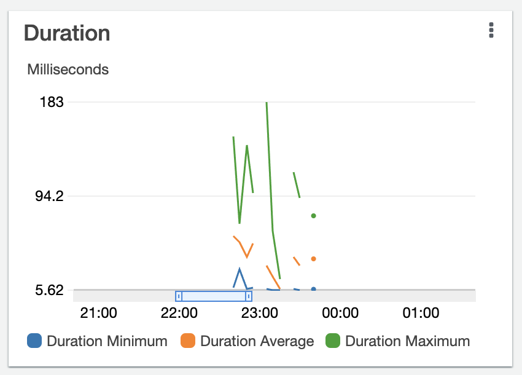

Your brain keeps solving problems when you aren't looking. One morning you jump out of bed and think _"OMAIGOD I'm an idiot! It's so obvious!"_

And you rush to your project, try your idea, and ...

... and you might still be wrong 😅

https://www.youtube.com/watch?v=_Ziv6eirmuo

Like when I had the brilliant idea to use [eventual consistency](https://en.wikipedia.org/wiki/Eventual_consistency) to speed up the AWS Lambda that saves your 👍👎 vote at the bottom of this email and I couldn't have been more off base. Classic [over-confidence that makes you tank an interview](https://swizec.com/blog/the-quickest-way-to-fail-a-tech-interview/) because you read somewhere that $Technique Is For Speed.

## Trying eventual consistency to improve load times

The idea behind eventual consistency is to delay database writes. Does everything need to happen in-request or can you do some of the work async?

My Lambda makes 2 writes to DynamoDB in a GraphQL Mutation:

1.  Update a vote counter
2.  Save the vote

```typescript
// Updates thumbsup/down count in a widget
const widgetUpdateResult = await updateItem({
  Key: { userId, widgetId },
  UpdateExpression:
    "SET thumbsup = thumbsup + :thumbsup, thumbsdown = thumbsdown + :thumbsdown",
  ExpressionAttributeValues: {
    ":thumbsup": thumbsup ? 1 : 0,
    ":thumbsdown": thumbsdown ? 1 : 0,
  },
  ReturnValues: "ALL_NEW",
})
const widget = widgetUpdateResult.Attributes || {}

// Saves a new vote in the feedbacks table
const feedback = await saveFeedback(
  {},
  {
    widgetId,
    voteId,
    instanceOfJoy,
    createdAt,
    voteType,
    voter,
    answers: {},
  }
)
```

This is a stupid design.

You could count the votes for each widget when you need the number. Why am I manually counting this? 🙄

You could save the vote, then [use DynamoDB Streams](https://swizec.com/blog/using-dynamodb-streams-with-the-serverless-framework/) to update the count. User-facing lambda performs a quick save, triggers additional lambdas to update meta data.

### Test your hypothesis

Rule number 1 of performance tweaks – **measure**. [Serverless Performance](https://serverlesshandbook.dev/serverless-performance) is a strange beast and you have to ask the computer where it hurts. You can't guess.

We removed a DynamoDB write and ran the same mutation a bunch of times in a GraphQL Playground. While streaming.

```graphql
mutation ($userId: String!, $widgetId: String!, $thumbsup: Boolean) {
  widgetVote(userId: $userId, widgetId: $widgetId, thumbsup: $thumbsup) {
    followupQuestions
    voteId
    voter
  }
}
```

The mutation sends a `userId` and `widgetId` to identify what you're feedbacking and a `thumbsup` to say 👍. In retrospect the vote type should've been a string.

Our unscientific test[^1] gave a **258ms average** response time over 14 runs. Doesn't feel like much of an improvement.

We tried the original code and got **253ms average** response times. Faster than with my brilliant idea.


## Is it the Apollo overhead?

Okay if database writes aren't slow ... what is? Could it be that [Apollo Server](https://www.apollographql.com/docs/apollo-server/) has massive overhead? It's pretty heavy after all.

We upgraded from an old version of `apollo-server-lambda` (2.5.1) to the latest (3.6.1) and added memoization to cache the server between requests. AWS Lambda caches values in global scope.

```typescript
// cached server instance
let server: ApolloServer | null = null
function getServer() {
  if (!server) {
    // instantiate server if doesn't exist
    server = new ApolloServer({
      typeDefs: getTypeDefs(),
      resolvers,
    })
  }

  return server
}

// creates the Lambda request handler
export const handler = getServer().createHandler({
  expressGetMiddlewareOptions: {
    cors: {
      origin: "*",
      credentials: true,
    },
  },
})
```

Wrap `server = new ApolloServer` in a function and use global file scope to cache the value between requests. If instantiating overhead is the problem, this is gonna solve it.

The result was a **249ms average** response time. Within the margin of error for my benchmarking approach[^1]. 💩

## Wait is the Lambda slow at all??

At this point it looks like the benchmark may be dominated by round-trip times to us-east-1, an AWS region, and AWS's internal machinery. How fast is the Lambda itself?



The slowest invocations are around 95ms with averages hovering around 50ms ...

All this effort to speed up our code and our code isn't even the slow part. That was dumb. 🙈

Best thing I learned in college: [Amdahl's Law](https://en.wikipedia.org/wiki/Amdahl%27s_law) – speeding up the fast part of your system won't do shit for performance.

## API Gateway v2, a hail mary

On stream, [David Wells](https://twitter.com/DavidWells) suggested I give [API Gateway v2](https://www.serverless.com/blog/api-gateway-v2-http-apis) a shot. It's cheaper, newer, and faster. Worth a shot ...

I'm using the Serverless Framework, which made changing to API Gateway v2 easy.

```yaml
functions:
  graphql:
    handler: dist/graphql.handler
    events:
      - httpApi: # was http:
          path: /graphql
          method: GET
      - httpApi: # was http:
          path: /graphql
          method: POST
```

Change `http:` event triggers to `httpApi:` and move CORS configuration up to the provider block. That's it.

**169ms average** response times. A 33% improvement 🤩

Just goes to show you 👉 you can't blindly grab every performance technique you read about online. You have to analyze _your_ system.

Cheers,<br/>
~Swizec

PS: API Gateway is how Lambdas connect to the outside world. You can read more about that in [Serverless Handbook](https://serverlesshandbook.dev)

[^1]&#x3A; the benchmarks in this article are imperfect. Directionally useful, but running on a domestic internet provider while streaming video. Ethernet connection into a Comcast router. All benchmarks ran under these same conditions. 12 to 15 rapid retries each.
