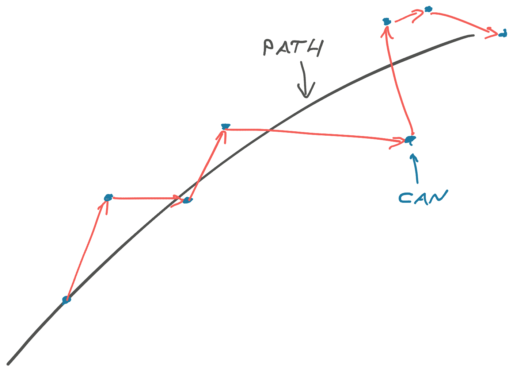

Writing software is a playful process of exploration and discovery. Like a game of kick the can on a Sunday walk.

It's a beautiful day out. The sun is shining, the birds are chirping, the conversation with your friend fulfilling. You're on a walk through the park when you come upon a can on the road.

The child inside you says _"Kick it!"_ and you do. The can flies forward a few feet bouncing off pebbles and cracks in directions you cannot predict.

What happens next is key: The can didn't go directly forward so you _change direction_ towards the can. You want to kick again! You always do. If it bounced too far off your path, your friend gets the kick.

You continue for a few hundred yards passing the can between you and your friend, hearts leaping with joy at this childish pursuit. You weave around your perfect path at the whims of a metal can.

Every piece of code you write is like a kick of that can. Gets you a few steps closer, a little off path, and creates the basis for your next step.
