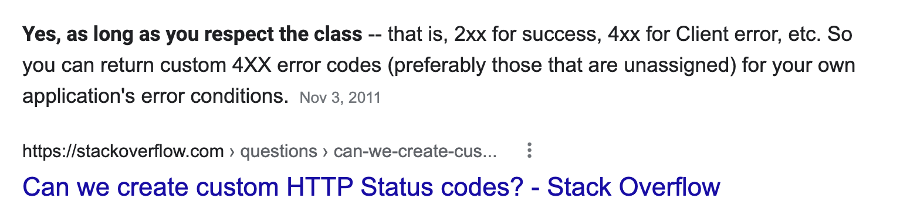
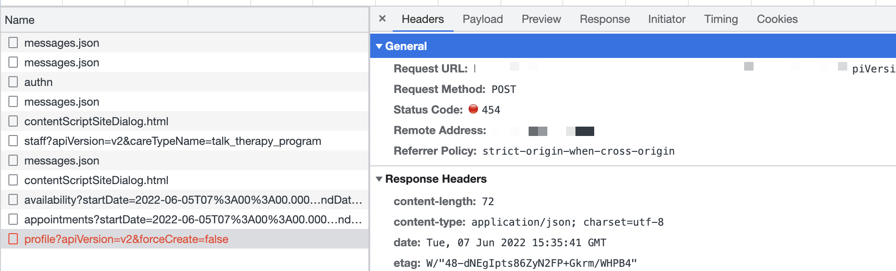

Here's my 2nd favorite frustration with RESTful APIs, one where I spent the first 10 years of my career valiantly arguing for the wrong side.

You make a request. It returns `404 Not Found`. What's wrong?

https://twitter.com/Swizec/status/1533934323136573441

## Everything an error may mean

You may be requesting a resource that doesn't exist. Server looked in the database, found nothing, returned 404. As expected.

You may be requesting an API route that doesn't exist. Server got the request, couldn't figure out where it goes, returned 404. As ... expected?

You may be requesting [a domain that isn't configured](https://serverfault.com/questions/187020/what-http-status-code-should-an-unconfigured-domain-return). Server got the request, couldn't find the application, returned 404. Rare because DNS won't return 404, but it _can_ happen.

Any number of intermediary servers (proxies, VPNs, CDNs, NATs, etc) between your browser and your API may return a 404 Not Found. For any "didn't find the thing" reason.

The response can even get cached along the way. You'll get 404 for a few seconds even after you fix routing on the server 💩

## Protocol vs application level errors

> HTTP Status Codes work just fine. Use them.

The problem you're facing is that traditional RESTful design mixes domains between protocol and application errors.

You can't tell the difference between an error that happened on the way to your server, in your server, or inside your business logic. Is it really the same error when you can't find a user and when you typo'd the path? 🤔

Feels different doesn't it ...

That's why many modern APIs have started returning `200 Success` for everything. As long as the server machinery works.

    Status: 200
    {
      error: 'Not Found'
    }

GraphQL does this – everything is a POST and gets a 200 response. Even if your app breaks down. As long as the app itself is responding, you get a 200.

Some RESTful APIs do it too.

## An elegant (and evil?) solution

`200 Not Found` feels weird to me.

I understand the reasoning and dislike that nobody except your very special custom client understands there was an error. This can lead to over-aggressive caching from other servers in the chain.

Imagine a CDN that caches a `200 Not Found`. Fix all you want, CDN won't check with your server for 3 days 💩

You can use additional headers that explain why a 404 happened. Good approach. Can be cumbersome.

OR! You can invent a custom HTTP status code.


### Custom HTTP status code

The idea is not as crazy as it sounds. I checked.

[](https://stackoverflow.com/questions/7996569/can-we-create-custom-http-status-codes)

In the 4xx space, [status codes 452-499](https://developer.mozilla.org/en-US/docs/Web/HTTP/Status#client_error_responses) are unassigned and free to use for your nefarious means.

The ergonomics of a custom error code are great:

```javascript
async function example() {
  const res = await fetch("https://example.com/some/api")

  if (!res.ok) {
    if (res.status === 493) {
      throw new Error("Server said 493 not cool enough")
    }
  }

  return res.json()
}
```

Because your status code is in the `4xx` space, every piece of web machinery knows the client made a bad request. They won't know what kind, but they do know it failed.

You'll see it as an error in server logs too. Because that machinery knows it's an error.

And it won't get unexpectedly cached. Because caches know it's an error and cache less aggressively.

Even your browser shows it as a helpful error when debugging.



### The major downside

Inventing HTTP status codes of your own comes with one major downside:

What if the HTTP protocol starts using your code in the future? Then you're back to not knowing the difference _and_ your status code is wrong.

But HTTP moves slow 🤞

Cheers,<br/>
~Swizec

PS: APIs may return 404 on unauthenticated requests for security reasons. They don't want to reveal whether something exists, unless you're allowed to know. GitHub does this.
