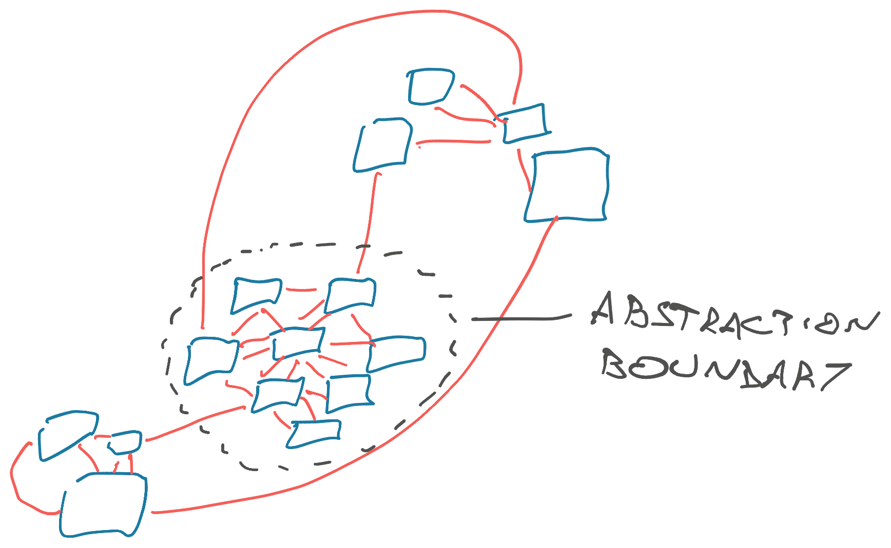

You know how sometimes you're building a thing and everything keeps going wrong? Edge case after edge case, workaround after workaround. Things are just hard 😩

You may have the wrong abstraction my friend.

I'm reading [System Design and the Cost of Architectural Complexity](https://dspace.mit.edu/handle/1721.1/79551), an MIT PhD thesis from 2013 by Daniel J. Sturtevant. It found empirical proof that engineering decisions matter 🤩. You can read my scribbled-over version at [/pdfs/system-design-and-the-cost-of-architectural-complexity-with-swiz-notes.pdf](https://swizec.com/pdfs/system-design-and-the-cost-of-architectural-complexity-with-swiz-notes.pdf). Right now I'm about a third through.

## Why architectural complexity matters

Sturtevant's study found that architectural complexity:

1.  Decreases productivity by up to 50%
2.  Increases bug density by 3x
3.  Causes an order of magnitude increase in staff turnover

That's a huge effect. The author developed an empirical measure of architectural complexity and was able to show its effect on engineers by comparing different files in the same real world project. Working in areas with higher complexity had worse outcomes than poking areas with lower complexity.

## What _is_ architectural complexity

Sturtevant compares different academic measures of complexity and concludes that:

1.  _Measuring_ complexity is hard
2.  Every engineer knows it when they see it

Academics use engineers as a benchmark to judge whether a metric they develop correlates with experts' subjective feelings. This is in line with other research I've read saying that ethnographic approaches to studying software engineering are the most useful. Seeing what experts do and turning it into theory, not the other way around.

Out of available metrics, Sturtevant concludes that [cyclomatic complexity](https://en.wikipedia.org/wiki/Cyclomatic_complexity) is the best metric to answer _"Is this piece of code hard to understand?"_. The more indents you have in a code, the more complex it is.

But cyclomatic complexity doesn't work for _systems_.

Modern software isn't hard because the code is hard, it's hard because of emergent behaviors and spooky systemic behaviors. Because no one engineer knows how everything works.

### Your code is a network

Instead Sturtevant's research hinges on a metric he calls _architectural complexity_. This one measures how many connections exist between parts of a system.

Using this approach lets you analyze a codebase as a network graph and identify modules with tight or loose coupling, connections between modules, notice abstractions, choke points, layers, etc. Any big mess immediately stands out.

He points out that senior engineers "see" this structure when working with code. As opposed to more junior team members who rely on reading the code itself.

Interestingly that means good naming of functions, variables, etc is less important to seniors because they don't really read the code. The name is just a symbol.

## The impact of a wrong abstraction

Abstractions are key to taming architectural complexity.

You can think of an abstraction as a boundary between tight internal coupling and loose external coupling. A choke point through which unrelated modules talk to a piece of functionality.

A good abstraction hides details and makes them unimportant. You call a function, it does the thing, and you don't care how. The opposite of [lasagna or minestrone code](https://swizec.com/blog/the-italian-foods-theory-of-bad-software-design/).

A bad abstraction ... that feels like work. Like Sturtevant's thesis I'll quote from Daniel Jackson's [Software abstractions; logic, language and analysis](https://mitpress.mit.edu/9780262528900/software-abstractions/) because it's so good:

> Software is built on abstractions. Pick the right ones and programming will flow naturally from design; modules will have small and simple interfaces; and new functionality will more likely fit in without extensive reorganization. Pick the wrong ones, and programming will be a series of nasty surprises: Interfaces will become baroque and clumsy as they are forced to accommodate unanticipated interactions, and even the simplest of changes will be hard to make. **No amount of refactoring, bar starting again from scratch, can rescue a system built on flawed concepts.**
>
> When good abstractions are missing from the design, or erode as the system evolves, the resulting program grows barnacles of complexity. The user is then forced to master a mass of spurious details, to develop workarounds, and to accept frequent inexplicable failures
>
> An abstraction is a structure, pure and simple – an idea reduced to its essential form.

So, when everything feels hard, you may be doing it wrong. Time to step back and rethink your approach. The sooner the better.

Cheers, 
~Swizec
