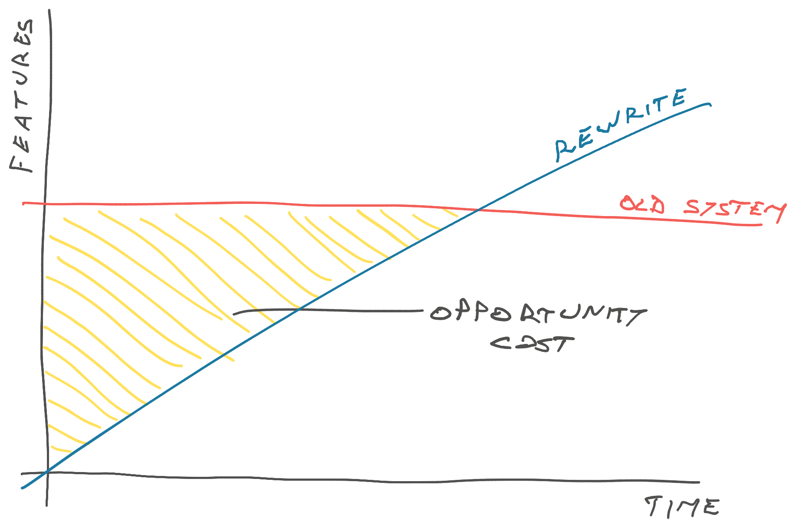
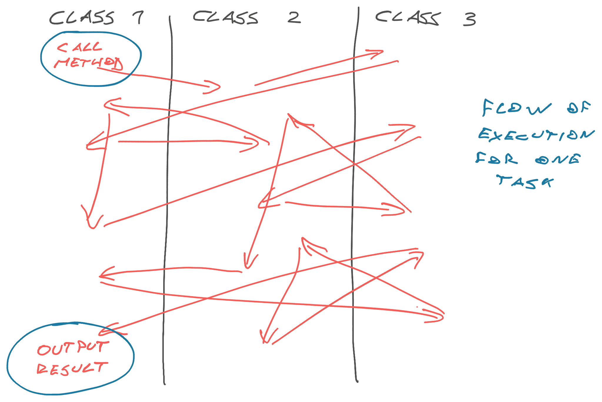
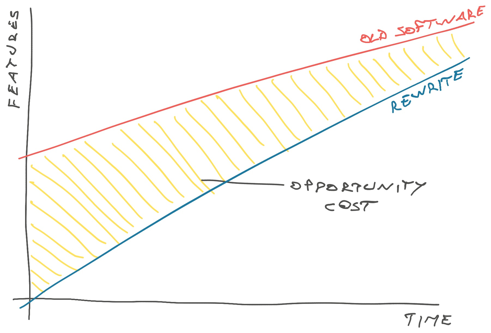

_👋 here's an excerpt from the Manning book I'm writing that I think you'll like._

In his famous [Things You Should Never Do](https://www.joelonsoftware.com/2000/04/06/things-you-should-never-do-part-i/) essay, Joel Spolsky says never to attempt a rewrite. It cannot succeed _and_ you're throwing away lessons learned. Lessons you'll need to re-learn again.

But [research](https://mitpress.mit.edu/9780262528900/software-abstractions/) and experience show that you can't fix the wrong abstraction – you _have to_ rewrite the code to fit new reality.

I think we're talking about different definitions of "rewrite". Joel is talking about the types of rewrites engineers first think of when they hear "rewrite":

1.  Stop the world and rewrite
2.  Build a new system next to the old

These sound clean and tidy. The old and the new system stay neatly separated while you work. But that almost never works.

The culprit is opportunity cost. These sorts of rewrites tend to runaway in scope.

## You can't stop the world and rewrite

When Christopher's team started work on rewriting the systems of the world's largest furniture manufacturer, they understood the challenge: Big system, lots of code, decades old.

Just knowing the full scope of what you're building can be difficult in a system like that. The team wanted to mitigate risk by delivering incremental improvements and adopting new code piece by piece.

But the business side was not ready. They couldn't work in a half new half old way. The whole migration would have to come down to pressing the big red button when everything's ready.

They never pressed the button.

After 2 years, the business decided that switching was too risky and scrapped the project. Now Christopher's team had to go back and retrofit 2 years worth of improvements to the old system. Because it lay there neglected while they were busy building the new world.

This is a painful story, but not uncommon. A lot can go wrong when you stop the world.

### Stopping creates risk

I was once asked to fix a company's billing system.

5 years of legacy business models started to stack up and bad code was slowing us down. Business had a new experiment to try and we ... couldn't. There was no way to make it work.

Nobody understood how the system works – too many cooks over too many years. We knew roughly where the code was, which tables held the data, and that was it.

My charge was to:

- make the code support our new business model,
- kill old business models,
- support some not too old models,
- allow everyone to migrate to the new model during a grace period where old models keep working

You know, the "make this impossible but also possible" ask that businesses love to make. I estimated 2 weeks of work and got to cleaning.

### You can't estimate accurately

Our 2 week estimate was based on assumptions we hoped were true. A proper estimate would mean digging into the code so much you may as well do the work.

Naturally, the system was even worse than we feared. [Spaghetti code](https://swizec.com/blog/the-italian-foods-theory-of-bad-software-design/) barely begins to describe it. Control flow bounced from function to function, module to module, with zero rhyme or reason. A masterpiece produced by years of _"Oh I'll just add this quick special case right here"_.

Projects like this are plagued by known and unknown unknowns. There is no way to know what you'll find without doing an extensive roadmapping project ahead of time. But that may take longer than the business is willing to spend.

_"Can I spend a week estimating how long fixing this code will take?"_ is a tough ask. It takes an experienced engineering leader to say yes.

Making a guess and adjusting as you learn more is usually the best you can do.

### And now you're stuck

6 weeks into my 2 week estimate the billing system was a mess. The original code limped along, the window of opportunity to try our new business model was all but gone, and my long-lived branch was full of bugs and half-written code.

When stakeholders asked what's going on it was like [that scene from Malcolm in the Middle](https://youtu.be/AbSehcT19u0) – Lois finds Hal in the garage under the car covered in grease and says _"Hal can you fix the lightbulb?"_. Hal rolls out and shouts, annoyed, _"What does it look like I'm doing!?"_

https://youtu.be/AbSehcT19u0

We were stuck past the point of no return. Couldn't make changes to the old code because they'll be gone soon, couldn't use the new code because it wasn't ready.

Eventually we negotiated some complexity, supported fewer old business models, and completed the rewrite. Then spent 2 months fixing bugs and re-adding old lessons.

## You can't build a new system next to the old

Nobody likes to feel stuck during a hard-to-estimate rewrite. You try a different approach next time – split the team. One team works on the fresh rewrite, the other maintains existing code.

Sounds great:

- bugs keep getting fixed
- product keeps adding features and running experiments
- the rewrite team can focus

But the exact problem you're avoiding is now the biggest risk for your rewrite: The target is running away!

The only way you'll ever catch up is, if you _code even faster_. A little bit of slope beats a lot of y-intercept, yes, but how much slope does the maintenance team have?

If the old code has 104 weeks worth of features, and the maintenance team works on fixes and additions for 1 day per week ... you'll need 130 weeks to catch up. That's almost 3 years 🥲

To catch up faster, you'll have to do more than a week's worth of work per week. You can save a few weeks by avoiding old mistakes. And you totally won't make any new mistakes, right?

The same old challenges remain:

- known and unknown unknowns
- nobody understands the old code
- use-cases you forgot existed

Like when we set out to rewrite that login page in React and discovered that there's _two_ login flows – email _and_ sms. The estimate ballooned every time we looked at the code. 😅

The biggest challenge with chasing a moving target is that the old code continues to kick the can. As other teams find new use-cases and uncover bugs, you have to build those twice – once in the old code, once in the new code.

Meanwhile your new code is _not_ kicking the can because it sits there unused until it's ready. Imagine all the bugs and missed use-cases you'll find when it ships ...

Cheers, 
~Swizec
