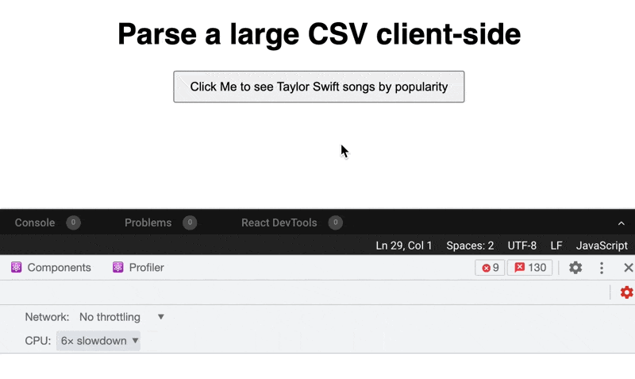
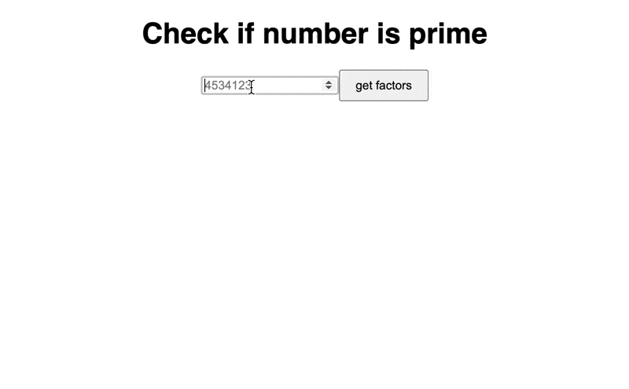

React Query brings [the ergonomics of GraphQL clients to RESTful APIs](https://swizec.com/blog/how-react-query-gives-you-almost-everything-you-thought-you-needed-graphql-for/). It scratched _my_ itch.

Getting a whole company onto a new way of writing the API layer is hard and there's real work to do. React Query offers the perfect middle ground.

Keep the RESTful API you're used to, get the request deduping, data caching, loading states, re-fetching, and hooks ergonomics you dream of. 😍

You can use those same ergonomics for any slow operation. Doesn't have to be an API call.

https://twitter.com/Swizec/status/1456761470042054666

## A slow client-side operation

Say you're parsing a CSV client-side.

You _could_ run a file upload, parse and validate on the server, respond with any errors, and tell the user what happened. That's the usual approach and it's okay.

A better approach is to use a library like [Papa Parse](https://www.papaparse.com/). Load file into browser memory or use a link, parse and validate, show the user what happened, ask for confirmation, send parsed JSON to your API.

Here's an example that parses and displays [Taylor Swift Spofity data from Kaggle](https://www.kaggle.com/thespacefreak/taylor-swift-spotify-data).

https://codesandbox.io/s/priceless-mirzakhani-nsb1p?file=/src/App.js

We're using a trick to load the CSV – Webpack imports it as a data URL and `fetch()` parses that data into a File format. This is okay for a demo, but bloats your bundle size. You should use [client-side file reading](https://swizec.com/blog/serverless-file-upload-to-s3-with-nextjs-and-aws-lambda-codewithswiz-27/#read-file-as-a-binary-blob) for a serious project.

https://twitter.com/Swizec/status/1457037060078927876

### Do thing, set state, yawn

You have to write your bazillionth state setter. Boilerplate you could write in your sleep, if it wasn't so easy to write a bug.

```javascript
const [taylorSwiftSongs, setTaylorSwiftSongs] = useState([])
async function parseCSV() {
  const file = await dataURLToFile(csv, "spotify_taylorswift.csv")

  // parse the file
  Papa.parse(file, {
    header: true,
    complete: (data) =>
      setTaylorSwiftSongs(
        // sort by popularity
        data.data.sort((a, b) => Number(b.popularity) - Number(a.popularity))
      ),
  })
}

// ...

;<Button onClick={parseCSV}>Click Me</Button>
```

1.  Define a new state that starts with an empty array
2.  create a function to call on user action
3.  run the operation (Papa.parse + sort for us)
4.  set state

No wonder people are eyeing Svelte where a compiler writes much of this code for you. 😅

### Render the data

Because this is a demo, we show a list of Taylor Swift songs by popularity. Your project would do something super cool here.

```javascript
{
  taylorSwiftSongs ? (
    <ol>
      {taylorSwiftSongs.map((song) => (
        <li key={song.id}>
          {song.name} – {song.album}
        </li>
      ))}
    </ol>
  ) : null
}
```

If songs are loaded, iterate through and render a list. Otherwise show nothing.

### What about loading states?

Parsing our CSV is pretty fast on a modern computer. You [almost don't have to think about web performance](https://swizec.com/blog/screw-web-performance-just-wait-a-little/) these days.

But we're treating it as a slow operation. Would be nice if the user knew their click didn't fall into the void.

There _is_ a small delay when you click the button:


Okay it's _very_ small. Remember when I said a large CSV would bloat bundle size? Pretend this is a 200MB monster that the user imported instead.

To add a loading state, you need to write yet more boilerplate.

First, you add a loading state to your button:

```javascript
import Loading from "./loading.gif"

function Button({ loading, onClick, children }) {
  return (
    <button
      onClick={onClick}
      style={{ padding: "0.5rem 1rem" }}
      disabled={loading}
    >
      {loading ?  : children}
    </button>
  )
}
```

Shows a loading gif and disables the button when `loading=true`. You'll need this part no matter what.

Then you set the loading state while your slow operation runs:

```javascript
const [taylorSwiftSongs, setTaylorSwiftSongs] = useState([])
const [loadingSongs, setLoadingSongs] = useState(false)

async function parseCSV() {
  setLoadingSongs(true)
  const file = await dataURLToFile(csv, "spotify_taylorswift.csv")

  // parse the file
  Papa.parse(file, {
    header: true,
    complete: (data) => {
      setTaylorSwiftSongs(
        // sort by popularity
        data.data.sort((a, b) => Number(b.popularity) - Number(a.popularity))
      )
      setLoadingSongs(false)
    },
  })
}
```

And you find out that modern computers are really fast. A gif doesn't have enough frames to show the flash of loading state 😂


But if you throttle CPU in devtools, now we're talking.



PS: where's the error handling? What if the CSV fails? 🤔

## Simplify your code with React Query

Writing all that boilerplate was tedious. Instead, we can use React Query.

```javascript
const taylorSwiftSongs = useMutation(async () => {
  const file = await dataURLToFile(csv, "spotify_taylorswift.csv")

  // we need to wrap Papa in a promise
  return new Promise((resolve, reject) => {
    // parse the file
    Papa.parse(file, {
      header: true,
      complete: (data) => {
        const sorted = data.data.sort(
          (a, b) => Number(b.popularity) - Number(a.popularity)
        )
        resolve(sorted)
      },
    })
  })
})
```

We kept the same core of our code – turn CSV into a file, ask Papa to parse.

Because Papa is an older library, we had to wrap the code in a promise. Makes it work better with async/await.

But look there's no boilerplate!

https://codesandbox.io/s/using-react-query-otpxf

No fiddly states, no loading, and we even get error handling. It's all in the `taylorSwiftSongs` object.

You call `taylorSwiftSongs.mutateAsync()` and React Query handles the rest. `taylorSwiftSongs.data` will hold your data (whatever your async method returns), `taylorSwiftSongs.isLoading` tells you loading states, `taylorSwiftSongs.isError` for errors, ...

It's a mutation because we want to run this code when users click a button. `useQuery` for when you want to replace an awkward `useEffect` that runs on mount. ✌️

## Okay but that code was fast

You are right, that code was fast. How about we try to find all factors of a number instead? Using the simplest algorithm possible.

```javascript
async function getFactors(number) {
  return new Promise((resolve) => {
    setTimeout(() => {
      // the algorithm
      const factors = []
      for (let i = 2; i < number; i++)
        if (number % i === 0) {
          factors.push(i)
        }
      resolve(factors)
    }, 0)
  })
}
```

We wrap the algorithm in a Promise and timeout so our calculation doesn't block the UI. Even better would be moving this to a Web Worker, but that's an article for another day.

Once you have a slow function, `useQuery` is the easiest way to hold it.

```javascript
function Factors({ number }) {
  const factors = useQuery(["factors", number], async () => {
    return getFactors(number)
  })

  if (factors.isLoading) {
    return 
  } else if (factors.isError) {
    return <p>Oh no something went wrong</p>
  } else if (factors.data) {
    return (
      <p>
        {number} has {factors.data.length} factors, they are [
        {factors.data.join(", ")}]
      </p>
    )
  }
}
```

We set the cache key to `["factors", number]` and use `getFactors` in the query function. Then we let React Query handle our loading and error states.

The end result is a neat UI that caches slow computations for reuse. ✌️



Try it for yourself. Make sure you don't use _crazy_ numbers because your browser will hang.

https://codesandbox.io/s/slow-algorithm-code-i7d14

Cheers,<br/>
~Swizec

PS: in the future, [React useTransition](https://swizec.com/blog/a-better-react-18-starttransition-demo/) will make this pattern a first-class citizen
