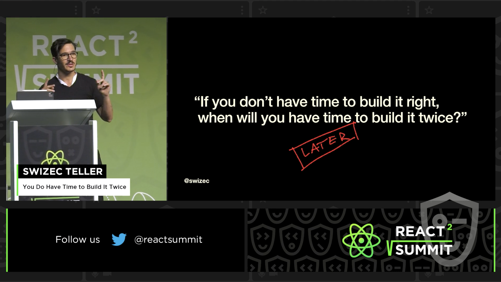

My [talk from React Summit is now online](https://portal.gitnation.org/contents/you-do-have-time-to-build-it-twice), if you're curious. It's about code rewrites in the context of hyper growth startups. The ultimate sin. Or is it 🤔

My thesis is that code rewrites _enable_ fast growth. Here's the pitch:

> If you don’t have time to build it right, when will you have time to build it twice?
>
> In hyper growth startups the old adage breaks down. You get an expanding time horizon – IF you can get it shipped. An imperfect feature next week beats the perfect feature 2 months from now. Your code won’t matter if you’re dead.
>
> I didn’t believe this until I saw it myself.
>
> A startup on the cusp of hockeystick hired me to rewrite their jQuery app in React. Their tech proved the idea then became a burden.
>
> Over the next year we rewrote the whole app from scratch, grew a team of React experts, created a codebase that’s a joy to work with, and got the company to a $100,000,000 Series B. All because the early engineers knew that if the crappy version works out, there’s going to be time and resources to fix it later.
>
> This talk is about what I’ve learned while rewriting an app with users banging down the door.

The audience loved it, [but I didn't](https://swizec.com/blog/the-audience-loved-my-talk-but-i-didnt/). Plus I had a terrible hair day 🙈. What do you think?

Cheers, 
~Swizec
