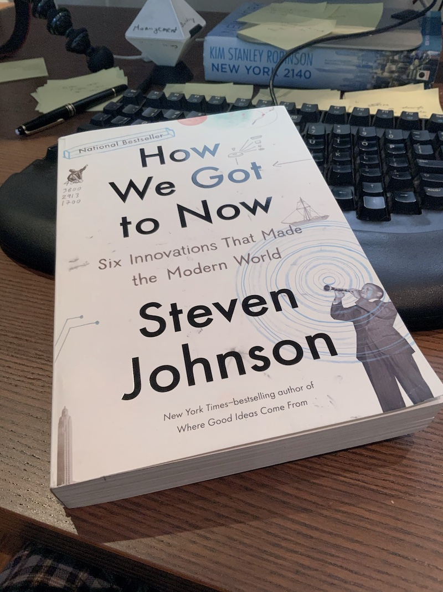

Your mental model about ideas is all wrong my friend.

[How We Got To Now](https://en.wikipedia.org/wiki/How_We_Got_to_Now) describes Frederic Tudor as "comically ambitious". A 19th century Bostonite whose father sent him to the Caribbean in 1800 – at 17 years of age.

He arrived in summer.

Humid, hot, downright atrocious weather for someone used to Massachusetts winters, frock coats, and top hats. Locals liked it fine enough, but they didn't know any better.

This gave [Frederic](https://en.wikipedia.org/wiki/Frederic_Tudor) an idea 👉 ice.

What if you could have a refreshing glass of cold water in the blistering Caribbean summer heat?

Fantastic! But it's 1800 and there's no such thing as a fridge

THERE'S FREE ICE ALL OVER BOSTON! Brilliant.

What a killer business idea. You take ice from a Boston lake in winter, free since nobody wants it, transport that ice to the Caribbean where it's hot, sell for big bux. 🤑

## The idea becomes a prototype

6 years later he set sail for Martinique with his first ship full of ice.

> No joke. A vessel has cleared at the Custom House for Martinique with a cargo of ice. We hope this will not prove a slippery speculation. ~ Boston Gazette

Most of Frederic's ice melted on that voyage. Much of the rest melted in Martinique. And locals, who'd never seen ice before, didn't know what to use it for anyway.

He lost $4500 on that trip. $92,000 in today's money.

But ice was free, renting empty ships on their way to get sugar was cheap, and he did sell _some_ ice. Frederic Tudor kept going.

After more failed trips and a stint in debtor's prison, he figured it out. It was 1815.

## The prototype becomes a process

You harvest ice in the Boston winter. Cut it into large blocks, insulate with sawdust, store in cave-like warehouses. Both ice and sawdust are free, you just pay the labor and the warehouse. 👌

Rent cheap empty boats and ship off to the Caribbean.

Some ice melts on the way, but not much. The blocks are large and the sawdust insulates well.

Once in the Caribbean, you store that ice in purpose-built ice houses. Local businesses buy it by the block. Store in their own ice rooms.

Folks have gotten used to the idea of _cold drink in hot summer_, too. They wanted it now. They understood.

## The prototype becomes a business

By 1820 The Tudor Ice Company had icehouses packed with frozen water all over the American South. By the 1830's they reached as far as India. By 1850 the first competition showed up.

Ice trade became a well-established global business. Reaching all parts of the world from Hong Kong to Calcutta.

Tudor now known as The Ice King amassed some $200,000,000 in today's money by the time he died in 1864.

And it all started with that initial hunch in 1800 that you could sell a winter nuisance to a population that's never seen cold.

It wasn't until the American Civil War that artificial ice overtook natural ice as The Way To Keep Things Cold™. And ice blocks remained popular well into World War 2 when fridges became small enough to stick in restaurants, shops, and homes.

Tudor pretty much invented the idea of cold in summer.

## How you develop an idea

Your best ideas work like a slow hunch. You collect little scraps here and there until one day they fit together to **solve a problem**.

That's your first kernel. The idea – a solution to a problem.

Then you gotta prove the problem is solvable and your solution works. **You build a prototype.**

And you're done.

Lol no of course not. Now comes the hardest part 👉 _develop_ the idea.

You have to show that your prototype solves a problem for others. That they see the problem. That they want the solution. That they'll use _your_ solution. That you can reach them. That you know how to market to them. That ...

You iterate. You reshape. You refine. You build the moving pieces for the whole idea. Not just your initial hunch.

And success awaits my friend. Maybe. With a little luck :)

Happy Tuesday ❤️

Cheers,  
~Swizec

PS: some of the most fun projects you can work on never make it past the prototype stage
