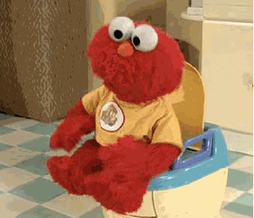
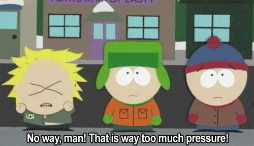

It&#x27;s been 40 days since I published [my last daily video](https://www.youtube.com/watch?v=IvR-vxTYhKQ&index=30&list=PLF8WgaD4xmjWuh7FTYTealxehOuNor_2S).

26 days since I said, [”Ok. getting back to it now.”](https://swizec.com/blog/learned-recording-educational-video-every-day/swizec/8405)

Last night, I finally made a new one. After 50 minutes of procrastination, it took 15 minutes to produce.

But I didn&#x27;t publish. Yet.

https://twitter.com/boaticus/status/1009067338241576960

It&#x27;s all got to do with [the psychology of daunting tasks](https://dcgross.com/accomplish-dread-tasks/) and the vicious cycle that creates.

Here&#x27;s how it works for me 👇

You do something creative every day. You&#x27;re having a blast. You make a video or a blog post or a piece of code or a tiny open source library. Create create create. Write write write. Publish publish publish.

The feedback loop is tremendous. The more you create, the more creative you become. Every idea breeds five new ideas.

Explore a concept, find five new concepts. I should write about that and that, and oh that too! Someone asked me a question, amazing. Ooh, that tweet was interesting, I can do so much with that.

You get feedback, you get help, you get questions. The results compound and soon you have more ideas than you have time.

And then you stumble.

You have a conference. Or you get a little tired. A little burnt out. Your girlfriend says you&#x27;re an ass and should spend time with her, too. Or your creative practice leads to some cool opportunities and you have to say to yourself _&quot;Well fuck, this is such a cool opportunity, I can&#x27;t not do this! But then I won&#x27;t have time to create every day. But I have to do this. Isn&#x27;t this what I&#x27;ve been working towards this whole time? I gotta.”_

You miss a day. No biggie.

You miss two days. Okay.

You miss 3 days.

Ooof, now you need something worthy of 3 days to come back with. But what?

You don&#x27;t know what. 3 more days pass.

Shit. Now it needs to be awesome enough for 6 days!

That&#x27;s intimidating. What could possibly be good enough to warrant a 6 day hiatus?

6 more days pass.

Damn it!

Now you&#x27;re stuck in a loop. The more time passes, the more pressure you feel that the next thing you publish has to be really, really good. The harder you are on yourself, the harder it becomes to do anything.

That pressure to create something good is the killer. It guarantees you will never create anything at all.

And without creating, you won&#x27;t have ideas. You won&#x27;t have the compounding effect of ideas making more ideas. You&#x27;ll just have the compounding effect of pressure and more pressure bringing you down.

The only solution is to create. Force yourself to do something tiny. Stupid. Simple. It doesn’t have to be big or awesome. You&#x27;re just breaking the cycle.

And you know what they say about creative things that don&#x27;t spread, don&#x27;t you? They don&#x27;t spread.

That&#x27;s a blessing. An idea or video or blogpost or article or book that doesn&#x27;t spread is an idea, video, blogpost, or article that nobody saw.

You have permission to suck. Nobody&#x27;s gonna see it anyway. 😉

## Here’s the point…

Don&#x27;t be like that band who makes a great album, goes on tour, and forgets to make the next album. Too busy being successful.

Or that author who writes a book, makes some sales, and feels too much pressure to write the next hit.

Or that maker who launches an app, gets some customers, but &quot;not enough&quot;, and spends 2 years polishing and perfecting the next one only to find out they&#x27;re solving the wrong problem.

Stephen King asks [Can a novelist be too productive?](https://www.nytimes.com/2015/08/31/opinion/stephen-king-can-a-novelist-be-too-productive.html). Maybe. Probably not.

https://www.youtube.com/watch?v=xR7XMkjDGw0
