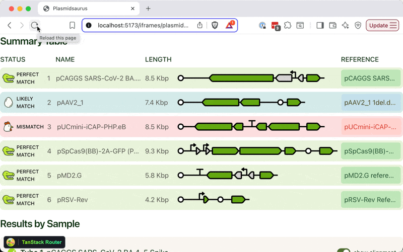
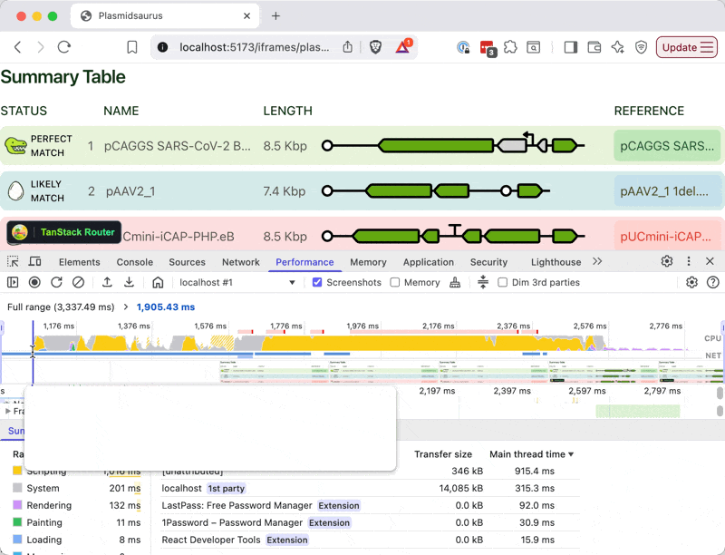
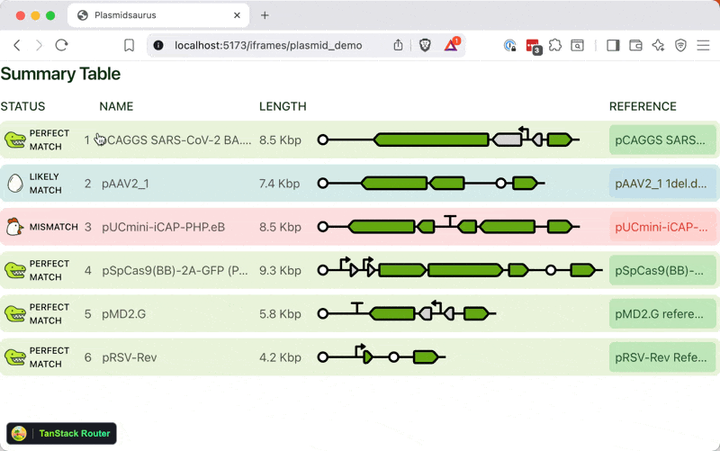

\[name|Friend], when you see a `useEffect` that updates a `useState` and returns a value, you might be looking for a `useSyncExternalStore`. This is my current vendetta.

Makes it easier to fix jank like this:



_PS: you can [read and share this online](https://swizec.com/blog/you-may-be-looking-for-a-useSyncExternalStore/)_

## A common pattern

A pattern I see a lot in our React code combines a state, an effect, and a subscription:

```javascript
function useSomeValue() {
  const [value, setValue] = useState(0);

  useEffect(() => {
    const eventSource = getEventSource();
    eventSource.subscribe((val) => setValue(val));

    return () => {
      eventSource.unsubscribe();
    };
  }, []);

  return value;
}
```

This is a custom hook that subscribes to an event source like a browser API, or a ResizeObserver, or a state machine. Sometimes includes refs to the DOM to measure things.

This works.

The effect runs on mount, subscribes to a thing, updates state to trigger re-renders, and cleans up with an unsubscribe when the component unmounts. It's a pattern you're familiar with after writing React for a while and you easily spot what's happening.

## Can lead to jank with server rendering

The problem is that React has to render your component 2+ times before it settles into what you wanted. First it renders with a default value, then the effect runs, then it re-renders when state updates.

What you saw in the gif above is a slow hydration process.

1. Component rendered on server with default values
2. Couldn't subscribe to browser events because there's no browser (I haven't confirmed if effects run at all)
3. HTML showed up in the browser
4. Hydration ran to make everything interactive
5. Finally the effect ran on mount
6. Subscribed to browser event
7. Updated state
8. And rendered the component



Look at all that JavaScript compute chugging away :D It's not a data issue, notice there's no network calls on that graph. We preload data with a shared query cache during server rendering.

## useSyncExternalStore to the rescue

The right way to do this effect+subscribe+state pattern is a [useSyncExternalStore](https://react.dev/reference/react/useSyncExternalStore). This took me a long time to grok but it's super neat. The API is cleaner and you can specify a _server-side default value_.

Like this

```javascript
const eventSource = getEventSource();

function subscribe(callback) {
  eventSource.onChange(callback);
  return () => {
    eventSource.unsubscribe(callback);
  };
}

function useSomeValue() {
  const value = useSyncExternalStore(
    subscribe,
    () => eventSource.currentValue(),
    () => defaultValue,
  );

  return value;
}
```

We now have an explicit `subscribe` function that executes a callback when the value changes. This runs our value getter – the 2nd param to `useSyncExternalStore`. Last param is a default value getter that runs during server rendering.

You could, for example, initiate a ResizeObserver in your subscribe function, then measure a `ref` as your value getter.

The result is a less janky app.



Now you just gotta figure out how to set the right default values to minimize jank.

Cheers,<br />
\~Swizec
