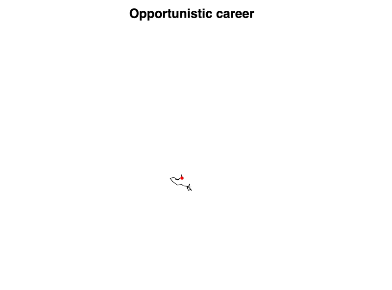
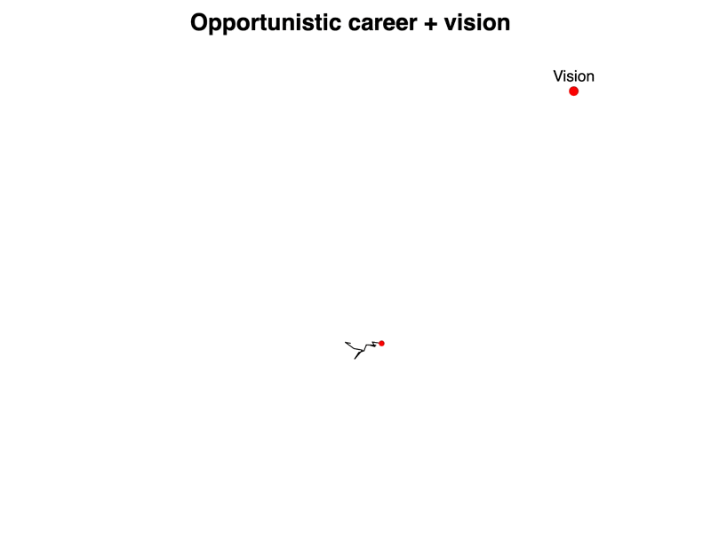
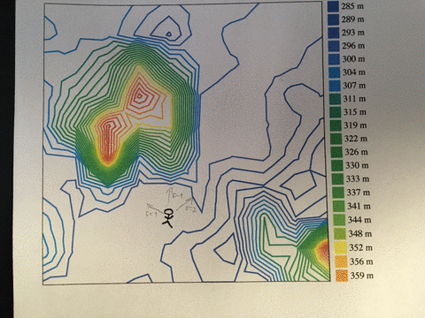

import { ContentUpgrades } from "@swizec/gatsby-theme-course-platform";
import RandomWalk from "../../../widgets/RandomWalk.js";

In his book, The Art of Science and Engineering, Richard Hamming says the key to a great career is vision.

https://twitter.com/Swizec/status/1411323188269568005

He likens your career to a [random walk](https://en.wikipedia.org/wiki/Random_walk). A meandering path through the unknown where each step goes in a random direction.

No matter how fast you walk, [how often you change jobs](https://swizec.com/blog/what-if-engineers-were-paid-like-athletes/), you'll never make it farther than the square root of the number of steps – `Math.sqrt(n)`.

You can grind out more steps but it's gonna be one hell of a grind. You'll burn out before you get anywhere.

Now look what happens when you add vision.

Each step is random, but they're 10% biased towards a vision. You travel a distance proportional to `n` and go far!

You can try it yourself here:

https://codesandbox.io/s/random-walk-with-a-vision-blsxl

## What's going on here

You can think of your career as a [multi-variate optimization problem](https://swizec.com/blog/these-19-words-are-the-only-selfhelp-and-business-advice-you-need/). You're looking for the best balance among the criteria you care about.

For most people that's a balance between income, freedom, impact, and the rest of your life. The problem has no exact solution.

Computer science solves this class of problem with a [hill climbing algorithm](https://en.wikipedia.org/wiki/Hill_climbing). Neural networks use it to converge on a solution, for example.

1.  start at random spot
2.  pick direction
3.  take step
4.  are you closer to the goal?
5.  goto 2

You can't choose your starting spot. That happened before you were born. The rest is in your control.

How many steps do you take? How big are they? That decides how fast you go and how many at-bats you get. The more attempts, the better.

Do you pick directions randomly? Follow every opportunity, chase every lead, do whatever anyone asks?

That's a random walk. No matter how big your steps or how fast, you won't get far.

But if you add a pinch of vision, a small bias towards your goal, you'll have a great career. My simulation has just a 10% chance of making the right decision and look what happens.

What's your vision? Who do you want to be?

Cheers, 
~Swizec

PS: the random walk visualizations were [coded live on stream](https://www.youtube.com/watch?v=XjwXGQYco5s), if you're curious how they work, you can also [see the source code on CodeSandbox](https://codesandbox.io/s/random-walk-with-a-vision-blsxl)
