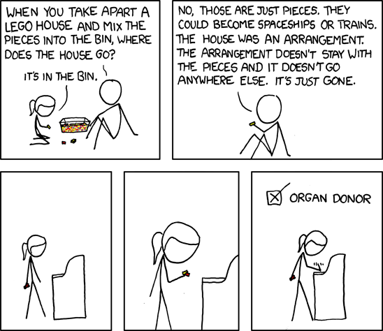

Your code doesn't matter my friend. But what does that even mean?

It's something experienced programmers say, between the lines, when they talk about concepts behind the code and sound like complete lunatics. Like a friend tripping on acid or high on weed who _Gets It_ and can't put it into words.


Like Linus Torvalds, the creator of git and Linux said:

> Bad programmers worry about the code. Good programmers worry about data structures and their relationships.

Or Fred Brooks, author of Mythical Man Month:

> Show me your flowchart and conceal your tables, and I shall continue to be mystified. Show me your tables, and I won't usually need your flowchart; it'll be obvious.

Or Eric S. Raymond, author of The Cathedral and The Bazaar:

> Smart data structures and dumb code works a lot better than the other way around.

Or even Cato the Elder, a Roman statesman:

> Have the argument clear in your mind, the words will follow naturally

The program is what you want to say. Your [understanding of the problem](https://swizec.com/blog/coding-forces-you-to-understand-the-problem/) and its solution. The code are the words you happen to use today. Tomorrow the words may change.

## Programs are concepts

Programs are like the LEGO house in [that XKCD comic](https://xkcd.com/659/). If you take it apart and put the bricks back in their box, where did the house go?



If you delete your code and write it a different way, where did the program go? 🤔

The program is an abstract concept. A combination of data structures, algorithms, and domain modeling. You can write it down a million different ways.

### A concrete example

Let's make a concrete silly example: Count to N.

You can write a classic for loop:

```javascript
for (let i = 0; i < N; i++) {
  console.log(i)
}
```

Or a modern for loop:

```javascript
for (let i in new Array(N).fill(0)) {
  console.log(i)
}
```

Or a `.map`:

```javascript
new Array(N).fill(0).map((_, i) => {
  console.log(i)
})
```

Or use a helper library:

```javascript
d3.range(N).map((i) => {
  console.log(i)
})
```

Or recursion:

```javascript
// this counts in reverse because I'm lazy
function count(N) {
  console.log(N)
  if (N > 1) {
    count(N - 1)
  }
}
```

Or a different programming language:

```python
for i in range(N):
	print(i)
```

You can draw a flow chart, a [turing machine](https://en.wikipedia.org/wiki/Turing_machine), or use [lambda calculus](https://en.wikipedia.org/wiki/Lambda_calculus). And they're all the same program. Same input, same output, same complexity, similar real world performance.

A good compiler might even guess your intent and translate them all to the same machine code!

So what's the difference between these examples? What does it matter?

## A focus on code makes your life harder

Code is the [shadows in Plato's cave](https://en.wikipedia.org/wiki/Allegory_of_the_cave). The current projection of a program.

https://twitter.com/Swizec/status/1540959055333711874

When the underlying structure is sound, the code is easy. Obvious, straight forward, easy to talk about, effortless. That's when you know the team deeply understands the problem.

When you use the wrong structure, or [don't lean into your tools](https://swizec.com/blog/25-lessons-from-25-years-of-coding/), the code is hard. Full of workarounds and edge cases and little exceptions to the rule.

Like the difference between these 2 React components:

```javascript
function DoesntUnderstandreact({ N }) {
  const [fizzbuzz, setFizzbuzz] = useState([])

  useEffect(() => {
    let temp = new Array(N).fill(0).map((_, i) => {
      if (N % 15 === 0) {
        return "fizz buzz"
      } else if (N % 5 === 0) {
        return "buzz"
      } else if (N % 3 === 0) {
        return "fizz"
      } else {
        return i
      }
    })
    setFizzbuzz(temp)
  }, [N])

  return (
    <ul>
      {fizzbuzz.map((w) => (
        <li>{w}</li>
      ))}
    </ul>
  )
}
```

```javascript
function UnderstandsReact({ N }) {
  const fizzbuzz = new Array(N).fill(0).map((_, i) => {
    if (N % 15 === 0) {
      return "fizz buzz"
    } else if (N % 5 === 0) {
      return "buzz"
    } else if (N % 3 === 0) {
      return "fizz"
    } else {
      return i
    }
  })

  return (
    <ul>
      {fizzbuzz.map((w) => (
        <li>{w}</li>
      ))}
    </ul>
  )
}
```

They both print [fizzbuz](https://en.wikipedia.org/wiki/Fizz_buzz) and they work. But something feels different ...

I probably sound like a lunatic raving about things that don't matter. We're [pragmatic programmers](https://swizec.com/blog/my-favorite-lessons-from-pragmatic-programmer/) and we care about real hands-on stuff! Not this philosophy bullshit.

But this is important. Soon enough _computers_ will write the code. Using AI. You'll to invent the program.

We're not far.

https://twitter.com/Swizec/status/1552368794890211328

Cheers,<br/>
~Swizec
