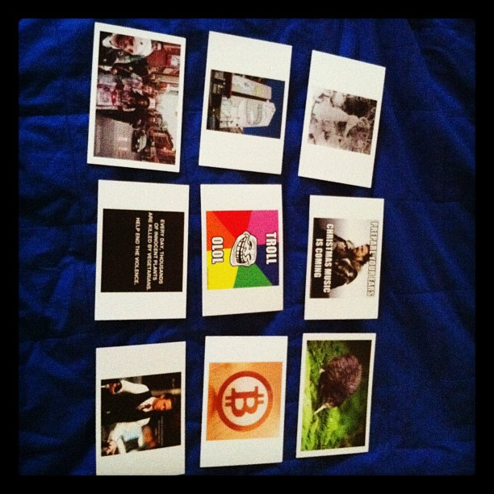

We like to think only our grandest biggest ideas are worth it my friend. Save world hunger! Solve poverty! Build the next Google! Send a rocket to Mars! Become Disney! Organize the world's information! Fix social media!

You know what's a billion dollar industry? Fucking [aglets](https://en.wikipedia.org/wiki/Aglet). Those little bits of plastic at the end of your shoelaces.

At 2¢ a pair and about 40,000,000,000 new shoes every year, that's $800,000,000 just for aglets. Not _quite_ a billion dollar industry, but damn.

You can make a killing with a tiny bit of plastic.

Oh and guess what, the fucking _cardboard box_ industry is worth $41 billion in the US alone. That's more than [all the professional sports leagues](https://en.wikipedia.org/wiki/Major_professional_sports_leagues_in_the_United_States_and_Canada) **combined** – NFL makes $13b, MLB $9b, NBA $5b, and $4b for NHL.

Well ... maybe not this year 😅

But what do you think is more achievable, getting into the NFL or starting a cardboard box business?

Fine, _making_ cardboard boxes is expensive. Bet you there's other parts of that industry. In NFL, too, someone has to bring water to the quarterback ...

Truth is it's your dumbest ideas that often work best.

Let me tell you a story.

## My first grand big idea

When I was in middle school, Terminator 2 hit TV screens and I was so impressed I decided to build an AI. Guess how that went? 😅

Started building in Delphi – because every AI needs a UI – made some progress until one day I realized: _"Swiz, you can't write all this code. You need to teach the computer to learn on its own from the environment"_

And actually ... you _can't_ make it work just inside your computer. It needs inputs from outside and you have no way of getting those.

That was a pretty big insight for a 13 year old ...

Turning 33 this year ... still haven't built an AI. Doesn't look like anyone else has either. A boy can dream. 😕

## My other grand big idea

In high school I tried to create _the best_ framework for building websites. All the others just felt like crap.

Didn't become a famous opensourcerer, but my boss at a web agency let me use it. My magnum opus ran in production 🤘

That wasn't enough.

I noticed something was rotten in the land of the interwebs! Too much info and sifting through it all to find something good is too damn hard.

I WILL BUILD A BETTER TWITTER CLIENT!

NO WAIT – AN AI RSS READER!!!!

Look at me pitching some prototypes to a very excited group at a local hacker space in Slovenia.

We spent 2 years on that idea.

Getting anyone to use our prototypes was like pulling teeth. The tech never quite worked. Melted our credit card the moment we launched on the app store.

Back then everyone with an iPad tried every new app. And we ran the full shebang for every user whether they were coming back or not. 😅

_Do not_ use expensive cloud infra to run AI algorithms in 2011.

So that flopped. I got fired as CEO.

## My first success

Got bored one weekend and built HipsterVision – a search engine for Instagram. Just to try their new API, launched 3 days prior.

College was fun like that. _"Oh I have an idea!"_ 👉 Go hack for 48 hours with no sleep.

It was totally dumb. An input box, type a string, pass the string to Instagram, show pictures. Had some tricks to localize search by city.

_Thousands of visitors._

Hit top of HackerNews and stayed there for a full day. Got the usual negativity, lol. [Check it out](https://news.ycombinator.com/item?id=2279619)

No screenshots survive, so here's some stats I found:

Might not look like much, but everyone in the Slovenian tech scene was very excited for me.

## My first $$$

It only gets worse from there. Wanna know the first time I made money online?

One Saturday morning after a night of partying in San Francisco, I was on a train back home with a friend. We were too poor for lodging in the city so just stayed up all night until the trains started running.

I had an idea: _"What if you could send memes as postcards?"_

We chatted about it excitedly the whole ride back to Palo Alto where we were interns at a very serious YC startup. They were gonna fix online journalism. It flopped.

But when I got home, I built Postme.me.

Here's an old blogpost about it: [Idea to profit in 3 days](https://swizec.com/blog/postmeme-idea-to-sales-in-3-days/)

Can't find the original HN launch. The followup [discussion is quite friendly though](https://news.ycombinator.com/item?id=3135469) ✌️

No stats or screenshots survive. Ran it for a few weeks then gave up. Couldn't figure out the marketing and I got tired of walking to the print shop and posting stuff at the post office.

Totally dumb idea.

What's your dumbest idea? Hit reply

Cheers,  
~Swizec

PS: [Find Your Idea](https://gum.co/fKfYf) closes tomorrow ❤️
