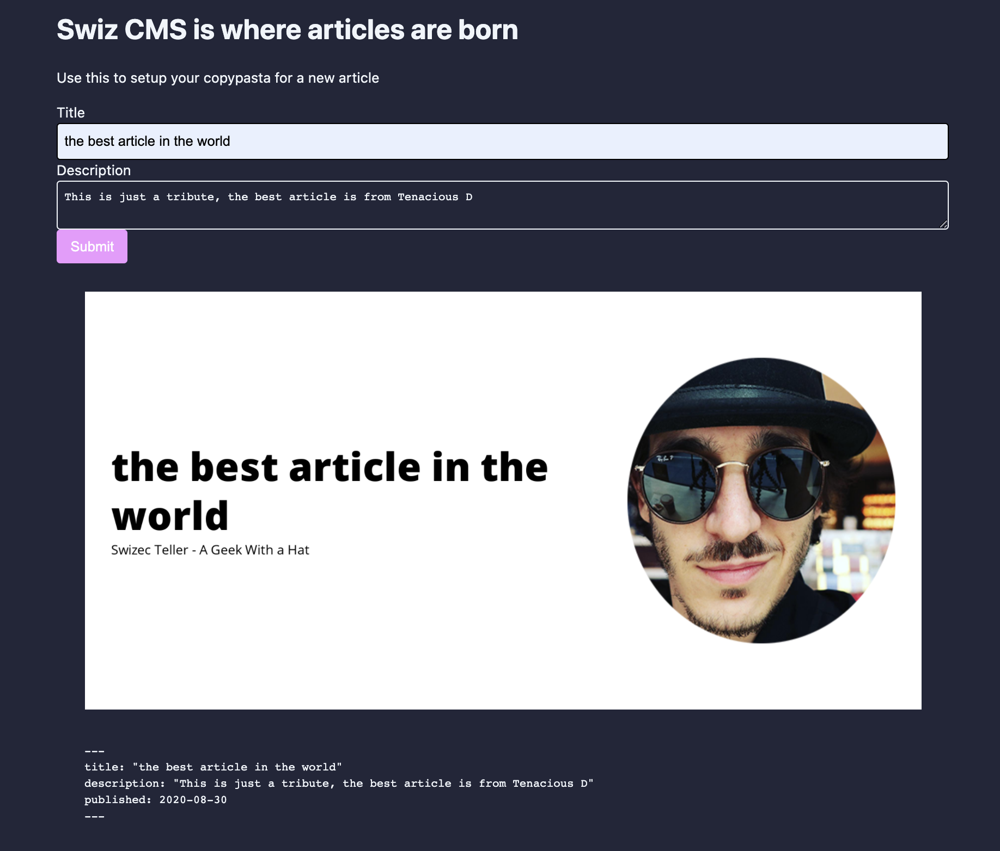

_CodeWithSwiz is a twice-a-week live series. Like a podcast with video and fun hacking. Focused on experiments. [Join live Wednesdays and Sundays](https://youtube.com/swizecteller)_

https://www.youtube.com/watch?v=YVyjST8jhbA

In this episode we tried [NextJS](https://nextjs.org/), a React webapp framework, and built a small app. You can see it live at [swiz-cms.vercel.app](https://swiz-cms.vercel.app/).

The ultimate goal for this app is to help folks create markdown articles. Copypasta is fine, but I always forget to change the title, write a description, add categories, and create a social card.

In 55min we went from _"Never tried NextJS before"_ to a working app with a design system, forms, static rendering, and talking to an AWS Lambda to make cards. Not bad.



## Initial setup

    npx create-next-app swiz-cms

That creates a plain ol' NextJS app. You get pleasant default styling, support for file-based routing, and server-side-rendering/generation out of the box.

Means you can add a new page by creating a file in `pages/file.js`. Anything in there becomes a page.

You get support for building APIs out of the box via `pages/api`, but we didn't try that on this stream. Next time 😉

Wish you got MDX support out of the box. Makes for a better experience writing landing pages, product descriptions, and other content-heavy materials.

I'm sure there's a plugin for that 🤔

## Adding a design system

I like to use [theme-ui](https://github.com/system-ui/theme-ui) as a base for my design systems. Comes with flexible theming support and a great set of default components.

    yarn add theme-ui @theme-ui/presets

Installs theme-ui and default presets with configured themes.

In NextJS, you add a root `<ThemeProvider>` in the `_app.js` file. Lets you wrap the component tree and gives you access to theming anywhere in your app.

```javascript
// pages/_app.js
import { ThemeProvider } from "theme-ui"
import theme from "../styles/theme"

function MyApp({ Component, pageProps }) {
  return (
    <ThemeProvider theme={theme}>
      <Component {...pageProps} />
    </ThemeProvider>
  )
}
```

We created a custom theme in `styles/theme.js` that extends from the `deep` preset. Because deep's colors looked pretty :)

```javascript
// styles/theme.js

import { deep } from "@theme-ui/presets"

export default {
  ...deep,
  sizes: {
    ...deep.sizes,
    container: 1024,
  },
}
```

Custom container size means we can center our app with `<Container> ... </Container>`. Might need to add more sizes to make it responsive.

Yes, theme-ui has support for that 🤘

## Creating a form

Forms are notoriously difficult and that's why we used [my new favorite form library, react-hook-form](https://swizec.com/blog/why-reacthookform-is-my-new-favorite-form-library/). It's great.

```javascript
// components/FrontmatterForm.js

import { useForm } from "react-hook-form"
import { Label, Input, Textarea, Button } from "theme-ui"

export const FrontmatterForm = ({ onSubmit }) => {
  const { register, handleSubmit } = useForm()

  return (
    <form onSubmit={handleSubmit(onSubmit)}>
      <Label>Title</Label>
      <Input name="title" ref={register} />

      <Label>Description</Label>
      <Textarea name="description" ref={register} />

      <Button type="submit" bg="secondary">
        Submit
      </Button>
    </form>
  )
}
```

Our form is simple – title and description – and react-hook-form made it even simpler. `ref={register}` sets up state management machinery, theme-ui default components make it pretty.

When you hit submit, the `onSubmit` callback gets values in a dictionary.

We put them in a `useState` inside the main page.

```javascript
// pages/index.js

export default function Home() {
    const [frontmatter, setFrontmatter] = useState(null);

    return (
        <>
            <Container>
                <h1>Swiz CMS is where articles are born</h1>

                <p>Use this to setup your copypasta for a new article</p>

                <FrontmatterForm onSubmit={setFrontmatter} />

                <Box sx={{ p: 4 }}>
                    {frontmatter ? <SocialCardImage {...frontmatter} /> : null}

                    {frontmatter ? <Frontmatter {...frontmatter} /> : null}
                </Box>
            </Container>
```

FrontmatterForm returns data when it's ready, sets state, and re-renders the page. That shows 2 new result components.

## Talking to a serverless function on AWS Lambda

We used [react-query](https://github.com/tannerlinsley/react-query) for talking to a server. An AWS Lambda running my [screenshot machinery](https://github.com/Swizec/lambda-screenshot-as-a-service) in this case.

```javascript
// components/SocialCardImage.js

import { useQuery } from "react-query"
import { Image, Spinner } from "theme-ui"

async function fetchSocialCard(key, title) {
  const res = await fetch(
    `https://pifc233qp6.execute-api.us-east-1.amazonaws.com/dev/social-card?title=${title}`
  )

  return res.json()
}

export const SocialCardImage = ({ title }) => {
  const cardQuery = useQuery(["social-card", title], fetchSocialCard)

  if (cardQuery.isLoading) {
    return <Spinner />
  }

  return <Image src={cardQuery.data.url} />
}
```

React Query is like Apollo Client, but for REST. It's fantastic.

You give your query a name, define a fetch function that returns data, and library handles the rest. Deals with caching, deduping, refetching, and coordination between different components making the same request.

Proper article on React Query coming soon.

## Verdict on NextJS

👍

Cheers,<br/>
~Swizec
