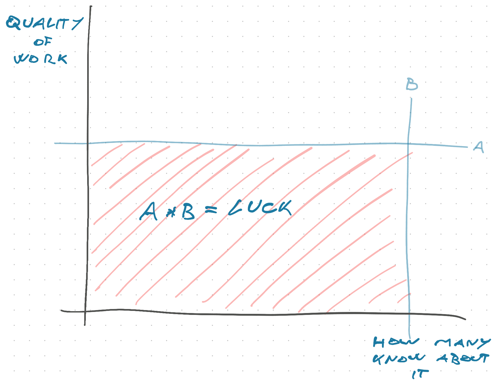

here's a comment that resonated yesterday and you might like. It's about how to maximize the opportunity in your work.

> Do you spend your time marketing your self to others and letting people know your accomplishments, or do you spend the time doing work that will benefit others?

I like the luck surface area analogy for this.

Take a rectangle. Side A is "Quality of work". Side B is "How many people know about it". The surface area – A\*B – is your luck and opportunity.

If you do amazing work and nobody knows about it, your luck is zero.

If you do terrible work and everyone knows about it, your luck is zero.

A square would be equal balance of A and B, which is okay but not to everyone's liking. You can get the same surface area with 2A and 0.5B. You can get a huge surface area with 2A and 1B.

For engineer types, optimizing for big A and just enough B is easiest. We tend to err on the side of not enough B.

[Discussion in replies](https://news.ycombinator.com/item?id=26583526) had some good ideas. Like expanding the rectangle into a cube.

Cheers, 
~Swizec
