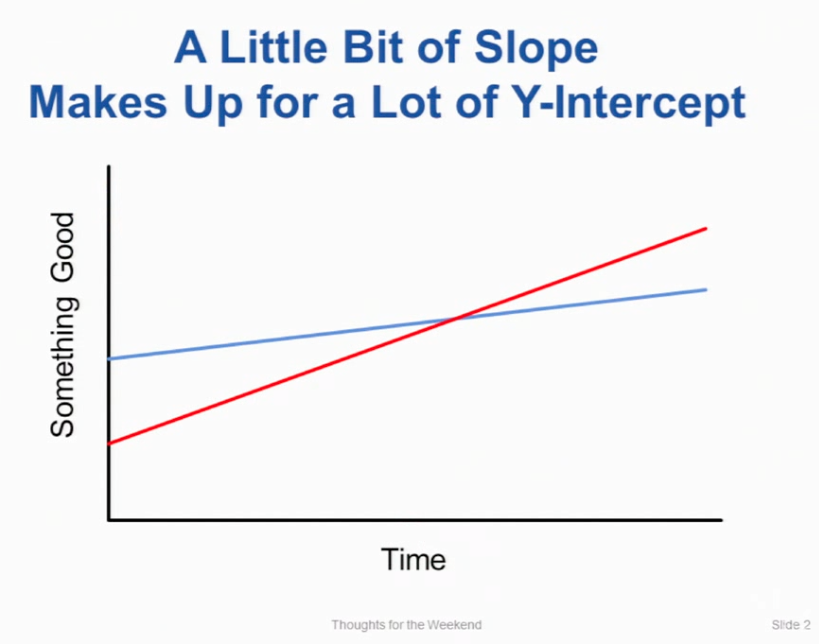

import { ContentUpgrades } from "@swizec/gatsby-theme-course-platform";

Job interviews suck. You go in there, solve a few puzzles, get a little hazing, and never hear from them again.

Now consider the other side.

You post a job, get 5000 applicants, pick 100, spend 2 weeks on phone screens, 5 people know what they applied for.

💩

Interviewing sucks for everyone.

My girlfriend got a business job at Visa in 2019 and later heard that 5000 applied for her role. She stood out _because she read the job description_ and highlighted relevant experience. Yeah, that's the bar.

Her boss hired _both_ candidates that stood out. They're besties now. He comes over for dinner sometimes. 🍲

Out of 5000 people, **2** stood out.

[I changed jobs in June 2020](https://swizec.com/blog/how-to-grow-as-a-senior-engineer-or-why-i-got-a-new-job). A 30min chat over coffee (I was referred) impressed them enough that they followed up for months until I was ready to interview.

What's the difference between the faceless masses and the few who stand out?

<ContentUpgrades.SeniorMindset />

## It's how you present yourself

https://twitter.com/Swizec/status/1324068647552249856

Imagine you're talking to 2 candidates for a senior engineering role. Same background, same experience, same years on the job.

**Bob presents as a typical engineer.** Amazing technical chops, can code circles around you, knows how to break complex problems into discrete tasks.

Bob asks about your technical stack, chuckles when you answer, says when he worked at Google they handled that differently. You've got work to do before Bob's impressed.

**Alice presents as a professional engineer.** Amazing technical chops, can code circles around you, knows how to break complex problems into discrete tasks. She likes to mentor junior engineers to help them advance faster.

Alice asks about your technical stack and says _"Yeah that's pretty typical at your stage. Modern companies like to get a product out quickly to test the market. Are you running into this issue yet? Ah cool, you will in a couple months, everyone does. I've seen this solution work before. How are you doing on the frontend? The mess is starting to slow you down isn't it? Here's what I've done in the past to solve that problem, we can take a step by step approach like this. You can't just abandon code that's working and making money. Oh btw what's your team scaling strategy?"_

Who do you hire?

## Be the expert, have suggestions

When you're junior, coachability is what gets you hired. How quickly can we train you to be effective?

When you're medium, technical chops get you hired. Can you do useful work _right now_ and quickly fill gaps in knowledge?

[A little bit of slope makes up for a lot of y-intercept.](https://gist.github.com/gtallen1187/e83ed02eac6cc8d7e185)

When you're senior, **your experience and opinions get you hired**.

The company doesn't know how to solve their problems. They don't even know the problems. But they know it hurts. Why aren't we shipping? Why's our code broken? Why can't we scale?

**You** are the expert my friend. You've seen this before, you know how it goes, you know what breaks before it breaks. You can see it coming a mile away and code or architect defensively.

Borne out of experience, lessons learned, and battle scars, you can give the new team advice. You don't just write code, you write the right code.

Or as Jonathan Stark said in a recent email: **Your value comes from what you know, not just what you do.**

Pure knowing without doing is for VPs and CTOs. Gets boring. 🤷‍♂️

## Interviews are sales

You and the hiring team are entering a $700,000+ business transaction (comp over 4 years) with imperfect information. You don't know if you'll enjoy the work and the company, they don't know if you can help.

If you can't deliver and get fired in 6 months, that's $87,000 in your pocket. Good incentive for fakes, eh? Companies are careful.

With that in mind, how would _you_ sell a $700,000 product? How would you buy it? 🤔

You don't buy a house after a 30min chat with a realtor. There's a process. There's schmoozing. There's due diligence. Followup.

Details vary but an attitude of _"I am selling the expensive services of a professional to a company that needs my help"_ never fails. Read a book or two on sales. It helps.

SPiN Selling is a good place to start.

1.  Identify pain points
2.  Sketch out solutions
3.  Make suggestions

Make the interview valuable.

After every chat, the interviewer should think: _"That was amazing! I can't wait to implement those recommendations even if you don't get hired!"_

You're not asking for a job, you're selling a service. A professional never begs my friend. ❤️

Cheers, 
~Swizec

PS: and remember, the interviewer wants you to succeed. Means they can stop interviewing and get back to work.
