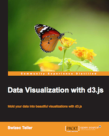

import { Box, Button } from "theme-ui"

## [Scaling Fast: Software Engineering Through the Hockeystick – 2025](https://scalingfastbook.com)

What happens when your startup hits hypergrowth?

Customers are flooding in, deadlines feel relentless, and your engineering team is drowning in technical debt. Scaling isn't optional—it's survival.

https://youtu.be/ipYaqafV3Oc

Scaling Fast is your engineer's playbook for surviving—and thriving—in hypergrowth. Based on my experience building fast growing companies, I share a practical guide to thriving when demand explodes.

You'll learn how to:

- Scale the business without losing product–market fit
- Grow teams with trust, delegation, and high-output culture
- Balance speed, quality, and technical debt
- Use feature flags, small-a agile, and continuous delivery to keep shipping
- Know when to let small fires burn—and when to fix them fast
- Architect your code to increase velocity and reduce bugs

## [Senior Engineer Mindset – 2022](https://seniormindset.com)

Are you tired of babysitting from your boss? Do you want more autonomy? Looking to solve bigger challenges? Dreaming of those $300,000+/year compensation packages?

You're not alone.

Getting the senior title is easy – just stick around. But to be a true senior, you need a new way of thinking that goes beyond the code. That's what unlocks your career.

## [Serverless Handbook - 2021](https://serverlesshandbook.dev)

Modern backend for frontend engineers.

Serverless Handbook shows you how to use your existng JavaScript and TypeScript skills to build backend systems with the serverless paradigm.

Based on AWS and the Serverless Framework, you'll learn how to build your ideas without wasting time on DevOps and server management.

## [React + D3v4 - 2017](https://swizec.com/reactd3js)

_This book is now the React for Dataviz course_

Creating dynamic data visualizations on the web is a pain in the ass.

You either have to use dumbed down libraries that won't let you do what you want, or make everything from scratch. Every time.

You want a quick way to build complex visualizations. Build once, use everywhere. In every project. Don't believe me?

With React + D3v4 you'll learn how to build re-usable visualization components in about an hour.

## [Data Visualization with d3.js - 2013](https://www.packtpub.com/web-development/data-visualization-d3js)

When you're learning d3.js on your own you often feel like Step 1: Draw two circles, is followed by Step 2: Draw the rest of the owl. My book aims to bridge that gap.

I guide you through complete examples from basic shapes on a page to full blown visualisations. There is no magic here, no steps left unexplained. You will understand everything that goes into making a visualization with d3.js.

## [Why programmers work at night - 2012](http://nightowlsbook.com)

The early bird does not always catch the worm, sometimes it meets a cat.

Programmers often work on unusual schedules that do not jive with the modern 9-5 office culture. They don't even do their best work at offices.

This book shows programmers and those around them that there's a better way.

"My girlfriend loved your book! " ~ Jan Hančič
