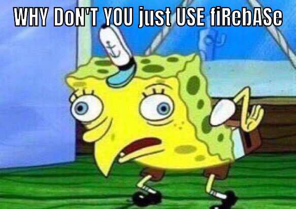

import { Box, Flex, Button } from "rebass"
import { Banner, NavGrid, Container, Grid, Title, JumpToCourse } from ".."
import GumroadButton from "../components/GumroadButton"
import Avatar from "../components/avatar"
import { graphql } from "gatsby"
import { Video } from "../components/Video"
import Pricing from "../components/pricing"

export const pageQuery = graphql`
  query {
    man1: file(relativePath: { eq: "man1.png" }) {
      childImageSharp {
        fluid(maxWidth: 120, maxHeight: 120) {
          ...GatsbyImageSharpFluid
        }
      }
    }
    man2: file(relativePath: { eq: "man2.png" }) {
      childImageSharp {
        fluid(maxWidth: 120, maxHeight: 120) {
          ...GatsbyImageSharpFluid
        }
      }
    }
    man3: file(relativePath: { eq: "man3.png" }) {
      childImageSharp {
        fluid(maxWidth: 120, maxHeight: 120) {
          ...GatsbyImageSharpFluid
        }
      }
    }
    woman1: file(relativePath: { eq: "woman1.png" }) {
      childImageSharp {
        fluid(maxWidth: 120, maxHeight: 120) {
          ...GatsbyImageSharpFluid
        }
      }
    }
  }
`

<Title h1># Most professional engineers can't build an app from scratch</Title>

<Container width={[1, 1, 1 / 2]} mt={[-0.5, -1, -1]} mb={[4, 4, 5]} sx={{textAlign: 'center'}}>

Learn how to <strong>build fast modern webapps</strong> from idea to launch with ServerlessReact.Dev

</Container>

<Container width={[1, 3/4, 1 / 2]}>

<Video id="L8Sx28i2NZw" />

You're a brilliant engineer. Great at your job. Someone gives you a spec and **you get it done**. Bam 💪

But you can't ship a product on your own.

You work with others. They're slow. They're busy. There's meetings. Committees. Pull requests. Managers. Approvals. So much work about work that _doesn't deliver value to users_.


Every little thing involves a designer, a JavaScript expert, a CSS professional, a backend engineer, a database person, the QA team, the devops folks, the ...

It takes you _months_ to turn a star button into a like button.

Ugh.

What if you could _grab an idea by the horns_ and **build the damn thing**? Own a feature from start to finish?

<JumpToCourse />

</Container>
<Title h2>
## The fullstack frontend engineer
</Title>
<Container width={[1, 3/4, 1 / 2]}>

You want to become a fullstack frontend engineer, my friend. The kind of person who gets an idea, project, or feature, and _builds it_. The whole thing. From scratch. Start to finish.

Most engineers hem and haw, wring their arms, think real hard, and give up. The blank editor steals their juice.

Sit down, great idea in mind. And then ... shit, how do I start?

Artists call this [The Blank Canvas Effect](https://zenpencils.com/comic/lilvincent/), writers have the blank page, engineers ... the greenfield project?


But why? Why can't most engineers build something from scratch?

_Amazing_ engineers creating great value for their companies. And they just never get the chance to **build something for real**.

There's [a story on HackerNews](https://news.ycombinator.com/item?id=21961560) from a Google engineer. Brilliant guy with a sneaking suspicion he's gotten lazy.

> I never challenge myself to deeply learn about what I'm doing, it's almost like I've been using only 10% of my mental capacity for work
> Even when I get a meaningful project, all I do is copy code from the internal codebase and patch things together until they work.

Sound familiar?

That's how it works in a mature product.

You have this massive codebase and your job is to make small adjustments. A tweak here, a trim there, a loving refactor over yonder.

**Maintenance. That's all they want.**

Your job is to understand the codebase and know where to find existing solutions to new problems. Like a taxi driver that knows every street in London.

When you do build a new feature, the hard part is making it fit into the codebase. Oh and finding all the legos.

**but the legos are already there** _you never build from scratch_


Don't you want to invent new legos, my friend? Is software gardening what you became an engineer for?

<JumpToCourse />

</Container>
<Title h2>
## Engineers don't know how it all fits together anymore
</Title>
<Container width={[1, 3/4, 1 / 2]}>

> Dude, sometimes you and Sean talk about these things so casually and it's like I know the words, but how it all relates together just doesn't make any sense

A fresh engineer whispered that to me. Ashamed almost.

Mate, there's no shame. You've been an engineer for a year. Sean and I have been at it for decades. We've seen it all.

Basics we take for granted, people just don't learn anymore. It's a solved problem. Click a button and you're done.

**Someone else did the hard work for you.**

Like how to set up a server? Spin up a database? Send an HTTP request? Deal with AJAX? Hacks before websockets? How HTML works? Where does CSS come in? How to create a user? Where to store data? How to make sure your data is safe? Where do you CDN? Why would you CDN? What should you process on the frontend? What on the backend? What's the point of compiling your code? When does it not make sense to build static? Why is code faster the 2nd time it runs? What's a cache?

Layers upon layers of technology that you're vaguely aware of and don't quite understand. A friend asks you to build a website and you don't even know where to begin.

https://twitter.com/chriscoyier/status/1183782878276128768

**You're just an expert in a tiny little niche.** Maybe you're the best UI engineer in the world, or a CSS grand master, killing it at React, or the best person that's ever walked the planet when it comes to complex data processing pipelines.

**And that means you're always relying on others**. You can't _own_ a project. You can't build that oasis where all code is perfect just like you.

**When you build yourself, YOU get to build the legos** 🎉

And that's exciting! And a little scary.


<JumpToCourse />

</Container>
<Title h2>
## What could you do with an extra $1,000/month?
</Title>
<Container width={[1, 3/4, 1 / 2]}>

The internet is changing, my friend.

Users are running away from ad-supported behemoths, tired of companies selling their data, invading privacy, and ruining apps with endless A/B testing. We the users are tired of "free".

Users want YOU to **understand their pain and fix it**. It's 2020 and _users love to pay_. **Users want to be customers**.

The indie hacker is back.

Forget launching a startup, raising a bunch of money, and capturing the market until everyone hates you. That's so 2010.

Startups are all fun and games until the VC cash runs out, my friend. Now [tech layoffs are on the rise](https://techcrunch.com/2020/01/08/tech-layoffs-rise-as-cost-cutting-comes-into-vogue/). Even engineers.

</Container>
<Title h3>
### What if your side business made $1,000+/month?
</Title>
<Container width={[1, 3/4, 1 / 2]}>

You could do what my favorite financial advisor Lucy Liu suggests 👉 **build a fuck you fund**.


A fuck you fund is the ultimate freedom. Even if it's small.

The difference between living paycheck-to-paycheck and having just 1 month of savings can mean the difference between enduring a bad job and quitting.

### Buy time

You can _buy_ time to spend with your friends, your family, your kids, or just reading that book you always wanted to.

Where does your time go?

Chores. Commuting. Cleaning. Groceries. Cooking. Annoying phone calls. The daily trappings of life.

Someone else can do that.

For example: my girlfriend and I splurge on weekly cleaners. They make our house look spotless and it's amazing. 😍

2 frustrating hours of our life that we can spend at the farmer's market instead. Yes we're _that_ couple.

### Buy expertise

> If you have a problem and the money to solve it, you don't have a problem.

Here's a crazy example of using money to solve problems.

Last year I got a job offer. Cool opportunity, right in my wheel-house, big impact for the company.

So I said yes and jumped in their arms, right?

Nope. I hired a salary negotiation expert.

For \$3000, I could sit back and relax. No worries about negotiation, no anguish over what to say, no pangs about pushing too far. _"I got you, Swiz, I've done this hundreds of times. Don't worry"_ he said.

Worth every penny. But only because I could.

**Money 👉 freedom, time, and expertise.**

<JumpToCourse />

</Container>
<Title h2>
## 5 crazy ideas that make $1,000+/month
</Title>
<Container width={[1, 3/4, 1 / 2]}>

Don't think you can build an app that makes \$1,000/month?

Here's 5 real businesses built by folks just like you. Engineers hacking on the side, solving real problems for real people. Shared by some of my internet friends.

### CSS Scan

Guilherme Rizzo built [CSS Scan](https://getcssscan.com/) because he

> always wanted to know what border-radius, box-shadow or font-family an element I see has. So, inspired by WhatFont? I decided to create a tool that wherever you point your mouse over, you get the computed CSS of the element. That was the initial idea.

It solves a problem we all have and are too lazy to fix.

He's been averaging \$1,000/month in sales. Mostly from twitter followers, building an audience, and reaching out to CSS influencers.

I didn't even know there were CSS influencers​.

### Doka

[Doka](https://pqina.nl/doka/) boggles the mind. It's a _javascript library_ making almost \$6,000/month, which is more than 1k. But damn! A LIBRARY.

Rik Schennink built Doka to solve this problem: A good image editor in the browser.

> I was trying to find a JavaScript image editor, IMHO they just weren't good enough, so I decided to build one myself. Doka makes image editing easy for both the user and the developer. The UX feels native and the product can be integrated by a developer in just a couple minutes. Most of my customers find Doka via FilePond (MIT licensed file upload component), it's quite popular so it sends traffic to Doka.

### Solid Book

Khalil Stemmler is writing [Solid Book](https://solidbook.io/) to teach developers how to write testable, flexible, and maintainable code.

> I got the idea to work on this book after having spent over \$800 on software books in order to learn how to fix a terrible codebase (that only I myself could blame for having designed). It made me realize that not a lot has changed about software in the past 40 years, but all those teachings have been spread out across several books. I wanted to create an introductory resource for junior to mid-level developers to mimimize their unknown unknowns about software design & architecture.

So Khalil built a serverless JAMStack site for the book, added a buy button, and now Google and his blog are bringing enough traffic to make almost \$2k/month.

You go Khalil 💪

### Jon's productized consulting

Productized consulting is a half-step between selling your time and selling a product. A great step towards freedom.

[Jon Major Condon](https://twitter.com/jonmajorc) is using this approach to make money mentoring very junior students on the basics of React. You know, the sort of stuff he's forgotten he's learned.

> Each year I do a lot of software related mentoring. Recently I’ve adventured into paid mentorship. I am working with a company remotely helping their student developers get up to speed in React. Although I am split into multiple channels, I’ve found opportunities to make money in each channel. I’ve found **my passion for learning and growing has really been the driving factor into me starting my side hustle**.

A great example of someone who's just starting to business seriously.

### Burner Mail

Sergiu Calborean built [Burner Mail](https://burnermail.io/) to solve the email privacy problem. How do you sign up for fun things online without getting a bunch of spam later?

> We decided to create Burner Mail out of our own frustration with being spammed and being targets for scammers. Burner Mail is a tool for generating burner email addresses. Instead of giving your personal email address, Burner Mail generates a unique and anonymous email for every service to protect your personal email address from spam, scams, data breaches, and identity theft.

Sergiu also mentioned they're making about \$1400/month right now. Good job 👏

### Tin Mustard

A mysterious twitter follower shared just this link 👉 [Tin Mustard](https://tinmustard.com/). Named after himself it's an artisanal mustard that sells \$1,000/month.

Mustard. Online. \$1,000.

The internet truly is a magical place.

<JumpToCourse />

</Container>
<Title h2>
## The hyper productive modern web stack makes launching an app the easiest it's ever been
</Title>
<Container width={[1, 3/4, 1 / 2]}>


When I created my first startup in 2010 we wanted to build an algorithmic feed AI. Wild crazy idea at the time.

Can you guess the hardest part?

That's right!

Charging money. Hosting. A scalable backend. A JS frontend. A clean API. A fast database. Those were the hardest.

Fast forward 10 years and everything is different. We're in the middle of an inflection point in how webapps are built.

**YOU can do the whole thing.**

It’s never been so easy to build a webapp and make your first \$1,000/month, my friend. Exciting times!

<JumpToCourse />

</Container>
<Title h3>
### 10 years ago starting was hard
</Title>
<Container width={[1, 3/4, 1 / 2]}>

10 years ago The Cloud was in its infancy. AWS was just 4 years old, GoogleAppEngine 2 years.

Debate raged at our hacker space 👇

Should you use Cloud? Host on bare metal? Poke one of the 10 friends with a hosting company? Use the PC running in your bedroom?

We picked AppEngine. It promised "web scale". Gave us a NoSQL database – a new concept at the time – and everything else we needed to _grow super hella fast_.

Monetization? Please, PayPal is too hard ... we'll do it later. Once we have millions of users.

JavaScript webapp? Heck no. Ain't nobody got time for that. Cobbling HTML together on every request using Django, the python framework, is where it's at my friend.

After **months of building** we were ready to launch.


Our credit card melted instantly. 6 months later I was kicked out of the company.

<JumpToCourse />

</Container>
<Title h2>
## Forget months, you can now launch an MVP in 24 hours
</Title>
<Container width={[1, 3/4, 1 / 2]}>

Times have changed, my friend. I only realized how much they've changed during Pat Walls's [24hour startup challenge](https://24hrstartup.com/) in late 2018.

_Can you build & launch a startup in 24 hours? Do it live on stream!_

Pat is crazy. There's no way.

Fuck it let's try.

https://www.youtube.com/watch?v=sqlC1zNYG4M

12 hours later [TechLetter.App](https://techletter.app) was born. 😳

Best part? It made $4 in sales *and* I use it to create emails for my newsletter *and* it costs $0/month to run.

Emails that get comments like this

https://twitter.com/_AshConnolly/status/1221555569087086593


<JumpToCourse />

</Container>
<Title h2>
## The hyper productive modern web stack
</Title>
<Container width={[1, 3/4, 1 / 2]}>

The hyper productive modern stack is here, my friend. All the pieces are coming together.

I love inflection points 😍


After a year of research, it's still too early to name winners. What I _can_ tell you is the outline. A sketch of what the future holds.

– **serverless backends** Serverless is eating the backend. The cloud moved us from physical to logical servers and code stayed the same. That's changing. No more servers, just functions.

– **progressive web apps – PWA** Webapps are going progressive. An offline-first approach makes webapps work offline and stay fast in areas with spotty internet. Optimistic updates keep your UI fresh, you sync data when possible. Much like a mobile app.

– **JAMStack hosting** your progressive webapp is a static asset. It don't need no servers. Host it with a JAMStack provider and let them handle advanced caching, CDN config, DNS routing, continuous deployment, and everything else. You just get a blazing fast app.

– **GraphQL** changes the API layer. Write complex queries on the frontend, expose data on the backend, agree on data types and let GraphQL handle the rest. No more begging backend engineers to add a parameter, no more gigantic payloads with ten times more data than you need.

– **design systems take over** we're achieving the dream everyone promised: A designer creates your styles and you don't have to fiddle around. Build UI with a suite of [open source] components and it always comes out looking perfect.

– **more full-stack engineers** with backend simplified to "just JavaScript functions" and system complexity handled by serverless providers, everyone can own the full stack again. Write your frontend code, add a function to the backend, it's all the same.

**The rise of indie hackers** is my favorite result. **_YOU_** can build in a day or two what used to take a team of engineers weeks or months.

<JumpToCourse />

</Container>
<Title h2>
## How GraphQL blows REST out of the water
</Title>
<Container width={[1, 3/4, 1 / 2]}>

> "i cant even imagine going back to REST it literally feels like working with jQuery"
> ~ [@deadcoder0904](https://twitter.com/deadcoder0904)

You're building an app. It needs data from a server. What do you do?

Oh, you make a `fetch()` request. Easy.

```javascript
fetch("https://swapi.co/api/people/1/")
  .then((res) => res.json())
  .then(console.log)
```

And you get eeeevery piece of info about Luke Skywalker.

```json
{
  "name": "Luke Skywalker",
  "height": "172",
  "mass": "77",
  "hair_color": "blond",
  "skin_color": "fair",
  "eye_color": "blue",
  "birth_year": "19BBY",
  "gender": "male",
  "homeworld": "https://swapi.co/api/planets/1/",
  "films": [
    "https://swapi.co/api/films/2/",
    "https://swapi.co/api/films/6/",
    "https://swapi.co/api/films/3/",
    "https://swapi.co/api/films/1/",
    "https://swapi.co/api/films/7/"
  ],
  "species": ["https://swapi.co/api/species/1/"],
  "vehicles": [
    "https://swapi.co/api/vehicles/14/",
    "https://swapi.co/api/vehicles/30/"
  ],
  "starships": [
    "https://swapi.co/api/starships/12/",
    "https://swapi.co/api/starships/22/"
  ],
  "created": "2014-12-09T13:50:51.644000Z",
  "edited": "2014-12-20T21:17:56.891000Z",
  "url": "https://swapi.co/api/people/1/"
}
```

Well that's annoying ... all you wanted was his name and hair color. Why's the API sending you all this crap? 🤦‍♂️

And what's this about Luke's species being `1`? What the heck is `1`?

Okay, another fetch request.

```javascript
fetch("https://swapi.co/api/species/1/")
  .then((res) => res.json())
  .then(console.log)
```

You get a bunch of data about humans. Great.

```json
{
  "name": "Human",
  "classification": "mammal",
  "designation": "sentient",
  "average_height": "180",
  "skin_colors": "caucasian, black, asian, hispanic",
  "hair_colors": "blonde, brown, black, red",
  "eye_colors": "brown, blue, green, hazel, grey, amber",
  "average_lifespan": "120",
  "homeworld": "https://swapi.co/api/planets/9/",
  "language": "Galactic Basic",
  "people": [
    "https://swapi.co/api/people/1/",
    "https://swapi.co/api/people/4/",
    "https://swapi.co/api/people/5/",
    "https://swapi.co/api/people/6/",
    "https://swapi.co/api/people/7/",
    "https://swapi.co/api/people/9/",
    "https://swapi.co/api/people/10/",
    "https://swapi.co/api/people/11/",
    "https://swapi.co/api/people/12/",
    "https://swapi.co/api/people/14/",
    "https://swapi.co/api/people/18/",
    "https://swapi.co/api/people/19/",
    "https://swapi.co/api/people/21/",
    "https://swapi.co/api/people/22/",
    "https://swapi.co/api/people/25/",
    "https://swapi.co/api/people/26/",
    "https://swapi.co/api/people/28/",
    "https://swapi.co/api/people/29/",
    "https://swapi.co/api/people/32/",
    "https://swapi.co/api/people/34/",
    "https://swapi.co/api/people/43/",
    "https://swapi.co/api/people/51/",
    "https://swapi.co/api/people/60/",
    "https://swapi.co/api/people/61/",
    "https://swapi.co/api/people/62/",
    "https://swapi.co/api/people/66/",
    "https://swapi.co/api/people/67/",
    "https://swapi.co/api/people/68/",
    "https://swapi.co/api/people/69/",
    "https://swapi.co/api/people/74/",
    "https://swapi.co/api/people/81/",
    "https://swapi.co/api/people/84/",
    "https://swapi.co/api/people/85/",
    "https://swapi.co/api/people/86/",
    "https://swapi.co/api/people/35/"
  ],
  "films": [
    "https://swapi.co/api/films/2/",
    "https://swapi.co/api/films/7/",
    "https://swapi.co/api/films/5/",
    "https://swapi.co/api/films/4/",
    "https://swapi.co/api/films/6/",
    "https://swapi.co/api/films/3/",
    "https://swapi.co/api/films/1/"
  ],
  "created": "2014-12-10T13:52:11.567000Z",
  "edited": "2015-04-17T06:59:55.850671Z",
  "url": "https://swapi.co/api/species/1/"
}
```

That's a lot of data just to get the word `"Human"` out of the [Star Wars API](https://swapi.co/), my friend.


What about all of Luke's starships? There's just 2 and yet that's 2 more API requests ...

```javascript
fetch("https://swapi.co/api/starships/12/")
  .then((res) => res.json())
  .then(console.log)

fetch("https://swapi.co/api/starships/22/")
  .then((res) => res.json())
  .then(console.log)
```

You've just made _4 API requests and transferred a shitload of data_ to find out that Luke Skywalker is human, has blond hair, and flies an X-Wing and an Imperial Shuttle.

🤦‍♂️

### GraphQL to the rescue

Here's what that same process looks like with GraphQL.

```graphql
query luke {
  Person(name: "Luke Skywalker") {
    name
    hairColor
    species {
      name
    }
    starships {
      name
    }
  }
}
```

And the API returns exactly what you wanted with a single request.

```json
{
  "data": {
    "Person": {
      "name": "Luke Skywalker",
      "hairColor": ["BLONDE"],
      "species": [
        {
          "name": "Human"
        }
      ],
      "starships": [
        {
          "name": "X-wing"
        },
        {
          "name": "Imperial shuttle"
        }
      ]
    }
  }
}
```

Wait what 😲

An API mechanism that gives you total flexibility on the frontend, slashes API requests to almost nothing, _and doesn't transfer a bunch of data you don't need?_

That's amazing!

You write a query, specify what you want, send to an endpoint, and GraphQL figures out the rest. Want different params? Just say so. Want multiple models? Got it. Wanna go deep? You can.

I fell in love the moment it clicked.


### GraphQL even better with hooks

You don't need much to make a basic GraphQL client. A post request to the right URL will do.

Where GraphQL really shines is with React hooks. I like to use `@apollo/react-hooks`.

You get a pattern like this:

```javascript
import { useQuery } from "@apollo/react-hooks"
import gql from "graphql-tag"

// define the graphql query
const PERSON_QUERY = gql`
  query person($name: String!) {
    Person(name: $name) {
      name
      hairColor
      species {
        name
      }
      starships {
        name
      }
    }
  }
`

// a component that fetches data and displays it
const Person = ({ name }) => {
  const { loading, data } = useQuery(PERSON_QUERY, {
    variables: {
      name,
    },
  })

  return loading ? (
    <p>Fetching ...</p>
  ) : (
    <p>
      {data.Person.name} is a {data.Person.hairColor[0]}{" "}
      {data.Person.species[0].name} and flies around in{" "}
      {data.Person.starships.map((ship) => ship.name).join(", ")}
    </p>
  )
}
```

Render `<Person name="luke skywalker" />` and it first says `Fetching ...` then changes into `Luke Skywalker is a BLONDE Human and flies around in X-wing, Imperial shuttle`.

Not the perfectest English but that's way better than cobbling together 4 API requests. ✌️

Then use `<Person name="chewbacca" />` to learn about Chewie.

All without changing a bunch of Redux state, coordinating a bazillion API requests, dealing with smart components, dumb components, presentational components, data stores, caching, configuration, permissions, anything. It just works.

🤯

<JumpToCourse />

</Container>
<Title h2>
## The edge first architecture
</Title>
<Container width={[1, 3/4, 1 / 2]}>

What GraphQL enables and hooks facilitate is the Edge First Architecture on the frontend. You can think of it sort of as [edge computing](https://en.wikipedia.org/wiki/Edge_computing) applied to your components.

The past few years of React common sense taught us to put everything in a global store. Almost everything. Anything that multiple components might need.

You get a unidirectional data flow, easy to understand state transitions, and a total mess of an impenetrable state tree as your app grows. Things slow down, debugging gets hard, and help you god if you can't keep the entire app in your head. I'm looking at you sagas 😒


With edge first, we turn that upside-down. _The edge does the work_

Look at the `<Person />` component.

```javascript
// a component that fetches data and displays it
const Person = ({ name }) => {
  const { loading, data } = useQuery(PERSON_QUERY, {
    variables: {
      name,
    },
  })

  return loading ? (
    <p>Fetching ...</p>
  ) : (
    <p>
      {data.Person.name} is a {data.Person.hairColor[0]}{" "}
      {data.Person.species[0].name} and flies around in{" "}
      {data.Person.starships.map((ship) => ship.name).join(", ")}
    </p>
  )
}
```

It's doing all the work. Fetches its own data, deals with loading states, maybe errors, displays the result when ready.

You can put this _anywhere_ in your app and it Just Works™. No props to pass in, no hooking into global state, no coordination.

**Self-contained. Beautiful.**

Internally, `useQuery` talks to a global context, coordinates similar API requests, adds a caching layer, and ensures that even if you render `<Person name="luke skywalker" />` twice in a row, performance doesn't suffer.

Which is more than you've ever ensured with a global store and a lot of hard work isn't it? Sure is more than I have 😇

https://twitter.com/Swizec/status/1220390906748030976

<JumpToCourse />

</Container>
<Title h2>
## Why serverless beats servers
</Title>
<Container width={[1, 3/4, 1 / 2]}>

You're building an app. It needs to store some data. What do you do?

Easy.

You start a RubyOnRails project, create a model for your data, add routes for reading and writing, add some glue code in your controller, install the JBuilder gem, write a JSON view, create a migration file, run the Postgres database locally, start your Rails app and you're ready to test.

Then you go to AWS, create a new EC2 instance, pick from a billion Linux distributions, set up an HTTP server like Nginx, run your Rails app, add a cronjob to restart the app when it dies, buy a new domain on Namecheap, set up its DNS servers, wait a few hours, point the domain to your server ...

... and you haven't even set up the production database server yet.

Your virtual server and its database are running 24/7. Unless they die. You're in charge of keeping them up, maintaining configuration, and paying for every second of the day _even if nobody uses your app_.


Yes, services like Heroku make it easier. At least you can deploy with a `git push`.

And after all that you still have to host the webapp somewhere. Set up a static file server, configure a CDN for speed, optimize JavaScript builds for production, and find a way to avoid hitting Rails every time someone needs a CSS file.

It's a lot of work.

Took us weeks of engineering time at my day job. 😅

## Serverless to the rescue

The simplest serverless backends look just like functions.

```typescript
export const handler = async (event: APIGatewayEvent) => {
  return {
    statusCode: 200,
    body: "Hello 👋",
  }
}
```

That's all it takes. That's a server 😍

To build a backend to store some data with serverless and GraphQL you need just 2 files:

- an infrastructure definition
- a function that creates a GraphQL server

### infrastructure as code

```yaml
service: example

# Define provider and runtime
provider:
  name: aws
  runtime: nodejs12.x
  stage: dev
  # these are env vars
  environment:
    ITEM_TABLE: ${self:service}-items-${self:provider.stage}
  # AWS is strict about permissions :)
  iamRoleStatements:
    - Effect: Allow
      Action:
        - dynamodb:Query
        - dynamodb:Scan
        - dynamodb:GetItem
        - dynamodb:PutItem
        - dynamodb:UpdateItem
        - dynamodb:DeleteItem
      Resource: "arn:aws:dynamodb:${opt:region, self:provider.region}:*:table/${self:provider.environment.ITEM_TABLE}"

# define a /graphql function
functions:
  graphql:
    handler: dist/graphql.handler
    events:
      - http:
          path: graphql
          method: GET
          cors: true
      - http:
          path: graphql
          method: POST
          cors: true

# create a DynamoDB table
resources:
  Resources:
    ItemsTable:
      Type: "AWS::DynamoDB::Table"
      Properties:
        AttributeDefinitions:
          - AttributeName: itemId
            AttributeType: S
        KeySchema:
          - AttributeName: itemId
            KeyType: HASH
        ProvisionedThroughput:
          ReadCapacityUnits: 1
          WriteCapacityUnits: 1
        TableName: ${self:provider.environment.ITEM_TABLE}
```

That yaml defines your whole infrastructure. Specifies which endpoints you want, what functions should run, and even creates your database.

Infrastructure as code means you always know exactly what's running in production. Every branch of your project can use something different, every feature can add what it needs, and you never have to mess around by hand. ✌️

### a small GraphQL server

```typescript
import { ApolloServer, gql } from "apollo-server-lambda";

// this is where we define the shape of our API
const schema = gql`
    type Item {
        itemId: String
        property1: String
        property2: String
    }
    type Query {
        item(itemId: String): Item
    }
    type Mutation {
        createItem(property1: String, property2: String): Item
    }
`;

// this is where the shape maps to functions
const resolvers = {
    Query: {
        // read an item from the database and return
        item: async (_: any, { itemId }: ItemParams) => {
	        const result = await getItem({
			      TableName: process.env.ITEM_TABLE!,
			      Key: { itemId }
			    });
			    return result.Item
        }
    },
    Mutation: {
	    // write item to the database
	    createItem: async (_: any, { property1, property2 }:ItemParams) => {
	        const itemId = uuidv4();

	        const result = await updateItem({
		        TableName: process.env.ITEM_TABLE!,
		        Key: {
		            itemId
		        },
		        UpdateExpression: "SET property1 = :property1, property2 = :property2",
		        ExpressionAttributeValues: {
		            ":property1": property1,
		            ":property1": property2
		        },
		        ReturnValues: "ALL_NEW"
		    });

		    return result.Attributes;
        })
    }
};

// Create a GraphQL server
const server = new ApolloServer({ typeDefs: schema, resolvers });

export const handler = server.createHandler({
    cors: {
        origin: "*", // for security in production, lock this to your real endpoints
        credentials: true
    }
});
```

And you're done.

You've defined the shape of your API with a GraphQL schema, mapped it to resolver functions, and created a server. All with a couple of JavaScript functions.

GraphQL machinery takes care of data transformations and understanding queries. Serverless machinery takes care of setting up your servers, keeping them running, and exposing a URL to the world.

**Your frontend skills transfer directly to the backend.** _If you can write a JavaScript function, you can write your backend._ And that's amazing, my friend.

<JumpToCourse />

</Container>

<Title h1># ServerlessReact.Dev</Title>

<Container width={[1, 1, 1 / 2]} mt={[-0.5, -1, -1]} mb={[4, 4, 5]} sx={{textAlign: 'center'}}>

Learn how to <strong>build fast modern webapp</strong> from idea to launch with ServerlessReact.Dev

</Container>

<Container width={[1, 3/4, 1 / 2]}>


ServerlessReact.Dev is a video course that shows you how to build a modern webapp from scratch to launch using the hyper productive modern web stack.

You'll learn everything you need to **become a fullstack frontend engineer.**

ServerlessReact.Dev is focused on practical examples and showing you the whole process. Warts and all.

When you follow a polished tutorial, you learn how to build _that_ thing. But your skills don't transfer. And when something goes wrong, you're stuck.

With ServerlessReact.Dev you get a behind-the-scenes look. I'll show you how to debug problems, how to design a solution, where to start, and when to say good enough.

Learn **the pragmatic way to build modern apps**.

We start with some theory, learn the stack, do some practical exercises to get a feel for technologies, _then build a whole app_. From a list of features to accepting payments.

</Container>
<Title h2>
# What's in ServerlessReact.Dev
</Title>

<Container width={[1, 3/4, 1 / 2]}>

ServerlessReact.Dev covers the exciting new technologies that represent **the future of web development**. Get ahead of this **exciting new paradigm shift**.

– Learn how to build blazing fast **static-first React apps** with Gatsby

– Learn how to **use GraphQL** to minimize API requests

– Leverage **design systems** to build beautiful apps without designers

– **Serverless** technologies for adding functionality on the server

– **Store and manage data** in a database

– **Payments** integration

– **Authenticate** users and keep track of their accounts

– **JAMStack** deployments for production-ready frontend code

– The **Edge First Architecture** for frontend state management using React Hooks

</Container>
<Title h2>
## Start owning features like a pro
</Title>

<Container width={[1, 3/4, 1 / 2]} mb={[4, 4, 5]} style={{textAlign: 'center'}}>

Buy once forever yours.

Offering **37% off while The Situation lasts** because that's how far the markets dropped and I figured you might be worried so I wanna help. ❤️

</Container>

<Container width={[1, 1, 2 / 3]}>
  <Pricing
    products={[
      {
        name: "Pro",
        price: (
          <span>
            <strike style={{ fontWeight: 400 }}>297</strike>
            <big>187</big>
          </span>
        ),
        gumroadID: "IeDvq",
        cta: "Learn the modern stack",
        coupon: "37off",
        features: [
          "learn Gatsby",
          "learn GraphQL",
          "learn Serverless",
          "design system philosophy",
          "Edge First Architecture with hooks",
          "user authentication",
          "user authorization",
          "build an entire app",
          <span>&nbsp;</span>,
          "full source code for all modules",
          "subtitled video lessons",
        ],
      },
      {
        name: "Indie Hacker",
        price: (
          <span>
            <big>379</big>
          </span>
        ),
        gumroadID: "WTeMS",
        cta: "Learn the modern stack & Launch your app",
        features: [
          <strong>1-on-1 Roadmapping session for your idea</strong>,
          "learn Gatsby",
          "learn GraphQL",
          "learn Serverless",
          "design system philosophy",
          "Edge First Architecture with hooks",
          "user authentication",
          "user authorization",
          "build an entire app",
          <span>&nbsp;</span>,
          "full source code for all modules",
          "subtitled video lessons",
        ],
      },
    ]}
  />
</Container>

<Container width={[1, 3/4, 1 / 2]} mb={[4, 4, 5]} style={{textAlign: 'center'}}>

30 day moneyback guarantee.

</Container>

<Container width={[1, 3/4, 1 / 2]}>

## What people are saying

<Grid width={448} py={0}>

- > “I work with React but I want to learn the other technologies and how to use them with react”

  - dado90

  - <Avatar img={props.data.man1.childImageSharp.fluid.src} />

- > “I'm a React Dev, I wanted to get a boost further”

  - Samer

  - <Avatar img={props.data.woman1.childImageSharp.fluid.src} />

- > “I want to learn the full process of building a web app from start to finish using React and Serverless Technologies (could it be with AWS?)”

  - Ricardo Respo

  - <Avatar img={props.data.man2.childImageSharp.fluid.src} />

- > “I'm interested in the JAM stack and in AWS Serverless, but all of the examples for tutorials I found are boring.”

  - Rui

  - <Avatar img={props.data.man3.childImageSharp.fluid.src} />

</Grid>

</Container>

<Title h2>## Frequently Asked Questions FAQ</Title>

<Container width={[1, 3/4, 1 / 2]} mb={[4, 4, 5]}>

I try to answer every question and wanted to reach out with the most common questions I'm seeing. Just in case you're too shy to [ask](https://twitter.com/swizec) :)

</Container>

<Title h3>### Will this work for my super complicated use case?</Title>

<Container width={[1, 3/4, 1 / 2]} mb={[4, 4, 5]}>

Yes. The techniques and mental models I teach in [ServerlessReact.Dev](https://serverlessreact.dev/) come from 15 years of industry experience. Everything from one-off websites at a web agency, toy prototypes, and systems running at Fortune 500 companies.

Past few years I've been at a startup from Engineer 2 to making 7-figures in annual revenue. Building everything from complex webapps to data processing pipelines handling millions of datapoints per day.

That means I've seen the progression from a quick prototype to a rock-solid distributed system and I know the pain points you'll hit at each step.

</Container>

<Title h3>
  ### What's the difference between ServerlessReact.Dev and your live video
  series from mid 2019
</Title>

<Container width={[1, 3/4, 1 / 2]} mb={[4, 4, 5]}>

The live video series worked like a code-along. We built and app and discovered lessons along the way.

That's great if you have time to watch the entire 20 hours of video like a hawk.

Where ServerlessReact.Dev differs is that it still gives you the code-along experience in Modules 3 and 4, but starts with key lessons and takeaways from the build.

You get a more detailed section about the architecture, key lessons, and mental models to use when building your apps. There's also practice exercises and embedded playgrounds so you can try your new skills before jumping into a huge project.

The app is different too :)

</Container>

<Title h3>### What's the app we build in the course?</Title>

<Container width={[1, 3/4, 1 / 2]} mb={[4, 4, 5]}>

The app we build aims to strike a balance between complex enough to exercise the modern web stack and simple enough to build in a few hours. You don't wanna watch a 50 hour tutorial 😉

But it's still a real app I wanted to build and launch. Maybe turn into a business of its own.

So we're building MarkdownLandingPage – an app that lets you _write_ your next landing page. Write a bunch of markdown, hit a button, get a beautiful landing page.

It's like square space for nerds. Or a sort of headless CMS, if you will.

</Container>

<Title h3>### What if I fall behind? Can I ask for help?</Title>

<Container width={[1, 3/4, 1 / 2]} mb={[4, 4, 5]}>

[ServerlessReact.Dev](https://serverlessreact.dev) is completely self-paced and your access never expires. There's no time limit or a group you have to chase.

Join the course, watch videos when you can. If something doesn't click, watch it again as many times as you need. You can hit me up on email or twitter with questions and I'll try to help.

</Container>

<Title h3>### How much time does ServerlessReact.Dev take?</Title>

<Container width={[1, 3/4, 1 / 2]} mb={[4, 4, 5]}>

The more work you put in, the faster it's gonna go.

But I know what it's like, I am the world's worst course completer. There's just so much other stuff you gotta do in life.

That's why [ServerlessReact.Dev](https://serverlessreact.dev) is designed for busy people like you.

The first 2 or 3 hours give you 80% of the value. The rest goes into more detail, shows you examples, and discusses different options and approaches.

</Container>

<Title h3>
  ### I'm a student, in the military, non-profit, asian ... can I get a
  discount?
</Title>

<Container width={[1, 3/4, 1 / 2]} mb={[4, 4, 5]}>

Sorry, no location discounts for now.

I'm from Slovenia and I know what it's like to look at a high value course and think _"Damn that's expensive, I could never afford that"_

And I also know what it's like to leverage these skills and start making $100,000/year as a software engineer. Or launch that $1,000/month sidehustle.

ServerlessReact.Dev will pay for itself within a year.

</Container>

<Title h3>### What's the *actual* stack you're showing us?</Title>

<Container width={[1, 3/4, 1 / 2]} mb={[4, 4, 5]}>

We talked about GraphQL, React, and Serverless, but you're an engineer and you want details. I get it.

Just like our example app, the stack aims to strike a balance between easy to get started and good for the long term.

We use:

- React (components)

- Gatsby (static builds and speed)
- Rebass (flexible design system)
- useAuth (authentication hook)
- Auth0 (authentication service)
- Zeit/Netlify (JAMStack deploys)
- Serverless Framework (AWS toolkit)
- AWS Lambda (backend functions)
- AWS DynamoDB (flexible database)
- Apollo hooks (graphql frontend)
- Apollo Server (graphql backend)
- Stripe Checkout (payments)

And a few other libraries here and there.

</Container>

<Title h3>
  ### Don't JAMStack providers like Netlify or Zeit have cloud function support?
  Why are you showing us AWS?
</Title>

<Container width={[1, 3/4, 1 / 2]} mb={[4, 4, 5]}>

They do! Both Netlify and Zeit added cloud function support mid 2019 and it's a great option for basic use-cases.

As much as I love the bleeding edge, it's better to stay a year or two behind the curve. Give technologies time to mature.

Even AWS Lambda only recently added critical features for complex usecases.

I believe going straight to AWS gives you more power, control, and flexibility in ways that you'll need.

</Container>

<Title h3>### Isn't Serverless too complicated for frontend engineers?</Title>

<Container width={[1, 3/4, 1 / 2]} mb={[4, 4, 5]}>

No.

You may have heard of CloudFormation and Terraform and those are beasts. The toolkit we use in [ServerlessReact.Dev](https://serverlessreact.dev) makes Serverless a joy to use while giving you the flexibility to drop down to AWS's native config when you need to.

After that, it's just JavaScript functions you already know to write :)

</Container>

<Title h3>### Why not Just Use Firebase?</Title>

<Container width={[1, 3/4, 1 / 2]} mb={[4, 4, 5]}>

Engineers love this question. wHy DoNT yOU jUst ...



There's always a bunch of options. I've tried some of them, I haven't tried all. The stack you learn in [ServerlessReact.Dev](https://serverlessreact.dev) strikes a balance between ease of getting started and supporting you for the long term.

Firebase in particular is great for getting started and becomes a pain in the arse in the long term. Trust me, I've tried.

</Container>

<Title h3>### Aren't you worried about vendor lock-in?</Title>

<Container width={[1, 3/4, 1 / 2]} mb={[4, 4, 5]}>

Vendor lock-in is a myth. You will never hit that problem and you're far more likely to shoot yourself in the foot trying to avoid it.

Oh the glass house architectures I've built in the name of fighting vendor lock-in that shattered at the slightest cough.

</Container>

<Title h3>### What if I don't like your course?</Title>

<Container width={[1, 3/4, 1 / 2]} mb={[4, 4, 5]}>

Send an email and you get a refund.

</Container>

<Title h3>### Now's not the right time, can I join the course later?</Title>

<Container width={[1, 3/4, 1 / 2]} mb={[4, 4, 5]}>

You'll often see courses open and close many times per year. I hate that bullshit.

My courses stay available forever. Don't wanna learn now? That's okay, you can jump in at any time.

</Container>

<Title h1># ServerlessReact.Dev</Title>

<Container width={[1, 1, 1 / 2]} mt={[-0.5, -1, -1]} mb={[4, 4, 5]} sx={{textAlign: 'center'}}>

Learn how to <strong>build fast modern webapp</strong> from idea to launch with ServerlessReact.Dev

</Container>

<Container width={[1, 3/4, 1 / 2]} mb={[4, 4, 5]} style={{textAlign: 'center'}}>

Buy once forever yours.

Offering **37% off while The Situation lasts** because that's how far the markets dropped and I figured you might be worried so I wanna help. ❤️

</Container>

<Container width={[1, 1, 2/3]}>

<Pricing
  products={
    [
      
      {
        name: 'Pro',
        price: <span><strike style={{ fontWeight:400 }}>297</strike><big>187</big></span>,
        gumroadID: 'IeDvq',
        cta: 'Learn the modern stack',
        coupon: '37off',
        features: [
          'learn Gatsby',
          'learn GraphQL',
          'learn Serverless',
          'design system philosophy',
          'Edge First Architecture with hooks',
          'user authentication',
          'user authorization',
          'build an entire app',
          <span>&nbsp;</span>,
          'full source code for all modules',
          'subtitled video lessons'
        ]
      },
      {
        name: 'Indie Hacker',
        price: <span><big>379</big></span>,
        gumroadID: 'WTeMS',
        cta: 'Learn the modern stack & Launch your app',
        features: [
            <strong>1-on-1 Roadmapping session for your idea</strong>,
          'learn Gatsby',
          'learn GraphQL',
          'learn Serverless',
          'design system philosophy',
          'Edge First Architecture with hooks',
          'user authentication',
          'user authorization',
          'build an entire app',
          <span>&nbsp;</span>,
          'full source code for all modules',
          'subtitled video lessons'
        ]
      }
    ]
  }
/>
</Container>
