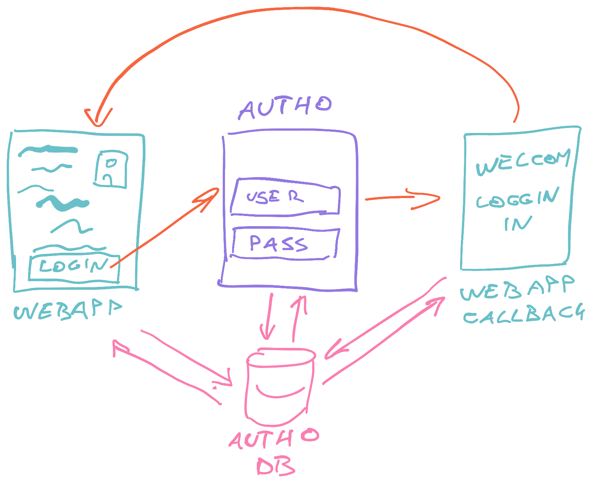

export const title = "Module 2"

export const description = ""

export const image = "/chapter_headers/serverless-elements.png"
import { Vimeo } from "../components/Video"

# Module 2: Setting up the basics

In [Module 2](/module-2) you will setup your project to use the modern stack. Create a new webapp, set up a design system with theming support, configure a basic GraphQL server on AWS Lambda, and add authentication to your app.

You can find code for this module [on GitHub](https://github.com/Swizec/markdownlandingpage.com). Commits follow the flow of these videos.

## Outline your project

<Vimeo id="390025846" />

## Create your repository

<Vimeo id="390178149" />

## Create Gatsby webapp

You will need to install Gatsby for this step.

```shell
npm install -g gatsby-cli
```

<Vimeo id="390182900" />

### Update config

See how Gatsby uses GraphQL to read local config files.

<Vimeo id="390218902" />

## Configure styling with Rebass

<Vimeo id="390235387" />

### Gatsby component shadowing

We use component shadowing to override the default theme config for our site. You can use this technique to change any files coming from a plugin.

<Vimeo id="390235516" />

### Rebass responsiveness

<Vimeo id="390364835" />

## Basic landing page

<Vimeo id="390364642" />

## Authentication

Authentication works via Auth0 using the [useAuth](https://github.com/Swizec/useAuth) hook.

<Vimeo id="390379219" />



### Add useAuth hook

<Vimeo id="390386823" />
<Vimeo id="390393362" />

## The backend

The backend works with AWS Lambda using Serverless Framework for configuration.

I recommend you [follow their documentation to setup your local environment and AWS credentials](https://serverless.com/framework/docs/providers/aws/guide/credentials/). AWS will ask for your creit card, if they don't have it yet.

Don't worry, it's still free until you have quite a bit of traffic :)

<Vimeo id="390408047" />

### serverless.yml

This is where you configure your whole infrastructure.

<Vimeo id="390408266" />

### GraphQL Lambda

<Vimeo id="390408529" />

### Deploy script

This goes in your package.json and makes life easier :)

<Vimeo id="390408756" />

You might need to install TypeScript globally, if you don't have it yet.

```shell
npm install -g typescript ts-node
```

And serverless too

```shell
npm install -g serverless
```

### What is The Server anyway?

<Vimeo id="390408835" />

## Connect your webapp to GraphQL

<Vimeo id="390523141" />

### use static query

Queries specifically for static data fetched dynamically at build.

<Vimeo id="390522624" />

### Connect to GraphQL at run-time

<Vimeo id="390522225" />

### Use live data

<Vimeo id="390521693" />

## What we created

The basics are there, the patterns were experimented with. Next module we build something useful, save actual data, and have heaps of fun.

<Vimeo id="390523333" />
