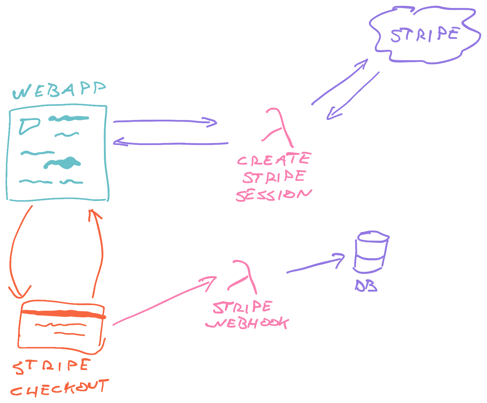

export const title = "Module 4"

export const description = ""

export const image = "/chapter_headers/serverless-elements.png"
import { Vimeo } from "../components/Video"

# Get paid with Stripe Checkout

Time to integrate Stripe and start getting paid for all your hard work.

<Vimeo id="399923494" />

## improve textarea, add Deploy button

<Vimeo id="399452125" />

## initiate payment proces

<Vimeo id="399452337" />

## create Stripe session pt1

<Vimeo id="399926355" />

## create Stripe session rest api

<Vimeo id="399452786" />

### fix typescript errors

<Vimeo id="399452954" />

### cors headers

<Vimeo id="399783660" />

## correctly call createStripeSession api

<Vimeo id="399783811" />

## make test purchase

<Vimeo id="399783978" />

## show purchase success

<Vimeo id="399924095" />
