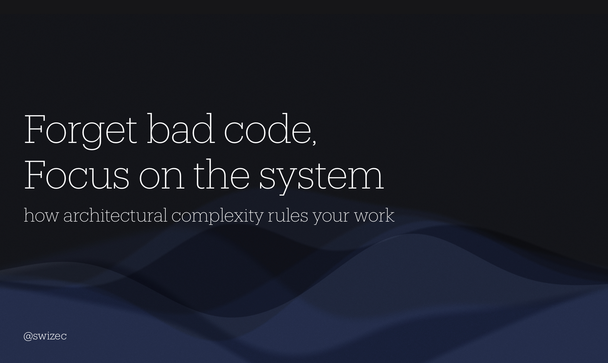

import { FormCK } from "@swizec/gatsby-theme-course-platform"

Hello React Summit audience person! 👋

You probably just saw my talk about architectural complexity and scanned a QR code or followed a link. Wonderful!

The best place to get more is to sign up for my newsletter. It's free and always useful. Scroll down for slides and further reading.

<FormCK copyBefore={<></>} />

Here's a few articles with further reading on the talk you just saw. If you want to go deeper still, they link to papers and other articles.

- [Forget complicated code, focus on the system](https://swizec.com/blog/forget-complicated-code-focus-on-the-system/)
- [Followup to the above](https://swizec.com/blog/followup-answers-to-forget-complicated-code-focus-on-the-system/)
- [Why taming architectural complexity is paramount](https://swizec.com/blog/why-taming-architectural-complexity-is-paramount/)
- [Some experiments of using AI to find natural modules](https://swizec.com/blog/finding-modules-in-a-big-ball-of-mud-with-chatgpt/)

Here are the slides:

If you'd like to see me talk about this at your company, send an email.

Cheers, 
~Swizec
