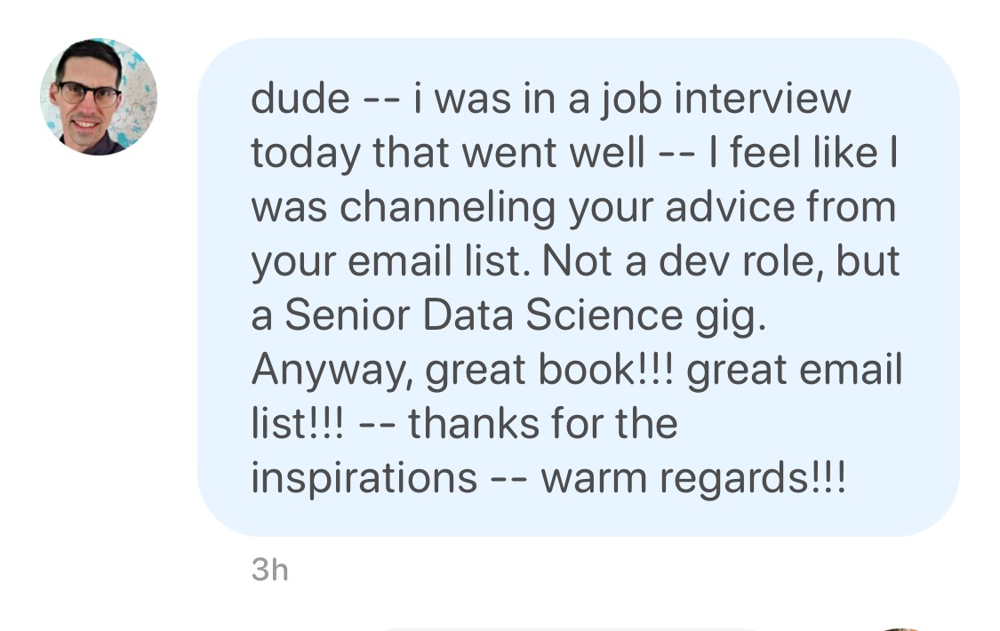

import { ContentUpgrades } from "@swizec/gatsby-theme-course-platform"
import { Script } from "gatsby"
import {
  SeniorMindsetBuyWidget,
  trackClick,
} from "../components/PurchaseButton"

<a href="https://swizec.lemonsqueezy.com/checkout/buy/c2b0c3ce-6d23-4d01-b4f2-bb01f600e72f?embed=1&media=0" className="lemonsqueezy-button" onClick={() => trackClick('c2b0c3ce-6d23-4d01-b4f2-bb01f600e72f-thumbnail')}>

</a>

Are you tired of babysitting from your boss? Do you want more autonomy? Looking to solve bigger challenges? Dreaming of those $300,000+/year compensation packages?

You're not alone.

Getting the senior title is easy – just stick around. But to be a _true_ senior, you need a new way of thinking that goes beyond the code. That's what unlocks your career.

<SeniorMindsetBuyWidget />

https://twitter.com/smlpth/status/1637536050305277952

## The backstory

When I came to Silicon Valley in 2015 I thought I was the shit. Able to solve any tech problem you threw at me, running circles around complexity, eating bugs for breakfast. Got my first Senior Software Engineer title and a 6-figure paycheck. Top of the world 🚀

3 years later the startup ran its first performance review. I walked into that room full of myself. Definitely the best engineer on the team, solving the hardest problems, writing the best code. Crushing it.

The CTO took a deep breath and said _"Swizec, you're a great programmer, the best we've got. Everything else, though ... terrible. You'd be fired if it wasn't for your history with the founders and the fact your immigration is tied to this job"_

I was crushed.

How can you be both the best engineer and failing as a senior engineer? What's going on here?

<SeniorMindsetBuyWidget />

I made it my mission to figure that out and wrote essays along the way. The Senior Engineer Mindset ebook is the collection of my best essays on the mindset of a true senior engineer. The tips and tricks that unlocked my career.

At a different company now people trust me to:

- lead initiatives across multiple teams,
- choose technologies,
- do whatever I think needs doing

And I get to work with product managers to define our roadmap, assess feasibility, and prioritize how we tackle business goals. That part is my favorite: negotiating scope before it becomes a problem.

Plus the extra autonomy comes with a 60% higher salary than before the pandemic, which is nice 😊

If that sounds interesting, keep reading.

## Fireside chat about Senior Mindset

https://www.youtube.com/watch?v=NAbEo2_6Us4&t=5980s

Watch a one hour fireside chat where Ben Dunphy and I talk about the Senior Mindset and what it means to be a true senior engineer at a local meetup in San Francisco.

<SeniorMindsetBuyWidget showPricing />

Not ready to buy? Start with a crash course 👇

<ContentUpgrades.SeniorMindset />

## The Senior Engineer Mindset book

<a href="https://swizec.lemonsqueezy.com/checkout/buy/c2b0c3ce-6d23-4d01-b4f2-bb01f600e72f?embed=1&media=0" className="lemonsqueezy-button" onClick={() => trackClick('c2b0c3ce-6d23-4d01-b4f2-bb01f600e72f-thumbnail')}>

</a>

The [Senior Engineer Mindset ebook](/senior-mindset) is a **271 page collection of essays** from my time in Silicon Valley. You can binge the pdf/epub or wait for each chapter to hit your inbox.

Lessons learned from crash landing as a hotshot solopreneur and freelancer, joining a seed stage company, growing to $1mm ARR, jumping ship, and growing the business from 50 to 350 employees in 18 months. With an eye-popping $100,000,000 Series B to boot.

How I approach technical decisions, writing code, and own outcomes has changed. A lot.

With the Senior Engineer Mindset book + audio package, you'll gain that same perspective and insight to grow your own career and become a true senior engineer. You'll gain autonomy, responsibility, and the trust of your peers.

If you've ever thought _"Why does That Guy get to do the cool stuff and I'm stuck here building my 50th checkout form??"_ this is the essay collection for you.

## The audiobook package

https://twitter.com/smlpth/status/1637580926057164800

The essay collection comes with **17 recorded interviews** on the mindset and practices of a senior engineer as a private podcast feed and **an audiobook with exclusive commentary**. You get full access to future updates.

Each interview comes with full show notes including **quotable quotes** and talking points. You'll access them as a **private podcast feed** that works in your favorite podcast app. **Content dives deeper** into various aspects of the Senior Mindset and is different from the book.

**The audiobook** is 3h 23min of audio narrated by the author, Swizec, with exclusive commentary and additional insights not available in the pdf/epub edition. Here's a sample:

<iframe
  width="100%"
  height="180"
  frameborder="no"
  scrolling="no"
  seamless
  src="https://share.transistor.fm/e/0ff188ab"
></iframe>

## The coaching package

With the coaching package you get a chance to dive into details of applying Senior Mindset to _your_ situation.

You'll start with a questionnaire before the call so we're both primed and ready to discuss the good stuff. We'll dive into your goals, obstacles, and deepest desires on a zoom call that lasts about an hour.

After the call, you'll have clear action steps you can take, areas to focus on, and a better understanding of what's next.

<SeniorMindsetBuyWidget showPricing />

## Table of Contents

34 essays in 5 sections – 308 pages.

**On being a senior engineer**

- Why senior engineers get nothing done
- What makes you a senior software engineer anyway?
- Computer science is not software engineering

**Mindset**

- A lesson on expertise from a great mafia movie
- Why engineers are worth so much
- What if engineers were paid like athletes
- Building software is a distraction
- DO more _work_ less
- Why great engineers hack The Process
- 4 years of coding in San Francisco, lessons learned
- Nobody is coming to save you
- How to own projects like a senior engineer
- Tech debt is a tool
- How Grit superchargers your career

**Career**

- Your career needs a vision
- Working IN your career vs. ON your career
- What a hockey legend can teach you about career development
- How to grow as a senior engineer or why I got a new job
- Why you should talk about engineering salaries
- Should you work at a startup
- Should you take a pay cut for equity
- What I learned while 6x-ing my income in 4 years
- How to make what you're worth even if you're from the wrong country
- When to join and leave a company, project, or trend

**Teamwork**

- What's more productive, a team or a talented soloist?
- How to succeed as a lead engineer – tactics and mindsets from practice
- Meetings – a senior engineer's secret weapon
- How we made the best burndown chart you've ever seen
- So about that perfect burndown chart ...
- What do collaborative teams look like?

**Tactics**

- My favorite lessons from Pragmatic Programmer
- What I learned from Software Engineering at Google
- HOW great engineers hack The Process
- When do you fix tech debt?

<SeniorMindsetBuyWidget showPricing />

## Testimonials

Next day he got an offer $20,000 above his current gig 🥳

The [Senior Engineer Mindset ebook](/senior-mindset) started as an email series. Here's what some of those early readers had to say:

> Before joining I was worried that senior mindset will be filled with useless information without actionable steps.
> But I learned the bigger picture about software development. That sometimes it's not only about code and best practises in the codebase
> I've recommended Senior Mindset to my friends.
> It's beneficial to junior/medior developers to connect the dots and I'm using what I learned to advance in my career, be a better person/developer and build something freaking cool.

---

> Reading the email series I learned to step back, observe, try to see the bigger picture, see what is the problem and how I can contribute the most with minimal effort
> I loved the format really...It is short, I can read it over breakfast
> and I'd recommend it to a friend. Any literature which is easy to read and teaches about something that you want to learn is worth picking up
> I'll apply it to my day to day job

---

> no hesitation subscribing.
> I learned that I should be focusing on amplifying my area of influencee
> The senior mindset is well written. It speaks to me.
> Got me into the googl engineering book
> I would recommend it to my friends, but it is not in german
> Going to use what I learned to help my customers, help my team, help my company to develop better

---

> loved learning the mindset! :) also, the stories and examples help me to assess if I'm following the right path.
> The 2 most helpful articles were the one about "what does a senior engineer do anyway" and "skate to where the puck goes". it helped remind me how to navigate my career and what skills I need to succeed.
> It helps reading things from someone else's point of view
> I'd recommend it to a friend, because it's been helpful to me
> Going to use what I learned for my own career. I'm kind of stuck in this limbo where I know I'm doing senior-level work, but I am not getting recognized for it. also when I interview, I get downleveled.

---

> I learned the habits that I have to change to become a senior engineer. The writing was very easy to follow and concise.
> I'd recommend this to a friend. Really liked how the author's experience was distilled into easy to digest essays/articles. They were also quite easy to implement
> Going to use this to move up my career ladder

---

> I felt that I got a ton of lessons from someone far more experienced and lessons that were hard earned, without having to learn them myself. I liked that the insights shared were very well written, and practical and actionable from my (not so senior) position.
> I learned a lot about the different possibilities for my career. i.e. startup vs big company, slowly writing less code to become an enabler and force multiplier for others, and how that's actually the proper career path and ideal for the future.
> It's a fantastic series that I really enjoyed and I think any developer could get a lot out of.
> I'm going to use this knowledge to develop my career in an intentional way, rather than just getting automatically somewhat better over time.

There's a near endless list of testimonials like that. Many readers take the time to leave thoughtful feedback ❤️

<SeniorMindsetBuyWidget showPricing />

Not ready to buy? Start with a crash course 👇

<ContentUpgrades.SeniorMindset />

## Frequently asked questions

**Will there be an audiobook?** Yes! For those of us who have a hard time sitting down to read, the audiobook is now available with 3h 23min of audio narrated by the author.

**If you write a new essay, will it arrive in my inbox?** Yes! You'll get all future writings on this topic. The best will be added as chapters to the book and you get all future updates.

**Why isn't this a paperback?** Self published paperbacks don't work as well as I'd hope. Print-on-demand sounds great in theory, but has lots of issues. My hope is that a future v2 of this book can be one of those NYT bestsellers you see in every book store 🤞

**Will I get access to future additions?** Yes you get future additions or at the very least a cheaper upgrade path. For example folks who originally bought the ebook for $29 could upgrade to the audio package for $20, but everyone at $49 and above got the whole audio package automatically. You always get future updates to your package.

**Do you support purchase power parity?** Yes! If you qualify, there's a banner at the top of this page with a code you can use.
