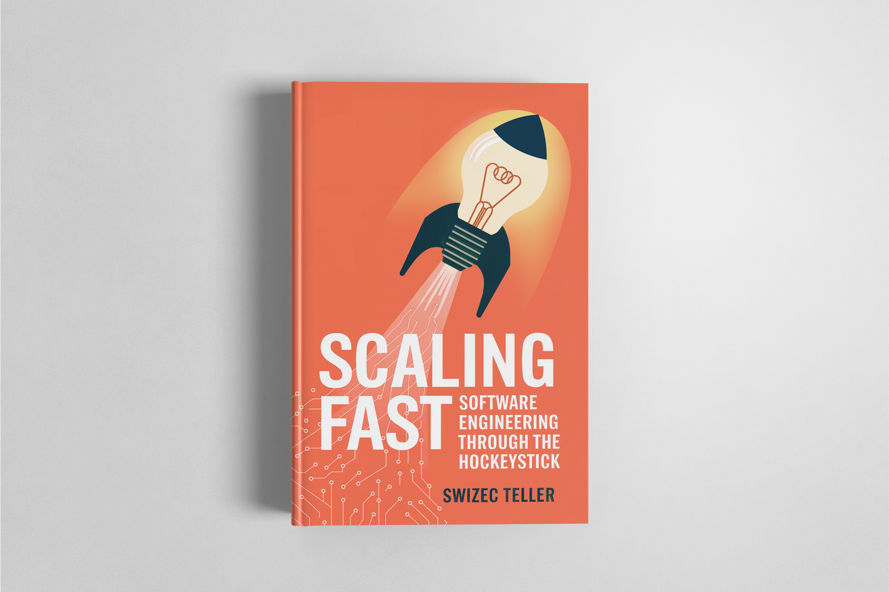

import { ContentUpgrades } from "@swizec/gatsby-theme-course-platform"

## What happens when your startup hits the hockey stick?

Customers are flooding in, deadlines are relentless, and your engineering team is drowning in technical debt. Scaling isn't optional — it's survival.

In _Scaling Fast: Software Engineering Through the Hockeystick_, veteran startup engineer Swizec Teller shares hard-won lessons from building and leading teams through hypergrowth. From women's health startups scaling to nine-figure Series B rounds, to biotech platforms going from zero to eight-figure revenue in just three years, this book is a practical guide to thriving when demand explodes.

You'll learn how to:

- **Scale the business** without losing sight of product-market fit.
- **Scale the team** with trust, delegation, and high-output culture.
- **Scale the tech** while balancing speed, quality, and technical debt.
- Use **feature flags, small-a agile, and continuous delivery** to keep shipping.
- Recognize when to let small fires burn — and when to fix them fast.

<ContentUpgrades.ScalingFastLanding />

Drawing on real startup war stories, this book shows what works (and what doesn't) when your company is growing faster than your systems can handle.

💡 _If you liked **Accelerate**, **The Phoenix Project**, **Team Topologies**, or **The Lean Startup**, Scaling Fast gives you the engineer's playbook for surviving — and thriving — in hypergrowth._

Whether you're an engineer joining your first rocketship, a tech lead managing rapid growth, or a founder trying to scale without breaking everything, this book will help you **navigate chaos, build resilient systems, and keep your company moving forward**.

## Table of Contents

- Preface
- How scale happens
- Scaling the Business
  - Why the business must grow
  - Even the best engineering can't beat market forces
  - Business metrics you should know
- Scaling the Team
  - A team will beat any soloist
  - Delegate decisions not just tasks
  - Let juniors speak first
  - Be Small-a agile
  - Work in Progress kills your progress
  - Approve with comment
  - Discuss before coding
  - Use vertical teams
  - Get us over the water, not build us a bridge
  - Weeks of programming saves you hours of planning
  - Keep shipping with feature flags
- Scaling the Tech
  - First, just get it done
  - Solve the problem, not a different more difficult problem
  - Use natural abstractions
  - Focus on architectural complexity
  - Avoid the big ball of mud
  - Observe your code break
  - You do have time to build it twice
  - Better is good
  - Let small fires burn
  - Make mistakes easy to fix
  - Software only moves forward
  - Write useful tests
- Conclusion
- Acknowledgements
- Sources

<ContentUpgrades.ScalingFastLanding />
