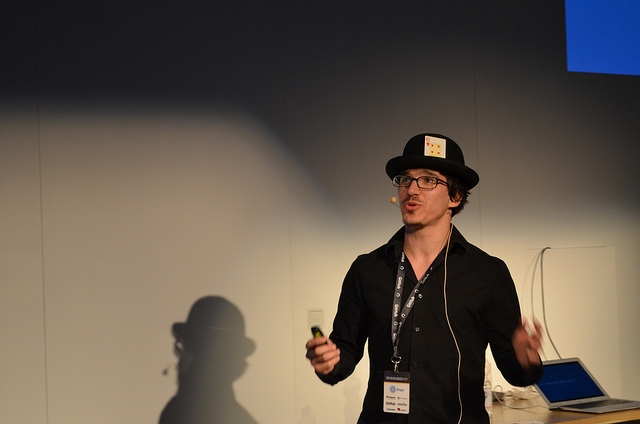

import { Button } from "rebass"

# Talks

> Swizec had every­one simul­ta­ne­ously laugh­ing, com­mis­er­at­ing and applaud­ing with his epic tale of blood, sweat, tears and rewrites. This ses­sion also fea­tured the sin­gle best quote of the entire con­fer­ence: “Edi­tors are hor­ri­ble people”.
>
> ~ [Kay Smoljak](http://kay.smoljak.com/2014/04/write-the-docs/) about my talk at WTD Hungary 2014

> First talk of the conference that made me want to close my laptop
>
> ~ [lowk3y](http://twitter.com/lowk3y) about my keynote at Drupal Alpe Adria 2014

<Button
  variant="secondary"
  as="a"
  href="mailto:swizec@swizec?subject=Come speak for us"
  mb={[2, 3, 4]}
>
  Email me to speak at your company or conference
</Button>

- 2020 - [Wormhole state management with React Hooks – ReactiveConf Meetup](https://www.youtube.com/watch?v=62AMy1QIpzk)
- 2020 - [UseAuth - delightfully simple authentication in React - #wwwhmb 111](https://www.youtube.com/watch?v=JUadifIFBTQ)
- 2019 - [The Web Got so Good You Can Build a Startup in 1 Day - Silicon Valley CodeCamp](https://www.siliconvalley-codecamp.com/Session/2019/the-web-got-so-good-you-can-build-a-startup-in-1-day)
- 2018 - [Data Visualizations with React + D3](https://www.youtube.com/watch?v=9JvIyz7uB2s)
- 2018 - [Using blockchain for shared UI state on the web](https://www.youtube.com/watch?v=fSpLUWhde5M)
- 2017 - [Modern web development: The Component is King](https://www.meetup.com/ReactJS-Boston/events/245412798/)
- 2016 - [Reusable data visualization with React and d3.js](https://www.youtube.com/watch?v=UP1nCXG2t4M)
- 2016 - [How to use React and d3.js to Build Visualization Components](https://www.youtube.com/watch?v=TbTOh5c4CGo)
- 2016 - [bayd3: React & D3 - Better Together](https://www.youtube.com/watch?v=47uMw-2mb4U)
- 2014 - [Wat ... are we doing to ourselves?](https://www.youtube.com/watch?v=LED7ezyT7l0)
- 2014 - [Why programmers work at night](https://www.youtube.com/watch?v=xVT19ZBL2g8), keynote
- 2014 - [What I learned writing a lousy tech book](https://www.youtube.com/watch?v=w1L2SgQuv6Q)
- 2013 - [Self-publishing yes or no](http://video.kiberpipa.org/samozaloznistvo_da_ali_ne/)
- 2012 - [Why programmers work at night](http://2012.webcampzg.org/swizec-teller-why-programmers-code-at-night/)
- 2012 - [Modern Python idioms](http://video.kiberpipa.org/py_swizec_modern_python_idioms/)
- 2012 - [I don't like servers](http://video.hekovnik.com/stc_4_p_2_swizec_i_dont_like_servers/)
- 2012 - [Django SQL optimisation](http://video.kiberpipa.org/pot_dml_0522/)
- 2012 - [Blogging, hats, stuff](http://video.kiberpipa.org/SU_Swizec_Teller-Bloganje_klobuki/)
- 2011 - [Tools that get you laid](http://video.webcamp.si/wc2011_teller_tools_that_get_you_laid/)
- 2010 - [Scraping the wild internets](http://video.kiberpipa.org/su_swizec_teller-ciscenje_divjih_internetov/)
- 2010 - [The future internet](http://video.kiberpipa.org/pot_swizec-the_future_internet/)
- 2010 - [LazySharer](http://video.kiberpipa.org/camp_swizec_teller-lazysharer/)
- 2009 - [The Synaptic Web](http://video.kiberpipa.org/camp_swizec-the_synaptic_web/)
