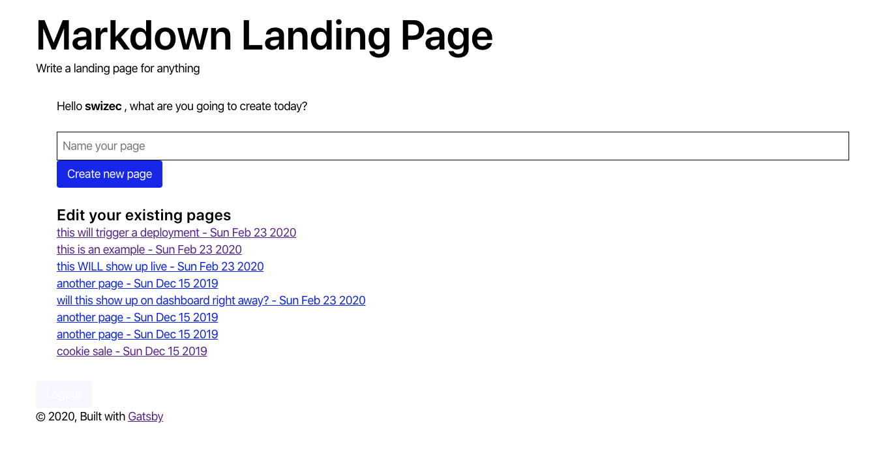

export const title = "Module 2"

export const description = ""

export const image = "/chapter_headers/serverless-elements.png"
import { Vimeo } from "../../components/Video"

# User dashboard

Our user dashboard will say hello to our users, let them edit existing landing pages, and create new ones.

## Exercises

These are the exercises that will get you there:

1. Add a `createPage` mutation to your backend
2. Connect it to the form on your dashboard
3. Add an `allPages` mutation to the backend
4. Use it to fetch pages
5. List those pages on the dashboard
6. Re-fetch the list of pages for the dashboard on page load
7. Create a Gatsby page for each landing page in `gatsby-node.js`
