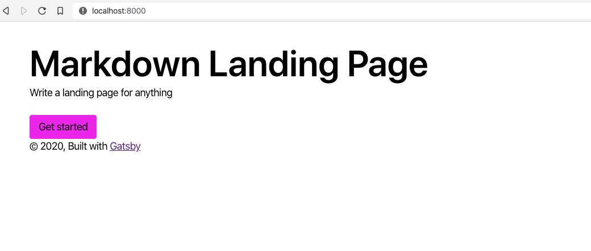

export const title = "Module 2"

export const description = ""

export const image = "/chapter_headers/serverless-elements.png"
import { Vimeo } from "../../components/Video"

# Homepage

Every project starts with a landing page. It gives you structure and somewhere to start.

A landing page answers the question: Why does this exist and what does it do?

Create one in `src/pages/index.js`. Try out Rebass's responsive features.

## Add a login button

The login button should be a clear call-to-action so users know where to start.

Make it so the login button lets you logout as well.
