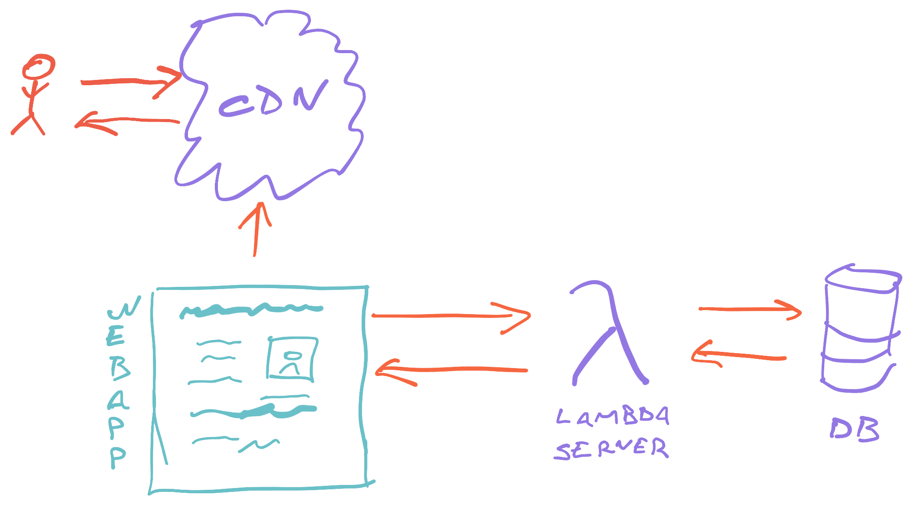
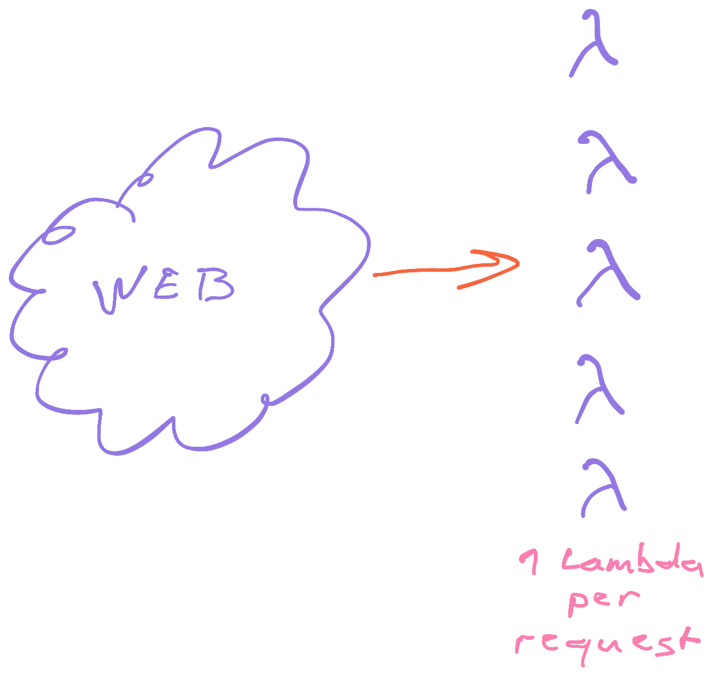
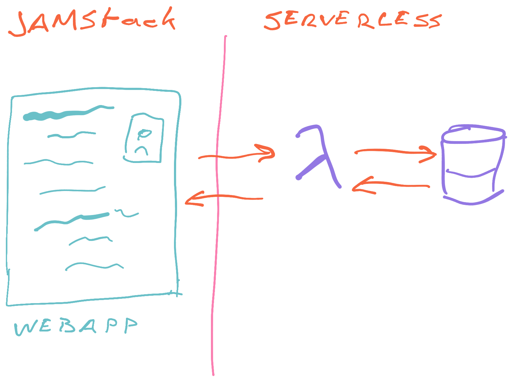
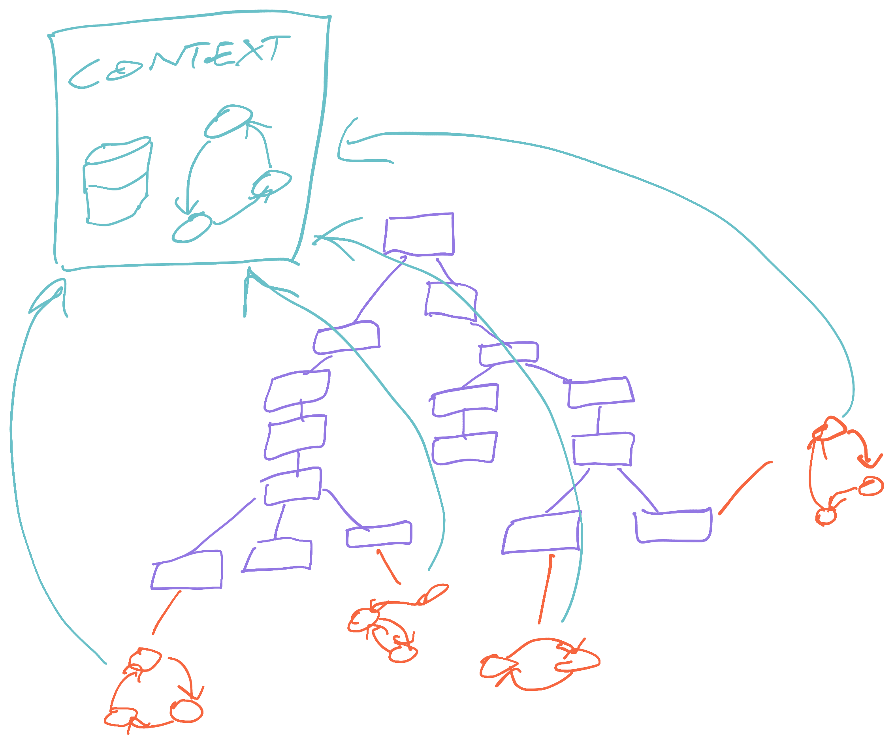
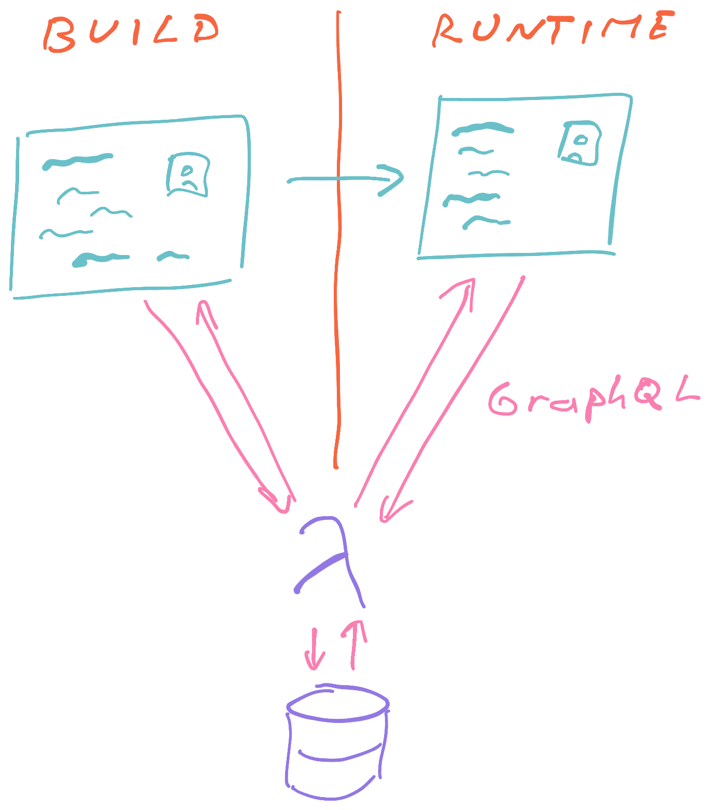

export const title = "Module 1"

export const description = ""

export const image = "/chapter_headers/serverless-elements.png"
import { Vimeo } from "../../components/Video"

# Part 1: The modern stack and mental models

Learn about the modern stack and some mental models about how it works. We discuss how to think about building a modern app, what to consider when deploying your infrastructure, and what each piece of the puzzle is doing for us.

## What is the modern stack

<Vimeo id="388889863" />

## The exact stack we use

<Vimeo id="388892864" />

## Gatsby

<Vimeo id="388899753" />

## Design systems and Rebass

<Vimeo id="388904151" />

## GraphQL

<Vimeo id="388908398" />

## Serverless

<Vimeo id="389017876" />

### Infrastructure as code

<Vimeo id="389017213" />

## DynamoDB

<Vimeo id="389020327" />

## Auth0 and useAuth

<Vimeo id="389022411" />

## Edge First Architecture

<Vimeo id="389028295" />

## Offline-first Architecture

<Vimeo id="389033075" />

