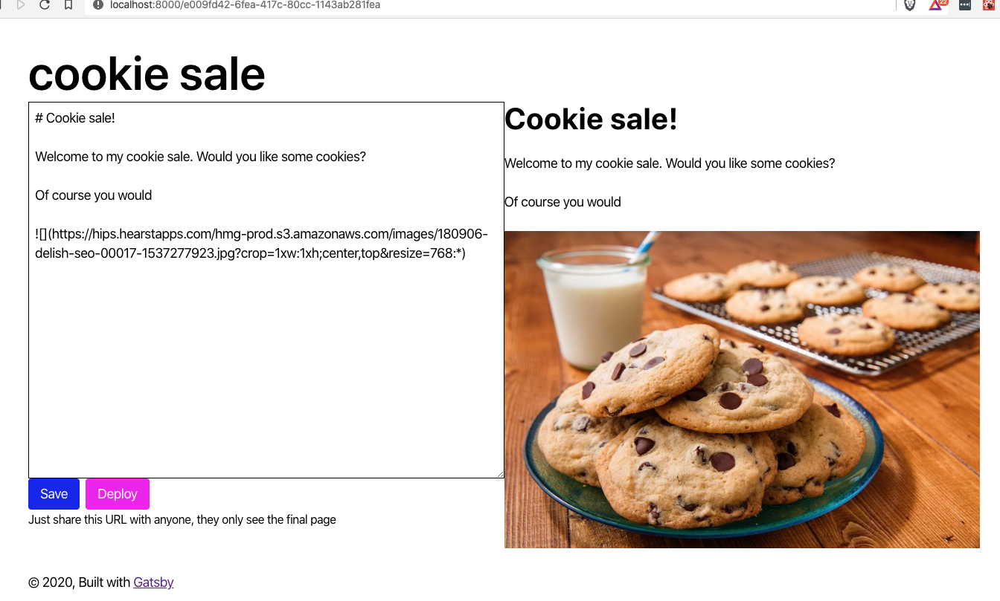

export const title = "Module 2"

export const description = ""

export const image = "/chapter_headers/serverless-elements.png"
import { Vimeo } from "../../components/Video"

# Page editor

Our page editor lets users edit their landing pages. If they're logged in.

When somebody else sees the page, they get the final version. This way it's easy for users to share drafts.

## Exercises

These are the exercises that will get you there:

1. Create a Gatsby page for each landing page in `gatsby-node.js`
2. Populate the textarea and preview with build-time data
3. Add a mutation to save the page
4. Re-fetch live data on page load
