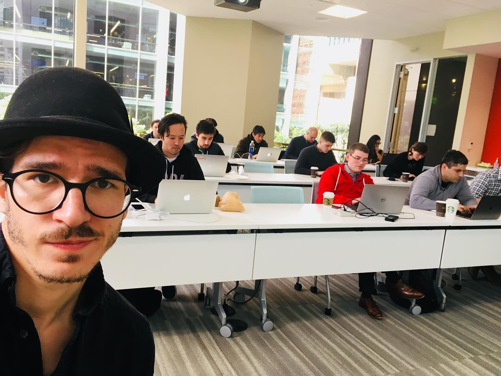

import { Button } from "theme-ui"

## Serverless React

**The web has never been so productive.**

You can build and launch a whole new app in just a few hours. It’s crazy! You can build what huge teams with large budgets could only dream of a few years ago.

- Beautiful UI? Got that.
- Great SEO? Yep. Easy.
- Amazing lighthouse speed scores? You got it.
- Running heavy code on the backend? Done.
- Saving user data? Yepp.
- Works on mobile? Of course.
- What about an offline PWA? Absolutely.
- Makes money? Yep got that too.

Maybe it’s not your job to do all that in your company right now. The bigger the company, the smaller your area of expertise.

But wouldn’t it be awesome if you could do all of that? What if the next time you have an idea for a great feature, you just build it? Own the whole stack from start to finish. You’d be a superhero!

Or maybe it’s just for you. Great idea for a project, an app, a painful problem you want to solve? Now you can. There’s no faster way to upercharge your career than a side project you’re passionate about. In this workshop, you will learn:

- How to set up a static-first webapp with Gatsby
- Why that’s important for SEO and speed scores
- How to build good looking UIs without design skills
- How to move some functionality to the backend using a serverless approach
- How to use serverless to store user data
- Using GraphQL to query your data
- How to add user authentication
- How to monetize your creation

You’ll leave this full-day workshop knowing some of the most powerful (and fun!) technologies that make web development in 2020 so amazing.

[Sign up to get notified when Serverless React Workshop happens next 👉](https://swizec.com/letters)

<Button
  variant="secondary"
  as="a"
  href="mailto:swizec@swizec?subject=Serverless React Workshop"
  mb={[2, 3, 4]}
>
  Email me to book Serverless React Workshop at your company or conference
</Button>

## React for Data Visualization

Become a data visualization engineer with React + D3v5. Creating dynamic and interactive data visualizations on the web is a pain. It gets really hard when you add animation, inter-connected dashboards, and fast performance on mobile devices.

You’re either using libraries you can’t customize, copy pasting D3 examples you don’t understand, or battling documentation to write spaghetti code you can’t reuse. It’s okay, we’ve all been there :)

In this workshop, you will learn:

- How to build modern data visualization the maintainable way.
- Modeling your code as a state machine in React apps
- D3 Fundamentals
- Different ways to integrate D3 with React
- Investigate the pros and cons of each method
- Build something beautiful together

By the end of this workshop you’ll have the tools you need to build any dataviz challenge your boss or client throws at you. Even if they ask you to animate 20,000 datapoints on a 5 year old phone.

[Sign up to get notified when React for Dataviz happens next 👉](https://reactfordataviz.com)

<Button
  variant="secondary"
  as="a"
  href="mailto:swizec@swizec?subject=React Dataviz Workshop"
  mb={[2, 3, 4]}
>
  Email me to book React for Dataviz Workshop at your company or conference
</Button>

## React and Redux

React and Redux was a workshop I taught in 2016/17 at several large companies.

It went over the basics of React, how to think with unidirectional dataflow, the fundamentals of using Redux, and prepared teams for migrating their codebases to React. They were lots of fun.

You can [see the materials online for free](https://reactworkshop.co/). They still work, but it's not how you write modern React.
