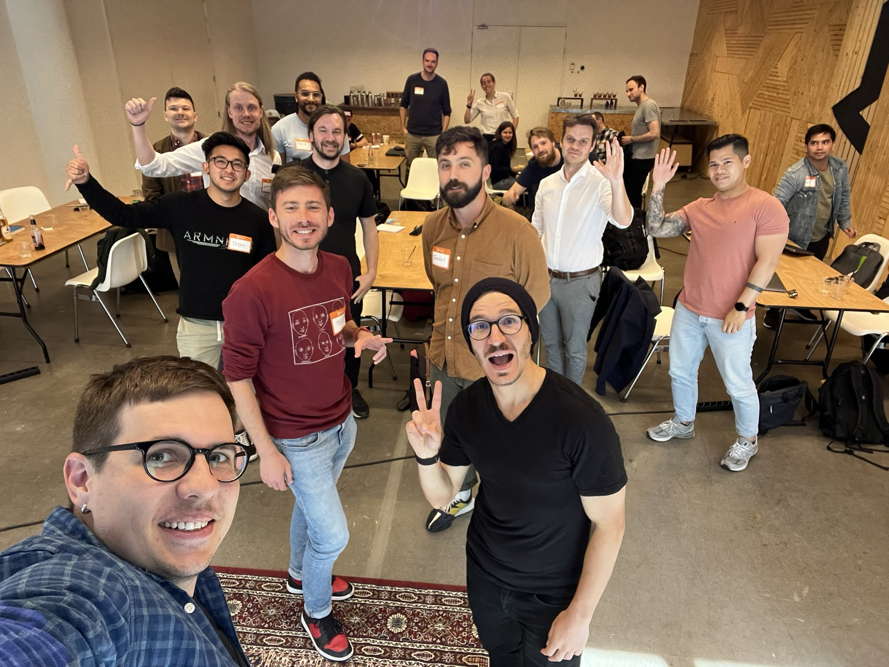

import { Button } from "theme-ui"

## Senior Mindset

Getting that senior title is easy. Just stick around. Being a _true_ senior takes a new way of thinking.

You're a great engineer. You can code anything you need, solve every problem, google any solution. Your code is flying.

But somehow you're ... stuck. Interviewing feels rough, you pass the coding and fail the real stuff. Culture and system. At work they keep giving you stupid little problems with no growth. You crave challenge and keep tweaking CSS instead.

You want some responsibility, damn it! What's that coworker got that you don't?

Most of all you crave autonomy. The freedom to tackle big challenges and help the company with your brilliance.

They don't even see all the bad code you see! How can they live like this?? Instead of autonomy, you're getting babysat. Managers asking what you're up to, daily standups that feel like a drag, pushback and 'maybe someday' on every idea that you give.

I was like that a few years ago. A totally senior engineer who keeps running into walls and getting stuck.

Now even bigger companies trust me with designing systems and leading teams on projects that could make or break the company.

In this workshop you'll learn what changed and how to apply the Senior Mindset to your work and career:

- How to gain autonomy
- Inspire trust
- Own large projects
- Get freedom to experiment
- Have your ideas heard
- Think like an expert
- Become a decision-making peer, not a pair of hands

You'll work on case studies, analyze anecdotes, discuss insightful books, and look at your work and career in a new light.

<Button
  variant="secondary"
  as="a"
  href="mailto:swizec@swizec?subject=Senior Mindset Workshop"
>
  {`Email me to book Senior Mindset Workshop at your company or conference`}
</Button>

## Serverless React

**The web has never been so productive.**

You can build and launch a whole new app in just a few hours. It’s crazy! You can build what huge teams with large budgets could only dream of a few years ago.

- Beautiful UI? Got that.
- Great SEO? Yep. Easy.
- Amazing lighthouse speed scores? You got it.
- Running heavy code on the backend? Done.
- Saving user data? Yepp.
- Works on mobile? Of course.
- What about an offline PWA? Absolutely.
- Makes money? Yep got that too.

Maybe it’s not your job to do all that in your company right now. The bigger the company, the smaller your area of expertise.

But wouldn’t it be awesome if you could do all of that? What if the next time you have an idea for a great feature, you just build it? Own the whole stack from start to finish. You’d be a superhero!

Or maybe it’s just for you. Great idea for a project, an app, a painful problem you want to solve? Now you can. There’s no faster way to upercharge your career than a side project you’re passionate about. In this workshop, you will learn:

- How to set up a static-first webapp with Gatsby
- Why that’s important for SEO and speed scores
- How to build good looking UIs without design skills
- How to move some functionality to the backend using a serverless approach
- How to use serverless to store user data
- Using GraphQL to query your data
- How to add user authentication
- How to monetize your creation

You’ll leave this full-day workshop knowing some of the most powerful (and fun!) technologies that make web development in 2020 so amazing.

[Sign up to get notified when Serverless React Workshop happens next 👉](https://swizec.com/letters)

<Button
  variant="secondary"
  as="a"
  href="mailto:swizec@swizec?subject=Serverless React Workshop"
>
  {`Email me to book Serverless React Workshop at your company or conference`}
</Button>

## React for Data Visualization

Become a data visualization engineer with React + D3v5. Creating dynamic and interactive data visualizations on the web is a pain. It gets really hard when you add animation, inter-connected dashboards, and fast performance on mobile devices.

You’re either using libraries you can’t customize, copy pasting D3 examples you don’t understand, or battling documentation to write spaghetti code you can’t reuse. It’s okay, we’ve all been there :)

In this workshop, you will learn:

- How to build modern data visualization the maintainable way.
- Modeling your code as a state machine in React apps
- D3 Fundamentals
- Different ways to integrate D3 with React
- Investigate the pros and cons of each method
- Build something beautiful together

By the end of this workshop you’ll have the tools you need to build any dataviz challenge your boss or client throws at you. Even if they ask you to animate 20,000 datapoints on a 5 year old phone.

[Sign up to get notified when React for Dataviz happens next 👉](https://reactfordataviz.com)

<Button
  variant="secondary"
  as="a"
  href="mailto:swizec@swizec?subject=React Dataviz Workshop"
>
  {`Email me to book React for Dataviz Workshop at your company or conference`}
</Button>

## React and Redux

React and Redux was a workshop I taught in 2016/17 at several large companies.

It went over the basics of React, how to think with unidirectional dataflow, the fundamentals of using Redux, and prepared teams for migrating their codebases to React. They were lots of fun.

You can [see the materials online for free](https://reactworkshop.co/). They still work, but it's not how you write modern React.
